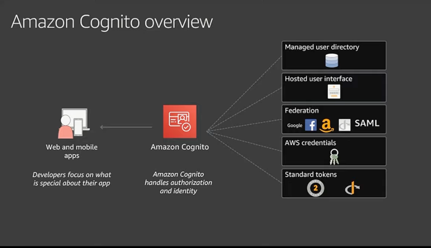

# Amazon Cognito
- [Amazon Cognito](https://aws.amazon.com/cognito/) can be used to add user sign-up, sign-in, and access control to the web and mobile apps quickly and easily.

# Source(s) and further reading
- [Scaling up to your first 10 million users](https://www.youtube.com/watch?v=kKjm4ehYiMs)