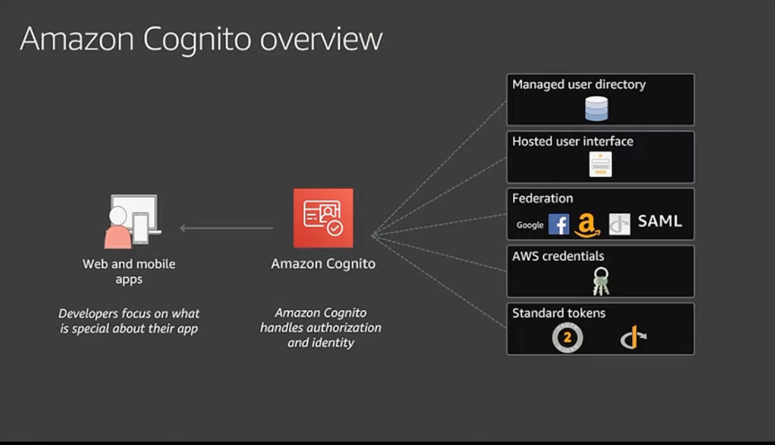

# Amazon Cognito
- [Amazon Cognito](https://aws.amazon.com/cognito/) can be used to add user sign-up, sign-in, and access control to the web and mobile apps quickly and easily.

# Features

| Pool type                                                                              | Business Use Case               | Description                                                                                                                                                                                                                                                                                                                   |
|----------------------------------------------------------------------------------------|---------------------------------|-------------------------------------------------------------------------------------------------------------------------------------------------------------------------------------------------------------------------------------------------------------------------------------------------------------------------------|
| [Identity Pool](https://repost.aws/knowledge-center/cognito-user-pools-identity-pools) | Grant access to AWS Services    | Give your users access to AWS resources, such as an [Amazon Simple Storage Service (Amazon S3) bucket](../../7_StorageServices/3_ObjectStorageS3/Readme.md) or an [Amazon DynamoDB table](../../6_DatabaseServices/AmazonDynamoDB/Readme.md). - Generate temporary AWS credentials for unauthenticated users. |
| [User pool](https://repost.aws/knowledge-center/cognito-user-pools-identity-pools)     | Add user directories to the app | Design sign-up and sign-in webpages for your app.  - Access and manage user data.  - Track user device, location, and IP address, and adapt to sign-in requests of different risk levels.  - Use a custom authentication flow for your app.                                                                       |

# Source(s) and further reading
- [Scaling up to your first 10 million users](https://www.youtube.com/watch?v=kKjm4ehYiMs)