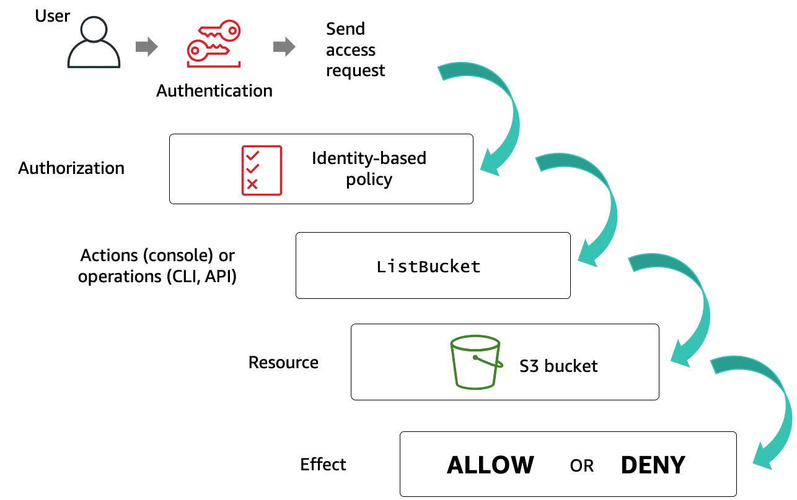

# IAM Policy/Request context
- [IAM Policy](https://docs.aws.amazon.com/IAM/latest/UserGuide/access_policies.html) helps to define user access (through AWS Console or AWS Cli) for the AWS resources.

| Context                                                                                                  | Description                                                                                                                                                                                                              |
|----------------------------------------------------------------------------------------------------------|--------------------------------------------------------------------------------------------------------------------------------------------------------------------------------------------------------------------------|
| Principal (specified in Resource-based policies only)                                                    | User, role, external user, another AWS service, another AWS account or application that sent the request and the policies associated with that principal.  - Example - arn:aws:iam::<AWS-account-ID>:user/<username> |
| Effect                                                                                                   | The effect element specifies whether the statement will explicitly allow or deny access.                                                                                                                                 |
| Action                                                                                                   | What the principal is attempting to do. Example - iam:GetUser                                                                                                                                                            |
| Resource                                                                                                 | AWS resource object upon which the actions or operations are performed.                                                                                                                                                  |
| [Condition](https://docs.aws.amazon.com/IAM/latest/UserGuide/reference_policies_elements_condition.html) | The Condition optional element (or Condition block) lets you specify conditions for when a policy is in effect.                                                                                                          |

# Condition keys

| Condition key                                                                                                                   | Description                                                                                                                                                                                                                         |
|---------------------------------------------------------------------------------------------------------------------------------|-------------------------------------------------------------------------------------------------------------------------------------------------------------------------------------------------------------------------------------|
| [iam:AWSService](https://docs.aws.amazon.com/IAM/latest/UserGuide/reference_policies_iam-condition-keys.html)                   | Specifies the AWS service to which this role is attached.                                                                                                                                                                           |
| iam:OrganizationsPolicyId                                                                                                       | IAM Condition key for IAM entity access to specific service control policy.                                                                                                                                                         |
| [iam:PermissionsBoundary](https://docs.aws.amazon.com/IAM/latest/UserGuide/reference_policies_iam-condition-keys.html)          | Checks that the specified policy is attached as a permissions boundary on the IAM principal resource.                                                                                                                               |
| [iam:PolicyARN](https://docs.aws.amazon.com/IAM/latest/UserGuide/reference_policies_iam-condition-keys.html)                    | Checks the Amazon Resource Name (ARN) of a managed policy in requests that involve a managed policy.                                                                                                                                |
| iam:ResourceTag                                                                                                                 | Checks the tag attached to the identity resource.                                                                                                                                                                                   |
| [iam:PassedToService](https://docs.aws.amazon.com/IAM/latest/UserGuide/reference_policies_iam-condition-keys.html)              | Condition keys for passing roles.  - Specifies the service principal of the service to which a role can be passed.                                                                                                              |
| [iam:AssociatedResourceArn](https://docs.aws.amazon.com/IAM/latest/UserGuide/reference_policies_iam-condition-keys.html)        | Condition keys for passing roles.  - Specifies the ARN of the resource to which this role will be associated at the destination service                                                                                         |
| [aws:SourceIP](https://docs.aws.amazon.com/IAM/latest/UserGuide/reference_policies_condition-keys.html#condition-keys-sourceip) | Represents the IP of the caller of the API.                                                                                                                                                                                         |
| [aws:RequestedRegion](https://aws.amazon.com/about-aws/whats-new/2018/04/requested-region-context-key/)                         | By adding the new global condition key ‘aws:RequestedRegion’ in the condition element of your IAM policy, you can control access to the regions in which an IAM principal (user or role) can perform AWS actions.                   |
| [ec2:Region](https://docs.aws.amazon.com/IAM/latest/UserGuide/reference_policies_examples_ec2_region.html)                      | Alternative to [aws:RequestedRegion](https://aws.amazon.com/about-aws/whats-new/2018/04/requested-region-context-key/).  - This allows action on full EC2 access within a specific Region, programmatically and in the console. |

# Action keys

| Action Key                                                                                      | Type          | Description                                                                                                               |
|-------------------------------------------------------------------------------------------------|---------------|---------------------------------------------------------------------------------------------------------------------------|
| [sts:AssumeRole](https://docs.aws.amazon.com/STS/latest/APIReference/API_AssumeRole.html)       | STS action    | Specify whether to allow/deny principal assuming another role (specified as Resource)                                     |
| [s3:ListBucket](https://tomgregory.com/s3-bucket-access-from-the-same-and-another-aws-account/) | Bucket action | Must be applied on bucket resource such as `arn:aws:s3:::examplebucket`.                                                  |
| [s3:GetObject](https://tomgregory.com/s3-bucket-access-from-the-same-and-another-aws-account/)  | Object action | Must be applied on objects within bucket such as `arn:aws:s3:::examplebucket/image.jpg` or `arn:aws:s3:::examplebucket/*` |
| [s3:PutObject](https://tomgregory.com/s3-bucket-access-from-the-same-and-another-aws-account/)  | Object action | Must be applied on objects within bucket such as `arn:aws:s3:::examplebucket/image.jpg` or `arn:aws:s3:::examplebucket/*` |

# Explicit and implicit denies

| Type                                                                                                         | Description                                                                                                                                                                                               |
|--------------------------------------------------------------------------------------------------------------|-----------------------------------------------------------------------------------------------------------------------------------------------------------------------------------------------------------|
| [Implicit denial](https://docs.aws.amazon.com/IAM/latest/UserGuide/reference_policies_evaluation-logic.html) | An [implicit denial](https://docs.aws.amazon.com/IAM/latest/UserGuide/reference_policies_evaluation-logic.html) occurs when there is no applicable Deny statement but also no applicable Allow statement. |
| [Explicit deny](https://docs.aws.amazon.com/IAM/latest/UserGuide/reference_policies_evaluation-logic.html)   | An [explicit deny](https://docs.aws.amazon.com/IAM/latest/UserGuide/reference_policies_evaluation-logic.html) in any of these policies overrides the allow.                                               |
