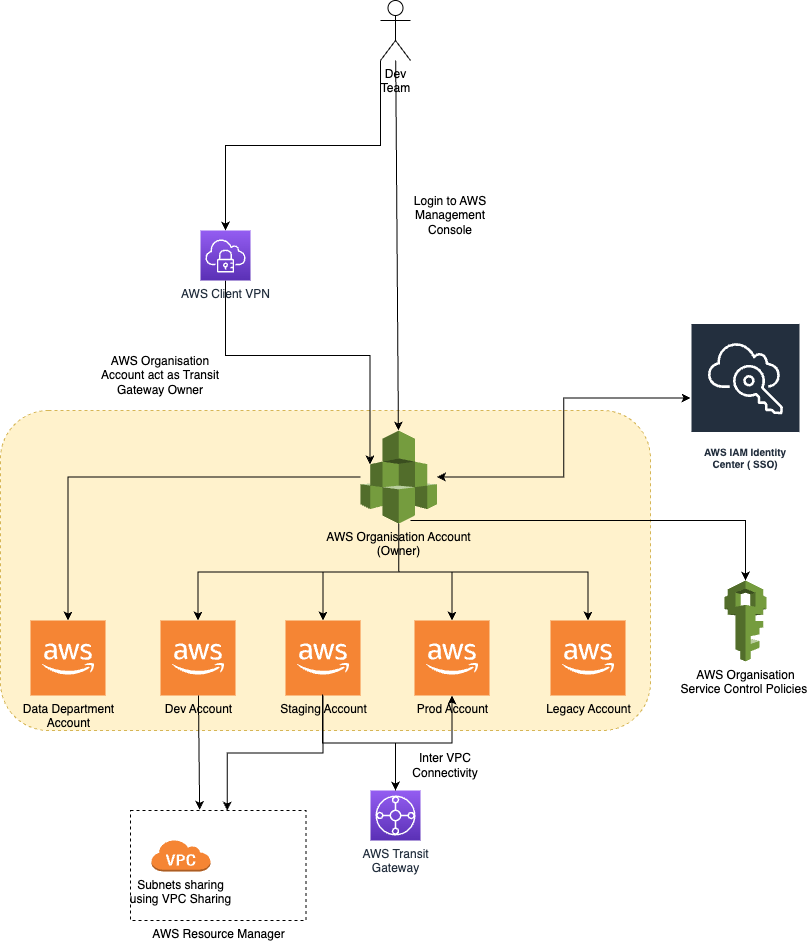

# AWS Organizations
- [AWS Organizations](https://aws.amazon.com/organizations/) lets you create new AWS accounts at no additional charge.
- More easily allocate resources, group accounts, and apply governance policies to accounts or groups.

# Why do I need multiple AWS accounts?
- [AWS accounts](https://docs.aws.amazon.com/accounts/latest/reference/welcome-multiple-accounts.html) serve as the fundamental security boundary in AWS. 
- They serve as a resource container that provides a useful level of isolation. 
- The ability to isolate resources and users is a key requirement to establishing a secure, well governed environment.

# Use Cases

| UC             | Examples                               |
|----------------|----------------------------------------|
| Dev Stage      | Production, Staging, Dev etc.          |
| Org Department | Infrastructure, Application, Data etc. |

# Useful Services

| AWS Service                                                                                    |
|------------------------------------------------------------------------------------------------|
| [AWS Firewall Manager](../2c_SecurityServices/2_InfraProtectionServices/AWSFirewallManager.md) |
| [AWS Resource Access Manager](AWSResourceAccessManager.md)                                     |
| [IAM Service Control Policy](../2a_IdentityServices/AWSIAM/IAMPolicyTypes.md)                  |

# Benefits

Separating your resources into separate AWS accounts helps you to support the following principles in your cloud environment:
- Security control 
- Isolation
- Many teams
- Data isolation
- Business process 
- Billing
- Quota allocation

All the recommendations and procedures described in this document are in compliance with the [AWS Well-Architected Framework](../AWS-Well-Architected-Framework.md).

# Steps to move an AWS account from one org to another

| Sequence | Step                                                                                                                                                                                                         |
|----------|--------------------------------------------------------------------------------------------------------------------------------------------------------------------------------------------------------------|
| Step1    | [Remove the member account from the old organization](https://docs.aws.amazon.com/organizations/latest/userguide/orgs_manage_accounts_remove.html#orgs_manage_accounts_remove-from-master)                   |
| Step2    | [Send an invite to the member account from the new organization](https://docs.aws.amazon.com/organizations/latest/userguide/orgs_manage_accounts_invites.html)                                               |
| Step3    | [Accept the invite to the new organization from the member account](https://docs.aws.amazon.com/organizations/latest/userguide/orgs_manage_accounts_invites.html#orgs_manage_accounts_accept-decline-invite) |
