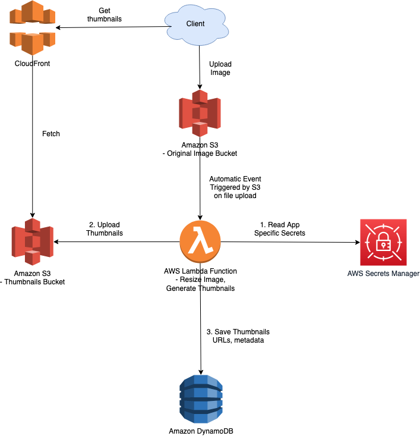

# AWS Secrets Manager
- [AWS Secrets Manager](https://aws.amazon.com/secrets-manager/) helps you manage, retrieve, and rotate database credentials, API keys, and other secrets throughout their lifecycles.

# How it works?
- Use [AWS Secrets Manager](https://aws.amazon.com/secrets-manager/) to store, rotate, monitor and control access to secrets such as database credentials, API keys and OAuth tokens. 
- Enable [secret rotation](https://docs.aws.amazon.com/secretsmanager/latest/userguide/rotating-secrets.html) using built-in integration for MySQL, PostgreSQL and [Amazon Aurora on Amazon RDS](../../6_DatabaseServices/AmazonRDS). 
- You can also enable rotation for other secrets using [AWS Lambda functions](../../3_ComputeServices/AWSLambda/Readme.md). 
- To retrieve secrets, you simply replace hard-coded secrets in applications with a call to Secrets Manager APIs, eliminating the need to expose plaintext secrets.



# Attach a policy
- In a resource-based policy, [you specify who can access the secret and the actions](https://docs.aws.amazon.com/secretsmanager/latest/userguide/auth-and-access_resource-policies.html) they can perform on the secret.

````json
{
    "Version": "2012-10-17",
    "Statement": [
        {
            "Effect": "Allow",
            "Principal": {
                "AWS": "arn:aws:iam::123456789012:role/MyRole"
            },
            "Action": "secretsmanager:GetSecretValue",
            "Resource": "*"
        }
    ]
}
````
# References
- [AWS Certified Solutions Architect Professional — Security — Secrets Manager](https://medium.com/codex/aws-certified-solutions-architect-professional-security-secrets-manager-f39137c72211)