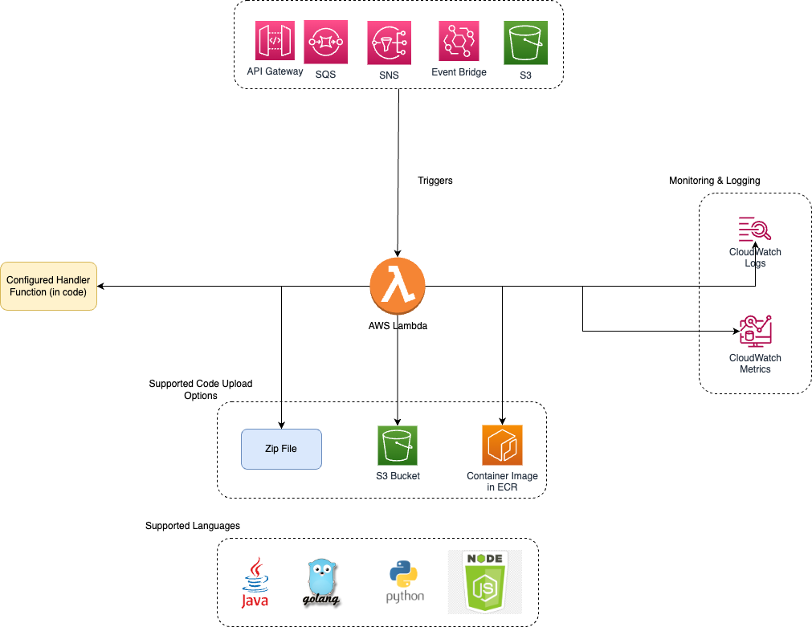

# AWS Lambda function handler
- Think of a function as a small, self-contained application.
- After you create your Lambda function, it is ready to run as soon as it is initiated.

# Supported Code Upload Options & Languages



# Handler function syntax

````go
package main

import (
        "fmt"
        "context"
        "github.com/aws/aws-lambda-go/lambda"
        )
        
type MyEvent struct {
    Name string `json:"name"`
}

func HandleRequest(ctx context.Context, name MyEvent) (string, error) {
    return fmt.Sprintf("Hello %s!", name.Name ), nil
}

func main() {
    lambda.Start(HandleRequest)
}
````

# Invoke AWS Lambda using AWS Cli

`aws lambda invoke --function-name ReturnBucketName outputfile.txt`

# Example Lambda function handler


# Reduce risk using versions and aliases

| Technique            | Description                                                                                                                                                                                                     |
|----------------------|-----------------------------------------------------------------------------------------------------------------------------------------------------------------------------------------------------------------|
| Versioning           | You can use versions to manage the deployment of your functions.<br/>- When you create a Lambda function, only one version exists, which is identified by $LATEST at the end of the Amazon Resource Name (ARN). |
| Publish              | Publish makes a snapshot copy of $LATEST.                                                                                                                                                                       |
| Aliases (like a tag) | A Lambda alias is like a pointer to a specific function version. You can access the function version using the alias ARN.                                                                                       |


# Shift traffic for Lambda using AWS CodeDeploy

Lambda is integrated with AWS CodeDeploy for automated rollout with traffic shifting. CodeDeploy supports multiple traffic shifting methods, in addition to alarms and hooks. CodeDeploy supports the following traffic-shifting patterns:
- Canary – Traffic is shifted in two increments. If the first increment is successful, the second is completed based on the time specified in the deployment. 
- Linear – With linear traffic shifting, traffic is slowly shifted in a predetermined percentage every X minutes based on how you have it configured. 
- All-at-once – Shifts all traffic from the original Lambda function to the updated Lambda function version at once.

