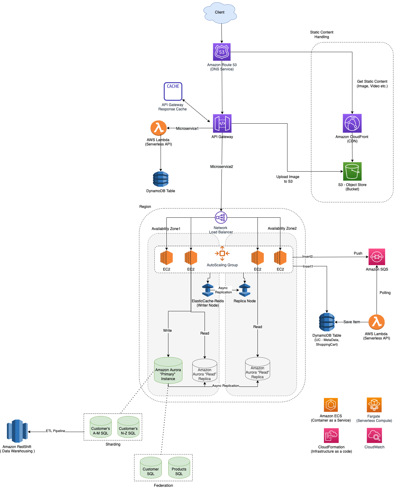

# Characteristics of an SQS queue as a Lambda event source

| Parameter                              | Limit       | Remarks                                                                                                                                                                                                                                                                                       |
|----------------------------------------|-------------|-----------------------------------------------------------------------------------------------------------------------------------------------------------------------------------------------------------------------------------------------------------------------------------------------|
| Concurrency Limit/Reserved Concurrency | Min. 5      | A concurrency limit that is set too low could definitely cause an increase in messages hitting the dead-letter queue.  - Anything less than five will generate errors out of the gate because [Lambda defaults to five processes]() pulling batches off the queue and invoking functions. |
| Processing time                        | Max 15 mins | The batch size * average message processing time should be less than 15 minutes.                                                                                                                                                                                              |

# Design Scalable System on AWS

[Read more](../../../3_HLDDesignProblems/AWSDesignScalableSystemWithRDMS/Readme.md)
