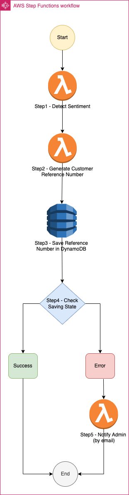

# AWS Step Functions
- [AWS Step Functions](https://docs.aws.amazon.com/step-functions/latest/dg/welcome.html) is a serverless orchestration service that lets you integrate with [AWS Lambda](AWSLambda/Readme.md) functions and other AWS services to build business-critical applications.

# General Use Cases

## Delay Lambda Functions for some time

[Read more](https://advancedweb.hu/how-to-delay-calling-a-lambda-function-using-step-functions/)

# References
- [Prototyping at speed with AWS Step Functions new Workflow Studio](https://aws.amazon.com/blogs/compute/prototyping-at-speed-with-aws-step-functions-new-workflow-studio/)
- [The Ultimate Guide to AWS Step Functions](https://dashbird.io/blog/ultimate-guide-aws-step-functions/)