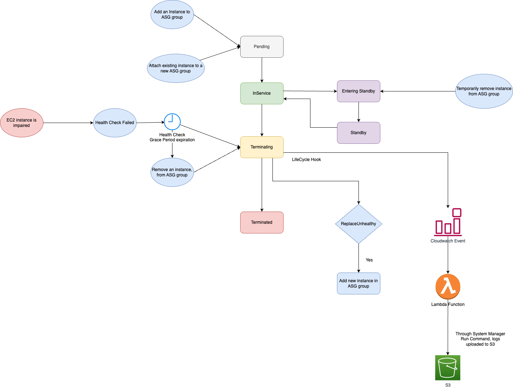

# Launch Template
- [Launch template](https://docs.aws.amazon.com/autoscaling/ec2/userguide/create-launch-template.html) includes the [ID of the Amazon Machine Image (AMI)](../AmazonMachineImages.md), the instance type, a key pair, security groups, and other parameters used to launch [EC2 instances](../Readme.md).

# Launch Template vs Launch Configuration

|                            | :+1: [Launch Template](https://docs.aws.amazon.com/autoscaling/ec2/userguide/create-launch-template.html) | Launch Configuration |
|----------------------------|-----------------------------------------------------------------------------------------------------------|----------------------|
| Strongly suggested by AWS? | :white_check_mark: Yes                                                                                    | :x: No               |
| Multiple Instance Types?   | :white_check_mark: Yes                                                                                    | :x: No               |
| Multiple Versions?         | :white_check_mark: Yes                                                                                    | :x: No               |
| Dedicated Host (host)      | :white_check_mark: Yes                                                                                    | :x: No               |
| Modifiable?                | :x: No                                                                                                    | :x: No               |

# Instance Placement Tenancy

| Tenancy                        | Supported Config                      | Remarks                                                                                                                                                                                                                                            |
|--------------------------------|---------------------------------------|----------------------------------------------------------------------------------------------------------------------------------------------------------------------------------------------------------------------------------------------------|
| Shared (default)               | Both launch template or configuration | Multiple AWS accounts may share the same physical hardware. - When you create a launch configuration, the default value for the instance placement tenancy is null and the instance tenancy is controlled by the tenancy attribute of the VPC. |
| Dedicated Instance (dedicated) | Both launch template or configuration | Your instance runs on single-tenant hardware.                                                                                                                                                                                                      |
| Dedicated Host (host)          | Only launch template                  | Your instance runs on a physical server with EC2 instance capacity fully dedicated to your use, an isolated server with configurations that you can control.                                                                                       |

[Read more](https://docs.aws.amazon.com/autoscaling/ec2/userguide/auto-scaling-dedicated-instances.html)

# Instance Lifecycles

[Read more](https://docs.aws.amazon.com/autoscaling/ec2/userguide/ec2-auto-scaling-lifecycle.html)