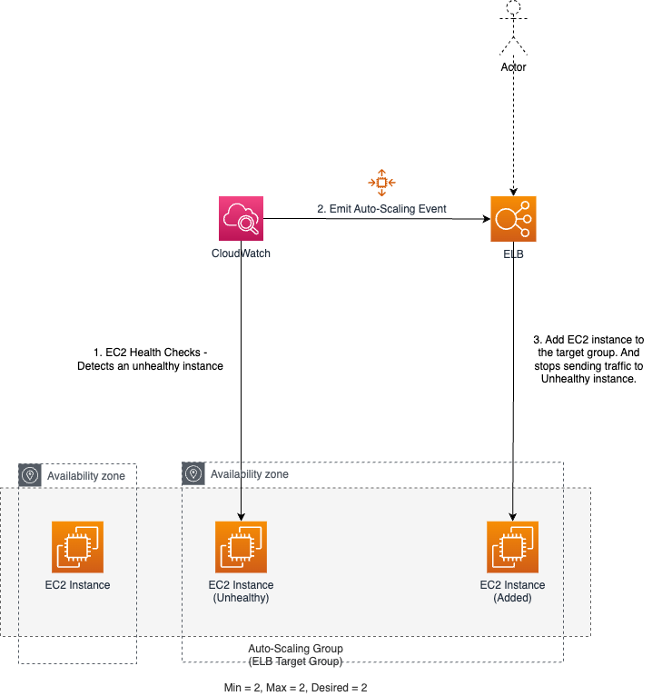

# AWS Auto-Scaling
- [AWS Auto-scaling Group (ASG)](https://aws.amazon.com/autoscaling/) is a function that allows you to [provision and launch new instances](../Readme.md) whenever there is a incoming demand. 
- It allows you to automatically increase or decrease resource capacity in relation to the demand.
- [AWS EC2 Auto Scaling](https://aws.amazon.com/getting-started/hands-on/ec2-auto-scaling-spot-instances/) enables you to automatically launch or terminate [Amazon EC2 instances](../Readme.md) based on user-defined policies, health status checks, and schedules.

# How Auto-Scaling works?
- [Amazon CloudWatch](../../../8_MonitoringServices/AmazonCloudWatch.md) detects that an [EC2 instance](../Readme.md) is not healthy and sends the message to [Auto-Scaling service](Readme.md).
- [Auto Scaling service](Readme.md) would then inform [ELB](../../../1_NetworkingAndContentDelivery/ElasticLoadBalancer/Readme.md) to add [another EC2 instance](../Readme.md)

# Types of Scaling

| Type of Scaling                  | Remarks                                                                                                                                                                                                                                                                                                                                                                                                                                                                    |
|----------------------------------|----------------------------------------------------------------------------------------------------------------------------------------------------------------------------------------------------------------------------------------------------------------------------------------------------------------------------------------------------------------------------------------------------------------------------------------------------------------------------|
| Step Scaling                     | We can use a [CloudWatch alarm](../../../8_MonitoringServices/AmazonCloudWatch.md) with Amazon EC2 Auto Scaling to scale your [Amazon EC2 instances](../Readme.md) based on demand. - For more information, see [Dynamic Scaling](https://docs.aws.amazon.com/autoscaling/ec2/userguide/as-scale-based-on-demand.html) in the Amazon EC2 Auto Scaling User Guide. - [Read more](https://docs.aws.amazon.com/autoscaling/ec2/userguide/as-scaling-simple-step.html) |
| Auto-Scaling based on Amazon SQS | Based on the [Amazon SQS](../../../5_MessageBrokerServices/AmazonSQS.md) queue size, the [auto-scaling of the EC2 instances](https://docs.aws.amazon.com/autoscaling/ec2/userguide/as-using-sqs-queue.html) can also be done. - Example Design - [Send-SMS-API design (App Internal Clients, Multiple SMS-Providers, AutoScaling)](../../../../3_HLDDesignProblems/NotificationSystem)                                                                                 |
| Scaling based on demand          | Autoscaling based on memory, CPU used.  - For example - Auto scale for CPU usage on a single instance rise above 80% for 5 mins.                                                                                                                                                                                                                                                                                                                                       |
| Scaling based on a schedule      | Best for Auto Scaling your EC2 instances for predictable traffic patterns                                                                                                                                                                                                                                                                                                                                                                                                  |

## Auto-Scaling based on Amazon SQS

# Steps to configure AutoScaling

| Title                                                                                                                                    | Description                                                                                                                                                                                                                                                                                                                                                                                                                                                                                    |
|------------------------------------------------------------------------------------------------------------------------------------------|------------------------------------------------------------------------------------------------------------------------------------------------------------------------------------------------------------------------------------------------------------------------------------------------------------------------------------------------------------------------------------------------------------------------------------------------------------------------------------------------|
| [Create a Launch template/configuration](https://docs.aws.amazon.com/autoscaling/ec2/userguide/create-launch-template.html)              |                                                                                                                                                                                                                                                                                                                                                                                                                                                                                                |
| Create [Auto Scaling group](https://docs.aws.amazon.com/autoscaling/ec2/userguide/auto-scaling-groups.html)                              | Specify Desired, Max & Min Nodes in the ASG group.                                                                                                                                                                                                                                                                                                                                                                                                                                             |
| Specify Network in ASG                                                                                                                   | We can specify availability zones of the Auto-Scaling Group (ASG) i.e. in which zones, new instances should be created.- This helps in [High Availability](../../../../1_HLDDesignComponents/0_SystemGlossaries/Reliability/HighAvailability.md).                                                                                                                                                                                                                                              |
| Tag Auto Scaling groups and instances                                                                                                    | A tag is a custom attribute label that you assign or that AWS assigns to an AWS resource.  Each tag has two parts:- A tag key (for example, costcenter, environment, or project)- An optional field known as a tag value (for example, 111122223333 or production)                                                                                                                                                                                                                         |
| [Attach a load balancer to your Auto Scaling group](https://docs.aws.amazon.com/autoscaling/ec2/userguide/attach-load-balancer-asg.html) | When you attach an [Application Load Balancer, Network Load Balancer, or Gateway Load Balancer](../../../1_NetworkingAndContentDelivery/ElasticLoadBalancer/Readme.md), you attach a [target group](../../../1_NetworkingAndContentDelivery/ElasticLoadBalancer/Readme.md). - [Amazon EC2 Auto Scaling]() adds instances to the attached target group when they are launched. - You can attach one or multiple target groups, and configure health checks on a per target group basis. |

## Network in ASG 

## ELB and ASG

# :thumbsdown: Disadvantages of AutoScaling
- It would be difficult to optimise the number of instances around the particular demands of the services. 
- For example - A whole new EC2 instance could be spun up due to the load on a first instance, but only utilised to 10% CPU.
- This can be resolved using [AWS Fargate - Serverless container service](../../AWSFargate.md).
- [During auto-scaling, it may take time (very roughly 30 mins) to go from 50 to 200 servers](https://youtu.be/mFpqrVxxwKc).

# References
- [AWS Autoscaling | AWS Autoscaling And Load Balancing | AWS Tutorial For Beginners | Simplilearn](https://www.youtube.com/watch?v=4EOaAkY4pNE)
- [How to do EC2 autoscaling?](https://docs.aws.amazon.com/autoscaling/ec2/userguide/get-started-with-ec2-auto-scaling.html)
- [Scaling based on Amazon SQS](https://docs.aws.amazon.com/autoscaling/ec2/userguide/as-using-sqs-queue.html)