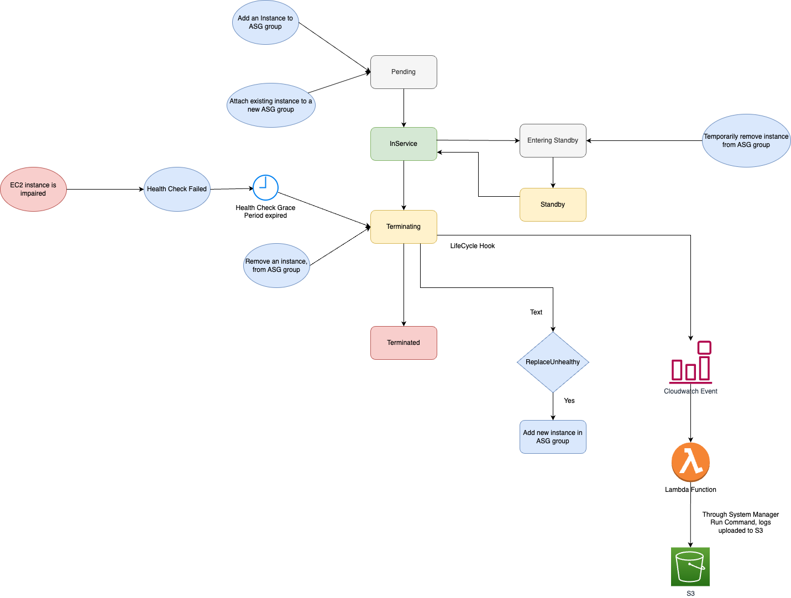

# AWS Auto-Scaling
- [AWS Auto-scaling Group (ASG)](https://aws.amazon.com/autoscaling/) is a function that allows you to [provision and launch new instances](../Readme.md) whenever there is a incoming demand.

# Types of Scaling

| Type            | Description                                                                                                                                                                  | Formula                                                     |
|-----------------|------------------------------------------------------------------------------------------------------------------------------------------------------------------------------|-------------------------------------------------------------|
| Fleet Scaling   | Maintain desired number of instances across AZs (for [high availability](../../../../1_HLDDesignComponents/0_SystemGlossaries/Reliability/HighAvailability.md)) at all time. | Desired-Capacity = Min-Capacity = Max-Capacity = Fleet-Size |
| Dynamic Scaling | Automatically increase or decrease resource capacity in relation to the demand                                                                                               | Based on demand                                             |

# How Auto-Scaling works?

# Scaling Policies
- [AWS EC2 Auto Scaling](https://aws.amazon.com/getting-started/hands-on/ec2-auto-scaling-spot-instances/) enables you to automatically launch or terminate [Amazon EC2 instances](../Readme.md) based on user-defined policies, health status checks, and schedules.

| Scaling policy                                                                                                                           | Type of Scaling | Description                                                                                                                                                                                                                                                                                                                                                                                                                                                                                                                           |
|------------------------------------------------------------------------------------------------------------------------------------------|-----------------|---------------------------------------------------------------------------------------------------------------------------------------------------------------------------------------------------------------------------------------------------------------------------------------------------------------------------------------------------------------------------------------------------------------------------------------------------------------------------------------------------------------------------------------|
| :star: [Step Scaling](https://docs.aws.amazon.com/autoscaling/ec2/userguide/as-scaling-simple-step.html#simple-scaling-policies-aws-cli) | Dynamic Scaling | [Step scaling policy](https://docs.aws.amazon.com/autoscaling/ec2/userguide/as-scaling-simple-step.html#simple-scaling-policies-aws-cli) can continue to respond to additional alarms, even while a scaling activity or health check replacement is in progress.  - Therefore, all alarms that are breached are evaluated by Amazon EC2 Auto Scaling as it receives the alarm messages.                                                                                                                                           |
| [Simple Scaling](https://docs.aws.amazon.com/autoscaling/ec2/userguide/as-scaling-simple-step.html)                                      | Dynamic Scaling | After a scaling activity is started, [the policy](https://docs.aws.amazon.com/autoscaling/ec2/userguide/as-scaling-simple-step.html) must wait for the scaling activity or health check replacement to complete and the [cooldown period](https://docs.aws.amazon.com/autoscaling/ec2/userguide/ec2-auto-scaling-scaling-cooldowns.html) to end before responding to additional alarms. - Cooldown periods help to prevent the initiation of additional scaling activities before the effects of previous activities are visible. |
| [Target Tracking](https://docs.aws.amazon.com/autoscaling/ec2/userguide/as-scaling-target-tracking.html)                                 | Dynamic Scaling | Target value that represents the ideal average utilization or throughput level for your application. - For example, let's say that you currently have an application that runs on two instances, and you want the CPU utilization of the Auto Scaling group to stay at around 50 percent when the load on the application changes.  - This gives you extra capacity to handle traffic spikes without maintaining an excessive number of idle resources.                                                                       |
| [Scheduled scaling](https://docs.aws.amazon.com/autoscaling/ec2/userguide/ec2-auto-scaling-scheduled-scaling.html)                       | Fleet Scaling   | Best for Auto Scaling your EC2 instances for predictable traffic patterns. - To use scheduled scaling, you create scheduled actions. Scheduled actions are performed automatically as a function of date and time.                                                                                                                                                                                                                                                                                                                |

# Scaling Metrics

| Metric                                                                                                 | Description                                                                                                                                                                                                                                                                                                                                                                         |
|--------------------------------------------------------------------------------------------------------|-------------------------------------------------------------------------------------------------------------------------------------------------------------------------------------------------------------------------------------------------------------------------------------------------------------------------------------------------------------------------------------|
| CPUUtilization                                                                                         | For example - Auto scale for CPU usage on a single instance rise above 80% for 5 mins.                                                                                                                                                                                                                                                                                              |
| Memory                                                                                                 | -                                                                                                                                                                                                                                                                                                                                                                                   |
| [Amazon SQS queue size](https://docs.aws.amazon.com/autoscaling/ec2/userguide/as-using-sqs-queue.html) | Based on the [Amazon SQS](../../../5_MessageBrokerServices/AmazonSQS.md) queue size, the [auto-scaling of the EC2 instances](https://docs.aws.amazon.com/autoscaling/ec2/userguide/as-using-sqs-queue.html) can also be done. - Example - [Send-SMS-API design (App Internal Clients, Multiple SMS-Providers, AutoScaling)](../../../../3_HLDDesignProblems/NotificationSystem) |

# Steps to configure AutoScaling

| Step                                                                                                                                     | Description                                                                                                                                                                                                                                                                                                                                                                                                                                                                                                                                                                   |
|------------------------------------------------------------------------------------------------------------------------------------------|-------------------------------------------------------------------------------------------------------------------------------------------------------------------------------------------------------------------------------------------------------------------------------------------------------------------------------------------------------------------------------------------------------------------------------------------------------------------------------------------------------------------------------------------------------------------------------|
| [Create a Launch template/configuration](https://docs.aws.amazon.com/autoscaling/ec2/userguide/create-launch-template.html)              | [Launch template/configuration](https://docs.aws.amazon.com/autoscaling/ec2/userguide/create-launch-template.html) includes the [ID of the Amazon Machine Image (AMI)](../AmazonMachineImages.md), the instance type, a key pair, security groups, and other parameters used to launch [EC2 instances](../Readme.md).  - However, [defining a launch template instead of a launch configuration](https://docs.aws.amazon.com/autoscaling/ec2/userguide/create-launch-template.html) allows you to have multiple instance types or multiple versions of a launch template. |
| [Create Auto Scaling group](https://docs.aws.amazon.com/autoscaling/ec2/userguide/auto-scaling-groups.html)                              | Specify Desired, Max & Min Capacity in the ASG group.                                                                                                                                                                                                                                                                                                                                                                                                                                                                                                                         |
| Specify Network in ASG                                                                                                                   | We can specify availability zones of the Auto-Scaling Group (ASG) i.e. in which zones, new instances should be created. - This helps in [High Availability](../../../../1_HLDDesignComponents/0_SystemGlossaries/Reliability/HighAvailability.md).                                                                                                                                                                                                                                                                                                                        |
| [Attach a load balancer to your Auto Scaling group](https://docs.aws.amazon.com/autoscaling/ec2/userguide/attach-load-balancer-asg.html) | When you attach an [Application Load Balancer, Network Load Balancer, or Gateway Load Balancer](../../../1_NetworkingAndContentDelivery/2_ApplicationNetworking/ElasticLoadBalancer/Readme.md), you attach a [target group](../../../1_NetworkingAndContentDelivery/2_ApplicationNetworking/ElasticLoadBalancer/Readme.md). - [Amazon EC2 Auto Scaling]() adds instances to the attached target group when they are launched. - You can attach one or multiple target groups, and configure health checks on a per target group basis.                                |
| Tag Auto Scaling groups and instances                                                                                                    | A tag is a custom attribute label that you assign or that AWS assigns to an AWS resource.  Each tag has two parts:- A tag key (for example, costcenter, environment, or project) - An optional field known as a tag value (for example, 111122223333 or production)                                                                                                                                                                                                                                                                                                   |

# Health check types

| Health check type                                       | What it checks                                                                                                      |
|---------------------------------------------------------|---------------------------------------------------------------------------------------------------------------------|
| Amazon EC2 status checks and scheduled events (Default) | Check if instance is running - Check for underlying hardware or software issues that might impair the instance. |
| ELB Health checks                                       | Checks whether the load balancer reports the instance as healthy.                                                   |
| Custom Health Checks                                    | Checks for any other problems that might indicate instance health issues, according to the custom health checks.    |

[Read more](https://docs.aws.amazon.com/autoscaling/ec2/userguide/ec2-auto-scaling-health-checks.html)

# Instance Lifecycles

[Read more](https://docs.aws.amazon.com/autoscaling/ec2/userguide/ec2-auto-scaling-lifecycle.html)

# ELB and ASG

# :thumbsdown: Disadvantages of AutoScaling
- It would be difficult to optimise the number of instances around the particular demands of the services. 
- For example - A whole new EC2 instance could be spun up due to the load on a first instance, but only utilised to 10% CPU.
- This can be resolved using [AWS Fargate - Serverless container service](../../AWSFargate.md).
- [During auto-scaling, it may take time (very roughly 30 mins) to go from 50 to 200 servers](https://youtu.be/mFpqrVxxwKc).

# References
- [AWS Autoscaling | AWS Autoscaling And Load Balancing | AWS Tutorial For Beginners | Simplilearn](https://www.youtube.com/watch?v=4EOaAkY4pNE)
- [Automating Management of Amazon EC2 Instances - March 2017 AWS Online Tech Talks](https://www.youtube.com/watch?v=bSRTAMPqS3E&t=2034s)
- [How to do EC2 autoscaling?](https://docs.aws.amazon.com/autoscaling/ec2/userguide/get-started-with-ec2-auto-scaling.html)
- [Scaling based on Amazon SQS](https://docs.aws.amazon.com/autoscaling/ec2/userguide/as-using-sqs-queue.html)