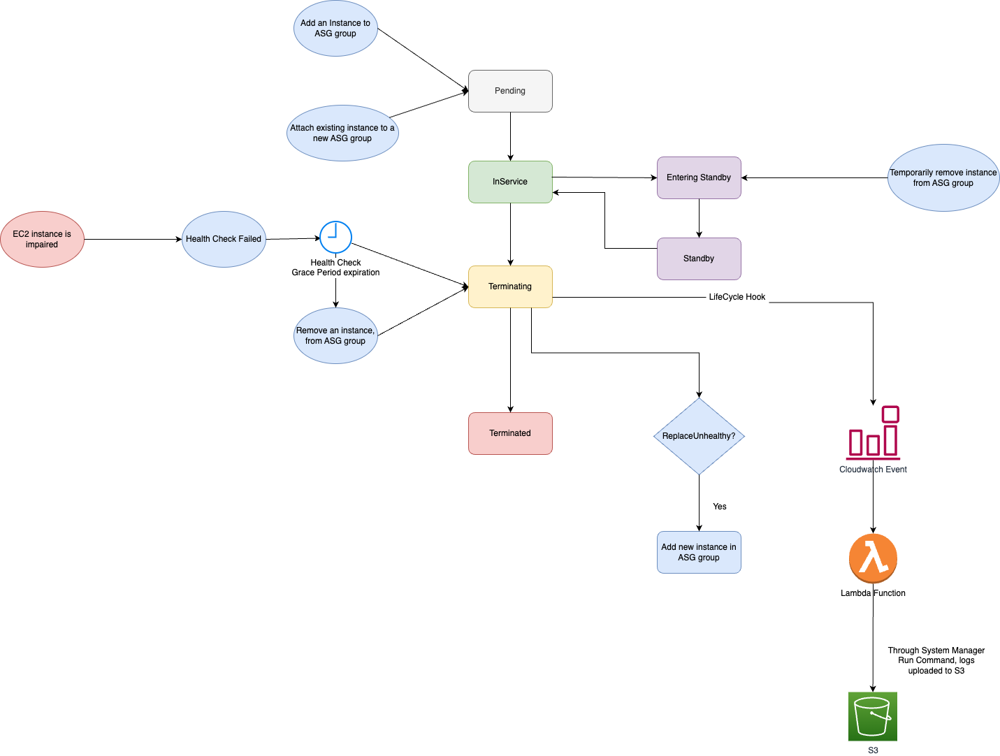
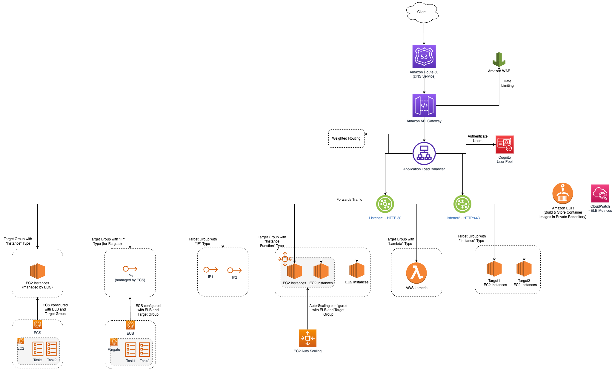

# AWS Auto-Scaling
- [AWS Auto-scaling Group (ASG)](https://aws.amazon.com/autoscaling/) is a function that allows you to [provision and launch new instances](../Readme.md) whenever there is a incoming demand.
- [Scaling Policies](ScalingPolicies.md)

# How Auto-Scaling works?

# Steps to configure AutoScaling

| Step                                                                                                                                     | Description                                                                                                                                                                                                                                                                                                                                                                                                                                                                                                                                                                   |
|------------------------------------------------------------------------------------------------------------------------------------------|-------------------------------------------------------------------------------------------------------------------------------------------------------------------------------------------------------------------------------------------------------------------------------------------------------------------------------------------------------------------------------------------------------------------------------------------------------------------------------------------------------------------------------------------------------------------------------|
| [Create a Launch template/configuration](https://docs.aws.amazon.com/autoscaling/ec2/userguide/create-launch-template.html)              | [Launch template/configuration](https://docs.aws.amazon.com/autoscaling/ec2/userguide/create-launch-template.html) includes the [ID of the Amazon Machine Image (AMI)](../AmazonMachineImages.md), the instance type, a key pair, security groups, and other parameters used to launch [EC2 instances](../Readme.md).  - However, [defining a launch template instead of a launch configuration](https://docs.aws.amazon.com/autoscaling/ec2/userguide/create-launch-template.html) allows you to have multiple instance types or multiple versions of a launch template. |
| [Create Auto Scaling group](https://docs.aws.amazon.com/autoscaling/ec2/userguide/auto-scaling-groups.html)                              | Specify Desired, Max & Min Capacity in the ASG group.                                                                                                                                                                                                                                                                                                                                                                                                                                                                                                                         |
| Specify Availability Zone, Network                                                                                                       | We can specify availability zones of the Auto-Scaling Group (ASG) i.e. in which zones, new instances should be created.                                                                                                                                                                                                                                                                                                                        |
| [Attach a load balancer to your Auto Scaling group](https://docs.aws.amazon.com/autoscaling/ec2/userguide/attach-load-balancer-asg.html) | When you attach an [Application Load Balancer, Network Load Balancer, or Gateway Load Balancer](../../../1_NetworkingAndContentDelivery/2_ApplicationNetworking/ElasticLoadBalancer/Readme.md), you attach a [target group](../../../1_NetworkingAndContentDelivery/2_ApplicationNetworking/ElasticLoadBalancer/Readme.md). - [Amazon EC2 Auto Scaling]() adds instances to the attached target group when they are launched. - You can attach one or multiple target groups, and configure health checks on a per target group basis.                                |
| Tag Auto Scaling groups and instances                                                                                                    | A tag is a custom attribute label that you assign or that AWS assigns to an AWS resource.  Each tag has two parts:- A tag key (for example, costcenter, environment, or project) - An optional field known as a tag value (for example, 111122223333 or production)                                                                                                                                                                                                                                                                                                   |

# Health check types

| Health check type                                       | What it checks                                                                                                                      |
|---------------------------------------------------------|-------------------------------------------------------------------------------------------------------------------------------------|
| Amazon EC2 status checks and scheduled events (Default) | Check if [instance is running](../Readme.md) - Check for underlying hardware or software issues that might impair the instance. |
| ELB Health checks                                       | Checks whether the load balancer reports the instance as healthy.                                                                   |
| Custom Health Checks                                    | Checks for any other problems that might indicate instance health issues, according to the custom health checks.                    |

[Read more](https://docs.aws.amazon.com/autoscaling/ec2/userguide/ec2-auto-scaling-health-checks.html)

# Instance Lifecycles

[Read more](https://docs.aws.amazon.com/autoscaling/ec2/userguide/ec2-auto-scaling-lifecycle.html)

# ELB and ASG

# :thumbsdown: Disadvantages of AutoScaling

| Disadvantage                      | Description                                                                                                                                                                                                                                                                                                                                   |
|-----------------------------------|-----------------------------------------------------------------------------------------------------------------------------------------------------------------------------------------------------------------------------------------------------------------------------------------------------------------------------------------------|
| Difficult to predict              | It would be difficult to optimise the number of instances around the particular demands of the services. - For example - A whole new EC2 instance could be spun up due to the load on a first instance, but only utilised to 10% CPU. - This can be resolved using [AWS Fargate - Serverless container service](../../AWSFargate.md). |
| Takes a bit of time to auto-scale | [During auto-scaling, it may take time (very roughly 30 mins) to go from 50 to 200 servers](https://youtu.be/mFpqrVxxwKc).                                                                                                                                                                                                                                                                                                                                              |

# References
- [AWS Autoscaling | AWS Autoscaling And Load Balancing | AWS Tutorial For Beginners | Simplilearn](https://www.youtube.com/watch?v=4EOaAkY4pNE)
- [Automating Management of Amazon EC2 Instances - March 2017 AWS Online Tech Talks](https://www.youtube.com/watch?v=bSRTAMPqS3E&t=2034s)
- [How to do EC2 autoscaling?](https://docs.aws.amazon.com/autoscaling/ec2/userguide/get-started-with-ec2-auto-scaling.html)
- [Scaling based on Amazon SQS](https://docs.aws.amazon.com/autoscaling/ec2/userguide/as-using-sqs-queue.html)