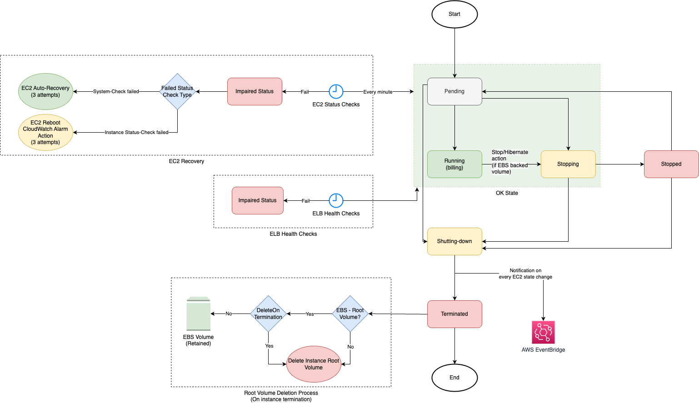

# EC2 Instance Life Cycle

# Other Points
- Amazon EC2 sends an [EC2 Instance State-change Notification event](https://docs.aws.amazon.com/AWSEC2/latest/UserGuide/monitoring-instance-state-changes.html) to [Amazon EventBridge](../../5_MessageBrokerServices/AmazonEventBridge.md) when the state of an instance changes.  