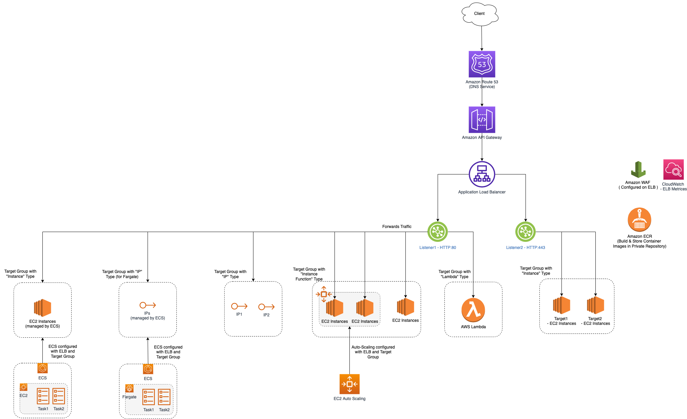

# Amazon EC2 - Elastic Compute Cloud
- [Amazon EC2 - Elastic Compute Cloud](https://aws.amazon.com/ec2/) offers the broadest and deepest compute platform, with over 500 instances and choice of the latest processor, storage, networking, operating system, and purchase model to help you best match the needs of your workload.
- So, you don’t have to invest in costly physical services. 
- Instead, you can create virtual machines with [Amazon EC2 - Elastic Compute Cloud](https://aws.amazon.com/ec2/) while managing other server features such as ports, security, and storage. 
- Spend less time maintaining your servers and more time on your strategic projects. 
- Invariably, Amazon EC2 is one of the most popular and fastest-growing of the many AWS services.

# EC2 with ELB

# How EC2 Auto-Scaling works?

- [Read here](AutoScalingGroup/README.md)

# Instance Types

| Type                                                                                                                                          | Description                                                                                                                                                                                                                                                                                                                                                                                                                                | Example        | UC                                                                                                                                                                                                                                                                  |
|-----------------------------------------------------------------------------------------------------------------------------------------------|--------------------------------------------------------------------------------------------------------------------------------------------------------------------------------------------------------------------------------------------------------------------------------------------------------------------------------------------------------------------------------------------------------------------------------------------|----------------|---------------------------------------------------------------------------------------------------------------------------------------------------------------------------------------------------------------------------------------------------------------------|
| [General Purpose - Burstable performance instances](https://docs.aws.amazon.com/AWSEC2/latest/UserGuide/burstable-performance-instances.html) | The T instance family provides a baseline CPU performance with the ability to burst above the baseline at any time for as long as required.                                                                                                                                                                                                                                                                                                | t2.medium      | Micro-services, low-latency interactive applications, small and medium databases, virtual desktops, development environments, code repositories, and business-critical applications.                                                                                |
| :star: [General Purpose - M family](https://aws.amazon.com/ec2/instance-types/)                                                               | Amazon EC2 M6g instances are powered by Arm-based AWS Graviton2 processors.  - They deliver up to 40% better price/performance over [current generation M5 instances](https://aws.amazon.com/ec2/instance-types/m5/) and offer a balance of compute, memory, and networking resources for a broad set of workloads.                                                                                                                    | m6g.large      | Applications built on open-source software such as application servers, microservices, gaming servers, mid-size data stores, and caching fleets.                                                                                                                    |
| [Compute Optimized](https://aws.amazon.com/ec2/instance-types/)                                                                               | Compute Optimized instances are ideal for compute bound applications that benefit from high performance processors.  - Instances belonging to this family are well suited for batch processing workloads, media transcoding, high performance web servers, high performance computing (HPC), scientific modeling, dedicated gaming servers and ad server engines, machine learning inference and other compute intensive applications. | c7g.large      | High performance computing (HPC), batch processing, ad serving, video encoding, gaming, scientific modelling, distributed analytics, and CPU-based machine learning inference.                                                                                      |
| [Memory Optimized](https://aws.amazon.com/ec2/instance-types/)                                                                                | Memory optimized instances are designed to deliver fast performance for workloads that process large data sets in memory.                                                                                                                                                                                                                                                                                                                  | r6a.large      | Memory-intensive workloads, such as SAP, SQL, and NoSQL databases; distributed web scale in-memory caches, such as Memcached and Redis; in-memory databases and real-time big data analytics, such as Hadoop and Spark clusters; and other enterprise applications. |
| [Accelerated Computing](https://aws.amazon.com/ec2/instance-types/)                                                                           | Accelerated computing instances use hardware accelerators, or co-processors, to perform functions, such as floating point number calculations, graphics processing, or data pattern matching, more efficiently than is possible in software running on CPUs.                                                                                                                                                                               | p4d.24xlarge 	 | Machine learning, high performance computing, computational fluid dynamics, computational finance, seismic analysis, speech recognition, autonomous vehicles, and drug discovery.                                                                                   |

Follow these best practices to get the maximum benefit from burstable performance instances.
- Ensure that the instance size you choose passes the minimum memory requirements of your operating system and applications. Operating systems with graphical user interfaces that consume significant memory and CPU resources (for example, Windows) might require a t3.micro or larger instance size for many use cases. As the memory and CPU requirements of your workload grow over time, you have the flexibility with the T instances to scale to larger instance sizes of the same instance type, or to select another instance type.
- Enable [AWS Compute Optimizer](https://aws.amazon.com/compute-optimizer/getting-started/) for your account and review the Compute Optimizer recommendations for your workload. Compute Optimizer can help assess whether instances should be upsized to improve performance or downsized for cost savings.

## Other Links
- [Getting Started with AWS Compute Optimizer](https://aws.amazon.com/compute-optimizer/getting-started/)