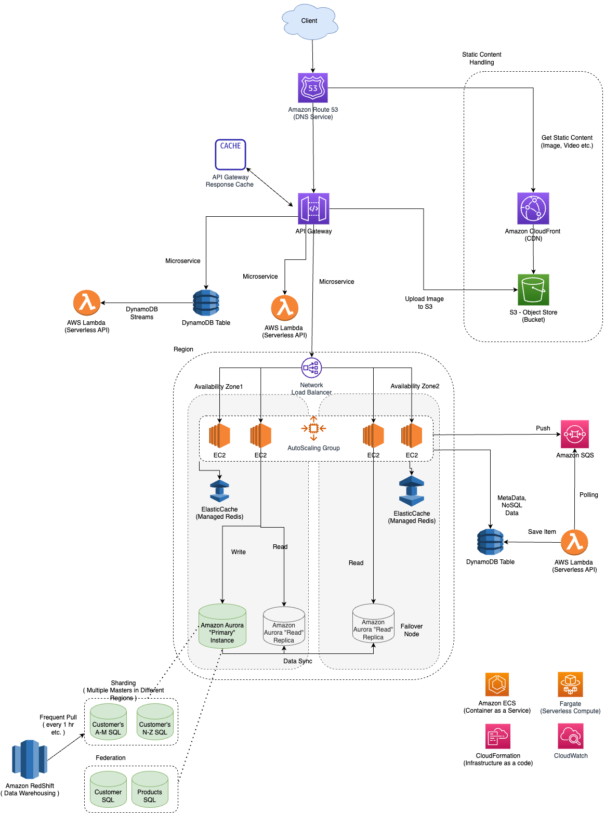

# Amazon EC2 - Elastic Compute Cloud
- [Amazon EC2 - Elastic Compute Cloud](https://aws.amazon.com/ec2/) offers the broadest and deepest compute platform, with over 500 instances and choice of the latest processor, storage, networking, operating system, and purchase model to help you best match the needs of your workload.
- Instead, you can create virtual machines with [Amazon EC2 - Elastic Compute Cloud](https://aws.amazon.com/ec2/) while managing other server features such as ports, security, and storage. 
- Spend less time maintaining your own costly physical servers and more time on your strategic projects.

# EC2, AMI, Root Volumes, EBS

# EC2 with ELB

# How EC2 Auto-Scaling works?

[Read here](AutoScalingGroup/Readme.md)

# Features

| Feature                                                                                                                                  | Remarks                                                                                                                                                                                                                                                                                                                                     |
|------------------------------------------------------------------------------------------------------------------------------------------|---------------------------------------------------------------------------------------------------------------------------------------------------------------------------------------------------------------------------------------------------------------------------------------------------------------------------------------------|
| [EC2 Auto Scaling](AutoScalingGroup/Readme.md)                                                                                           | -                                                                                                                                                                                                                                                                                                                                           |
| [Amazon Machine Images (AMI)](AmazonMachineImages.md)                                                                                    | -                                                                                                                                                                                                                                                                                                                                           |
| [Root Volume, depending on AMI](https://docs.aws.amazon.com/AWSEC2/latest/UserGuide/RootDeviceStorage.html#choose-an-ami-by-root-device) | An EC2 instance can be launched from either an [instance store-backed AMI]() or an [Amazon EBS-backed AMI](). - By default, the root volume for an AMI backed by Amazon EBS is deleted when the instance terminates. - To change the default behavior, set the DeleteOnTermination attribute to false using a block device mapping. |
| [Security Group](../../2_SecurityAndIdentityServices/3_InfraProtectionServices/VPCSecurityGroup.md)                                      | -                                                                                                                                                                                                                                                                                                                                           |
| [User Data](UserData.md)                                                                                                                 | -                                                                                                                                                                                                                                                                                                                                           |
| [State change events for your instances](https://docs.aws.amazon.com/AWSEC2/latest/UserGuide/monitoring-instance-state-changes.html)     | Amazon EC2 sends an [EC2 Instance State-change Notification event](https://docs.aws.amazon.com/AWSEC2/latest/UserGuide/monitoring-instance-state-changes.html) to [Amazon EventBridge](../../5_MessageBrokerServices/AmazonEventBridge.md) when the state of an instance changes.                                                           |

# :star: Pricing Options

| Option                                                                                                                                       | Ideal Use Cases                                                                                | Price Comparison                                    | Description                                                                                                                                                                                                                                                                                                                                                                                                                                                   |
|----------------------------------------------------------------------------------------------------------------------------------------------|------------------------------------------------------------------------------------------------|-----------------------------------------------------|---------------------------------------------------------------------------------------------------------------------------------------------------------------------------------------------------------------------------------------------------------------------------------------------------------------------------------------------------------------------------------------------------------------------------------------------------------------|
| [On-Demand](https://aws.amazon.com/ec2/pricing/)                                                                                             | Short-term, spiky, or unpredictable workloads that cannot be interrupted                       | Fixed per hour                                      | With On-Demand Instances, you pay for compute capacity with no long-term commitments.  - Billing begins whenever the instance is running, and billing stops when the instance is in a stopped or terminated state.                                                                                                                                                                                                                                        |
| [Reserved](https://aws.amazon.com/ec2/pricing/)                                                                                              | Long term business plans.  - Predictable & steady traffic.                                 | Up to 72% compared to On-Demand pricing             | Amazon EC2 Reserved Instances (RI) provide a significant discount (up to 72%) compared to On-Demand pricing and provide a capacity reservation when used in a specific Availability Zone.                                                                                                                                                                                                                                                                     |
| [Spot Instances](https://docs.aws.amazon.com/AWSEC2/latest/UserGuide/using-spot-instances.html)                                              | Disruptions are tolerable.  - Flexible start and end times, like Big data jobs.            | Up to a 90% discount compared to On-Demand prices.  | Amazon EC2 Spot Instances allow you to take advantage of unused EC2 capacity in the AWS Cloud.  - Note - Spot instances can be taken back by AWS with two minutes of notice.                                                                                                                                                                                                                                                                              |
| [Saving Plans](https://aws.amazon.com/savingsplans/)                                                                                         | Commitment to a consistent amount of usage (measured in $/hour) for a one- or three-year term. | -                                                   | Savings Plans is a flexible pricing model that offers low prices on EC2, Lambda, and Fargate usage, in exchange for a commitment to a consistent amount of usage (measured in $/hour) for a 1 or 3 year term.                                                                                                                                                                                                                                                 |
| [Dedicated Instances](https://docs.aws.amazon.com/AWSEC2/latest/UserGuide/dedicated-hosts-overview.html#dedicated-hosts-dedicated-instances) | -                                                                                              | Per-instance billing                                | Dedicated Instances are Amazon EC2 instances that run in a virtual private cloud (VPC) on hardware that's dedicated to a single customer.  - Dedicated Instances that belong to different AWS accounts are physically isolated at a hardware level, even if those accounts are linked to a single-payer account. - However, Dedicated Instances may share hardware with other instances from the same AWS account that are not Dedicated Instances.   |
| [Dedicated Hosts](https://aws.amazon.com/ec2/dedicated-hosts/pricing/)                                                                       | Allows you to consistently deploy your instances to the same physical server over time.        | Per-host billing, Costlier than Dedicated Instances | A Dedicated Host is a physical EC2 server dedicated for your use.  - Dedicated Hosts can help you reduce costs by allowing you to use your existing server-bound software licenses, including Windows Server, SQL Server, and SUSE Linux Enterprise Server (subject to your license terms), and can also help you meet compliance requirements. - With a Dedicated Host, you have visibility and control over how instances are placed on the server. |

# Instance Types

| Type                                                                                                                                                  | Description                                                                                                                                                                                                                                                                                                                                                                                                                                | Example          | Use Cases                                                                                                                                                                                                                                                           |
|-------------------------------------------------------------------------------------------------------------------------------------------------------|--------------------------------------------------------------------------------------------------------------------------------------------------------------------------------------------------------------------------------------------------------------------------------------------------------------------------------------------------------------------------------------------------------------------------------------------|------------------|---------------------------------------------------------------------------------------------------------------------------------------------------------------------------------------------------------------------------------------------------------------------|
| :star:  [General Purpose - Burstable performance instances](https://docs.aws.amazon.com/AWSEC2/latest/UserGuide/burstable-performance-instances.html) | The T instance family provides a baseline CPU performance with the ability to burst above the baseline at any time for as long as required.                                                                                                                                                                                                                                                                                                | t2.medium        | Micro-services, low-latency interactive applications, small and medium databases, virtual desktops, development environments, code repositories, and business-critical applications.                                                                                |
| :star: [General Purpose - M family](https://aws.amazon.com/ec2/instance-types/)                                                                       | Amazon EC2 M6g instances are powered by Arm-based AWS Graviton2 processors.  - They deliver up to 40% better price/performance over [current generation M5 instances](https://aws.amazon.com/ec2/instance-types/m5/) and offer a balance of compute, memory, and networking resources for a broad set of workloads.                                                                                                                    | m6g.large        | Applications built on open-source software such as application servers, microservices, gaming servers, mid-size data stores, and caching fleets.                                                                                                                    |
| [Compute Optimized](https://aws.amazon.com/ec2/instance-types/)                                                                                       | Compute Optimized instances are ideal for compute bound applications that benefit from high performance processors.  - Instances belonging to this family are well suited for batch processing workloads, media transcoding, high performance web servers, high performance computing (HPC), scientific modeling, dedicated gaming servers and ad server engines, machine learning inference and other compute intensive applications. | c7g.large        | High performance computing (HPC), batch processing, ad serving, video encoding, gaming, scientific modelling, distributed analytics, and CPU-based machine learning inference.                                                                                      |
| [Memory Optimized](https://aws.amazon.com/ec2/instance-types/)                                                                                        | Memory optimized instances are designed to deliver fast performance for workloads that process large data sets in memory.                                                                                                                                                                                                                                                                                                                  | r6a.large        | Memory-intensive workloads, such as SAP, SQL, and NoSQL databases; distributed web scale in-memory caches, such as Memcached and Redis; in-memory databases and real-time big data analytics, such as Hadoop and Spark clusters; and other enterprise applications. |
| [Accelerated Computing](https://aws.amazon.com/ec2/instance-types/)                                                                                   | Accelerated computing instances use hardware accelerators, or co-processors, to perform functions, such as floating point number calculations, graphics processing, or data pattern matching, more efficiently than is possible in software running on CPUs.                                                                                                                                                                               | p4d.24xlarge 	   | Machine learning, high performance computing, computational fluid dynamics, computational finance, seismic analysis, speech recognition, autonomous vehicles, and drug discovery.                                                                                   |
| Storage Optimized                                                                                                                                     | Designed for workloads that require high, sequential read and write access to large datasets on local storage.  - They are optimized to deliver tens of thousands of low-latency random I/O operations per second (IOPS) to applications that replicate their data across different instances.                                                                                                                                         | -                | NoSQL databases, such as Cassandra, MongoDB, and Redis, in-memory databases, scale-out transactional databases, data warehousing, Elasticsearch, and analytics.                                                                                                     |

## Best Practices with burstable performance instances
- Ensure that the instance size you choose passes the minimum memory requirements of your operating system and applications. 
- Operating systems with graphical user interfaces that consume significant memory and CPU resources (for example, Windows) might require a t3.micro or larger instance size for many use cases. As the memory and CPU requirements of your workload grow over time, you have the flexibility with the T instances to scale to larger instance sizes of the same instance type, or to select another instance type.
- Enable [AWS Compute Optimizer](https://aws.amazon.com/compute-optimizer/getting-started/) for your account and review the Compute Optimizer recommendations for your workload. Compute Optimizer can help assess whether instances should be upsized to improve performance or downsized for cost savings.
- Enable [Instance Scheduler on AWS](https://aws.amazon.com/solutions/implementations/instance-scheduler-on-aws/) to configure start and stop schedules for your Amazon EC2 and [Amazon RDS instances](../../6_DatabaseServices/AmazonRDS/Readme.md) to manage costs.

# Placement groups

| Group                                                                                  | Use Case                                                                                                                                                                                                                                                                                                                                  | Description                                                                                                                                                                            |
|----------------------------------------------------------------------------------------|-------------------------------------------------------------------------------------------------------------------------------------------------------------------------------------------------------------------------------------------------------------------------------------------------------------------------------------------|----------------------------------------------------------------------------------------------------------------------------------------------------------------------------------------|
| [Cluster](https://docs.aws.amazon.com/AWSEC2/latest/UserGuide/placement-groups.html)   | High-performance computing (HPC) applications, which need low-latency network performance for tightly coupled node-2-node communication.                                                                                                                                                                                                  | Packs instances close together inside an Availability Zone.                                                                                                                            |
| [Partition](https://docs.aws.amazon.com/AWSEC2/latest/UserGuide/placement-groups.html) | Large distributed and replicated workloads, such as [Hadoop](../../../1_HLDDesignComponents/5_BigDataComponents/BatchProcessing/ApacheHadoop/Readme.md), [Cassandra](../../../1_HLDDesignComponents/3_DatabaseComponents/NoSQL-Databases/ApacheCasandra.md), and [Kafka](../../../1_HLDDesignComponents/4_MessageBrokers/Kafka/Readme.md) | Spreads your instances across logical partitions such that groups of instances in one partition do not share the underlying hardware with groups of instances in different partitions. |
| [Spread](https://docs.aws.amazon.com/AWSEC2/latest/UserGuide/placement-groups.html)    | Reduce correlated failures                                                                                                                                                                                                                                                                                                                | Strictly places a small group of instances across distinct underlying hardware to reduce correlated failures.                                                                          |

# Fleets

|            | Description                                                                                                                                                                                                                                                                                                                                                            |
|------------|------------------------------------------------------------------------------------------------------------------------------------------------------------------------------------------------------------------------------------------------------------------------------------------------------------------------------------------------------------------------|
| EC2 Fleet  | An [EC2 Fleet](https://docs.aws.amazon.com/AWSEC2/latest/UserGuide/ec2-fleet.html) contains the configuration information to launch a fleet—or group—of instances. In a single API call, a fleet can launch multiple instance types across multiple Availability Zones, using the On-Demand Instance, Reserved Instance, and Spot Instance purchasing options together |
| Spot Fleet | A [Spot Fleet](https://docs.aws.amazon.com/AWSEC2/latest/UserGuide/spot-fleet.html) is a set of Spot Instances and optionally On-Demand Instances that is launched based on criteria that you specify. The Spot Fleet selects the Spot capacity pools that meet your needs and launches Spot Instances to meet the target capacity for the fleet.                      |

# References
- [Getting Started with AWS Compute Optimizer](https://aws.amazon.com/compute-optimizer/getting-started/)