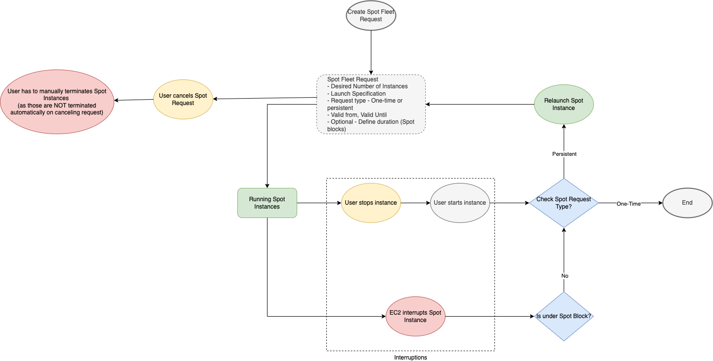

# Spot Instances
- A [Spot Instance](https://docs.aws.amazon.com/AWSEC2/latest/UserGuide/using-spot-instances.html) is an instance that uses spare EC2 capacity that is available for less than the On-Demand price.
- However, Spot does not guarantee that you can keep your running instances long enough to finish your workloads. 
- Spot also does not guarantee that you can get immediate availability of the instances that you are looking for, or that you can always get the aggregate capacity that you requested.

# Use Cases

| Use Case                         |
|----------------------------------|
| Big data                         |
| Containerized workloads          |
| CI/CD                            |
| Stateless web servers            |
| High performance computing (HPC) |
| Rendering workloads              |

# Reference
- [Work with Spot Instances](https://docs.aws.amazon.com/AWSEC2/latest/UserGuide/spot-requests.html)
