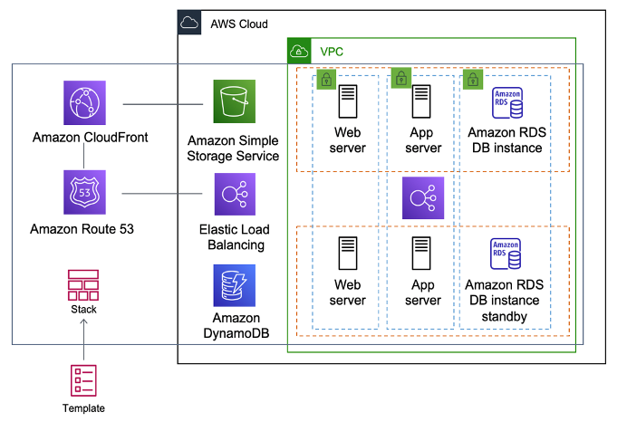

# [AWS CloudFormation - Infrastructure as a CODE](https://aws.amazon.com/cloudformation/)
- AWS CloudFormation is a service that helps you model and set up your AWS resources so that you can spend less time managing those resources and more time focusing on your applications that run in AWS.
- [You create a template](https://docs.aws.amazon.com/AWSCloudFormation/latest/UserGuide/gettingstarted.templatebasics.html) that describes all the AWS resources that you want (like [Amazon EC2 instances](../../4_ComputeServices/EC2) or [Amazon RDS DB instances](../../6_DatabaseServices/AmazonRDS.md)), and CloudFormation takes care of provisioning and configuring those resources for you.
- You don't need to individually create and configure AWS resources and figure out what's dependent on what - CloudFormation handles that.

[A CloudFormation template](https://docs.aws.amazon.com/AWSCloudFormation/latest/UserGuide/gettingstarted.templatebasics.html) is deployed into the AWS environment as a [STACK](https://docs.aws.amazon.com/AWSCloudFormation/latest/UserGuide/stacks.html). 
- You can manage stacks through the AWS Management Console, AWS Command Line Interface, or AWS CloudFormation APIs. 
- If you need to make changes to the running resources in a stack, you update the stack. 
- Before making changes to your resources, [you can generate a change set](https://docs.aws.amazon.com/AWSCloudFormation/latest/UserGuide/using-cfn-updating-stacks-changesets.html), which is a summary of your proposed changes. 
- [Change sets](https://docs.aws.amazon.com/AWSCloudFormation/latest/UserGuide/using-cfn-updating-stacks-changesets.html) enable you to see how your changes might impact your running resources, especially for critical resources, before implementing them.

# What are the steps involved in a CloudFormation Solution?
- [Create or use an existing CloudFormation template](https://docs.aws.amazon.com/AWSCloudFormation/latest/UserGuide/gettingstarted.templatebasics.html) using `JSON or YAML format`.
- Save the code in an [S3 bucket](../../7_StorageServices/AmazonS3.md), which serves as a repository for the code.
- Use AWS CloudFormation to call the bucket and [create a stack on your template](https://docs.aws.amazon.com/AWSCloudFormation/latest/UserGuide/stacks.html).
- CloudFormation reads the file and understands the services that are called, their order, the relationship between the services, and provisions the services one after the other.

# :thumbsup: Pros and Cons

| Pros                                 | Cons                                      |
|--------------------------------------|-------------------------------------------|
| Makes your life easier               | Steep Learning Curve                      |
| Coding Review Infrastructure Changes | Innocent Looking changes can be dangerous |
| Integration with CI Pipeline         | Drift can be painful                      |
| Large Community Support              | -                                         |

# Cloudformation Linter
- [Linter](https://github.com/aws-cloudformation/cfn-lint) can validate [AWS CloudFormation yaml/json templates](https://docs.aws.amazon.com/AWSCloudFormation/latest/UserGuide/gettingstarted.templatebasics.html) against the [AWS CloudFormation Resource Specification](https://docs.aws.amazon.com/AWSCloudFormation/latest/UserGuide/cfn-resource-specification.html) and additional checks. 
- Includes checking valid values for resource properties and best practices.

# Alternatives to AWS CloudFormation
- [Terraform - Open Source](https://www.terraform.io/)
- [Puppet - Open Source](https://puppet.com/)
- [Ansible by Red Hat](https://www.ansible.com/)

# Sample Cloudformation templates
- [Aurora Serverless](templates/aurora_serverless.yml)
- [EKS cluster for EC2 instances](templates/EKS_ECS.yml)
- [AutoScaling of EC2 instances](templates/Auto_Scaling_Group.yml)

# References
- [Sample Cloudformation templates](https://github.com/awslabs/aws-cloudformation-templates)
- [What is AWS Cloudformation? Pros and Cons?](https://www.youtube.com/watch?v=0Sh9OySCyb4)