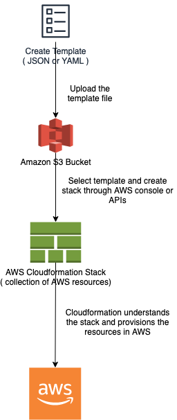

# AWS CloudFormation - Infrastructure as a CODE
- [AWS CloudFormation](https://aws.amazon.com/cloudformation/) is a service that helps you model and set up your AWS resources so that you can spend less time managing those resources and more time focusing on your applications that run in AWS.
- [You can create a template](https://docs.aws.amazon.com/AWSCloudFormation/latest/UserGuide/gettingstarted.templatebasics.html) that describes all the AWS resources that you want (like [Amazon EC2 instances](../../4_ComputeServices/AmazonEC2) or [Amazon RDS DB instances](../../6_DatabaseServices/AmazonRDS.md)), and CloudFormation takes care of provisioning and configuring those resources for you.
- You don't need to individually create and configure AWS resources and figure out what's dependent on what - CloudFormation handles that.



# Steps involved in a CloudFormation Solution
- [Create or use an existing CloudFormation template](https://docs.aws.amazon.com/AWSCloudFormation/latest/UserGuide/gettingstarted.templatebasics.html) using `JSON or YAML format`.
- Save the code in an [S3 bucket](../../7_StorageServices/AmazonS3.md), which serves as a repository for the code.
- Use [AWS CloudFormation]() to call the bucket and [create a stack on your template](https://docs.aws.amazon.com/AWSCloudFormation/latest/UserGuide/stacks.html).
- CloudFormation reads the file and understands the services that are called, their order, the relationship between the services, and provisions the services one after the other.

# What is Template?
- [A CloudFormation template](https://docs.aws.amazon.com/AWSCloudFormation/latest/UserGuide/gettingstarted.templatebasics.html) is deployed into the AWS environment as a [STACK](https://docs.aws.amazon.com/AWSCloudFormation/latest/UserGuide/stacks.html) (like microservice etc.).
- You can manage stacks through the AWS Management Console, AWS Command Line Interface, or AWS CloudFormation APIs.
- If you need to make changes to the running resources in a stack, you update the stack.
- Before making changes to your resources, [you can generate a change set](https://docs.aws.amazon.com/AWSCloudFormation/latest/UserGuide/using-cfn-updating-stacks-changesets.html), which is a summary of your proposed changes.
- [Change sets](https://docs.aws.amazon.com/AWSCloudFormation/latest/UserGuide/using-cfn-updating-stacks-changesets.html) enable you to see how your changes might impact your running resources, especially for critical resources, before implementing them.

# Sample Cloudformation templates
- :star: [AWS CloudFormation Sample Templates](https://github.com/awslabs/aws-cloudformation-templates)
- [Aurora Serverless](sample_templates/aurora_serverless.yml)
- [EKS cluster for EC2 instances](sample_templates/EKS_ECS.yml)
- [AutoScaling of EC2 instances](sample_templates/Auto_Scaling_Group.yml)

# Template anatomy
- A template is a JSON- or YAML-formatted text file that describes your AWS infrastructure. 
- The following examples show an [AWS CloudFormation template structure and its sections](https://docs.aws.amazon.com/AWSCloudFormation/latest/UserGuide/template-anatomy.html).

````yaml
AWSTemplateFormatVersion: "version date"

Description:
  String

Metadata:
  template metadata

Parameters:
  set of parameters

Rules:
  set of rules

Mappings:
  set of mappings

Conditions:
  set of conditions

Transform:
  set of transforms

Resources:
  set of resources

Outputs:
  set of outputs
````

## Description
- The [Description section (optional)](https://docs.aws.amazon.com/AWSCloudFormation/latest/UserGuide/template-description-structure.html) enables you to include comments about your template.

````yaml
Description: >
  Here are some
  details about
  the template.
````

## Parameters
- Use the [optional Parameters section](https://docs.aws.amazon.com/AWSCloudFormation/latest/UserGuide/parameters-section-structure.html) to customize your templates. 
- Parameters enable you to input custom values to your template each time you create or update a stack.

````yaml
Parameters:
  InstanceTypeParameter:
    Type: String
    Default: t2.micro
    AllowedValues:
      - t2.micro
      - m1.small
      - m1.large
    Description: Enter t2.micro, m1.small, or m1.large. Default is t2

Ec2Instance:
  Type: AWS::EC2::Instance
  Properties:
    InstanceType:
      Ref: InstanceTypeParameter
    ImageId: ami-0ff8a91507f77f867
````

### Parameter Types

| Type                         | Description                                                                                                                                       | Example                 |
|------------------------------|---------------------------------------------------------------------------------------------------------------------------------------------------|-------------------------|
| String                       | A literal string.                                                                                                                                 | "MyUserName"            |
| Number                       | An integer or float.                                                                                                                              | "8888"                  |
| List<Number>                 | An array of integers or floats that are separated by commas.                                                                                      | `["80","20"]`           |
| CommaDelimitedList           | An array of literal strings that are separated by commas.                                                                                         | `["test","dev","prod"]` |
| :star: SSM Parameter Types   | Parameters that correspond to existing parameters in [Systems Manager Parameter Store](../../2_SecurityAndIdentityServices/AWSSecretsManager.md). | -                       |
| AWS-Specific Parameter Types | AWS values such as Amazon EC2 key pair names and VPC IDs.                                                                                         | -                       |

[Read more](https://docs.aws.amazon.com/AWSCloudFormation/latest/UserGuide/parameters-section-structure.html)

### General requirements for parameters
- You can have a maximum of 200 parameters in an AWS CloudFormation template.
- Each parameter must be given a logical name (also called logical ID), which must be alphanumeric and unique among all logical names within the template.
- Each parameter must be assigned a [parameter type](#parameter-types) that is supported by [AWS CloudFormation]().
- Each parameter must be assigned a value at runtime for [AWS CloudFormation]() to successfully provision the stack. 
- You can optionally specify a default value for AWS CloudFormation to use unless another value is provided.
- Parameters must be declared and referenced from within the same template. 
- You can reference parameters from the Resources and Outputs sections of the template.

## Resources
- The [required Resources section](https://docs.aws.amazon.com/AWSCloudFormation/latest/UserGuide/resources-section-structure.html) declares the AWS resources that you want to include in the stack, such as an [Amazon EC2 instance](../../4_ComputeServices/AmazonEC2/ReadMe.md) or an [Amazon S3 bucket](../../7_StorageServices/AmazonS3.md).
- Through `AWS::SSM::Parameter` resource, we can create an SSM Parameter in [AWS System Manager Parameter Store](../../2_SecurityAndIdentityServices/AWSSecretsManager.md).

Syntax
- The Resource's section consists of the key name Resources. 
- The following pseudo template outlines the Resources section:
````yaml
Resources:
  Logical ID:
    Type: Resource type
    Properties:
      Set of properties
````

Example
- The following example shows a resource declaration. 
- It defines two resources. 
- The MyInstance resource includes the MyQueue resource as part of its UserData property.

````yaml
Resources: 
  MyInstance: 
    Type: "AWS::EC2::Instance"
    Properties: 
      UserData: 
        "Fn::Base64":
          !Sub |
            Queue=${MyQueue}
      AvailabilityZone: "us-east-1a"
      ImageId: "ami-0ff8a91507f77f867"
  MyQueue: 
    Type: "AWS::SQS::Queue"
    Properties: {}
````

# Outputs
- The [optional Outputs section](https://docs.aws.amazon.com/AWSCloudFormation/latest/UserGuide/outputs-section-structure.html) declares output values that you can import into other stacks (to create cross-stack references), return in response (to describe stack calls), or view on the AWS CloudFormation console. 
- For example, you can output the [S3 bucket name](../../7_StorageServices/AmazonS3.md) for a stack to make the bucket easier to find.

Syntax
- The Outputs section consists of the key name Outputs, followed by a space and a single colon. 
- You can declare a maximum of 200 outputs in a template.
````yaml
Outputs:
  Logical ID:
    Description: Information about the value
    Value: Value to return
    Export:
      Name: Name of resource to export
````

Example
- In the following example, the output named BackupLoadBalancerDNSName returns the DNS name for the resource with the logical ID BackupLoadBalancer only when the CreateProdResources condition is true.

````yaml
Outputs:
  BackupLoadBalancerDNSName:
    Description: The DNSName of the backup load balancer
    Value: !GetAtt BackupLoadBalancer.DNSName
    Condition: CreateProdResources
  InstanceID:
    Description: The Instance ID
    Value: !Ref EC2Instance
````
# Intrinsic functions

| Name                                                                                                                         | Description                                                                                                                                                                                                  | Example Code                                                     |
|------------------------------------------------------------------------------------------------------------------------------|--------------------------------------------------------------------------------------------------------------------------------------------------------------------------------------------------------------|------------------------------------------------------------------|
| [!Sub](https://docs.aws.amazon.com/AWSCloudFormation/latest/UserGuide/intrinsic-function-reference-sub.html)                 | The intrinsic function Fn::Sub substitutes variables in an input string with values that you specify                                                                                                         | `!Sub 'arn:aws:ec2:${AWS::Region}:${AWS::AccountId}:vpc/${vpc}'` |
| [!Ref](https://docs.aws.amazon.com/AWSCloudFormation/latest/UserGuide/intrinsic-function-reference-ref.html)                 | The intrinsic function Ref returns the value of the specified parameter or resource.                                                                                                                         | `!Ref logicalName`                                               |
| [!Join](https://docs.aws.amazon.com/AWSCloudFormation/latest/UserGuide/intrinsic-function-reference-join.html)               | The intrinsic function Fn::Join appends a set of values into a single value, separated by the specified delimiter. If a delimiter is the empty string, the set of values are concatenated with no delimiter. | `!Join [ ":", [ a, b, c ] ]`                                     |
| [!ImportValue](https://docs.aws.amazon.com/AWSCloudFormation/latest/UserGuide/intrinsic-function-reference-importvalue.html) | The intrinsic function Fn::ImportValue returns the value of an output exported by another stack.                                                                                                             | `!ImportValue sharedValueToImport`                               |
| [!GetAtt](https://docs.aws.amazon.com/AWSCloudFormation/latest/UserGuide/intrinsic-function-reference-getatt.html)           | The Fn::GetAtt intrinsic function returns the value of an attribute from a resource in the template.                                                                                                         | `!GetAtt logicalNameOfResource.attributeName`                    |

[Read more](https://docs.aws.amazon.com/AWSCloudFormation/latest/UserGuide/intrinsic-function-reference.html)

# Pros and Cons

| Pros                                 | Cons                                      |
|--------------------------------------|-------------------------------------------|
| Makes your life easier               | Steep Learning Curve                      |
| Coding Review Infrastructure Changes | Innocent Looking changes can be dangerous |
| Integration with CI Pipeline         | Drift can be painful                      |
| Large Community Support              | -                                         |

# Cloudformation Linter
- [Linter](https://github.com/aws-cloudformation/cfn-lint) can validate [AWS CloudFormation yaml/json templates](https://docs.aws.amazon.com/AWSCloudFormation/latest/UserGuide/gettingstarted.templatebasics.html) against the [AWS CloudFormation Resource Specification](https://docs.aws.amazon.com/AWSCloudFormation/latest/UserGuide/cfn-resource-specification.html) and additional checks. 
- Includes checking valid values for resource properties and best practices.

# Alternatives to AWS CloudFormation
- [Terraform - Open Source](https://www.terraform.io/)
- [Puppet - Open Source](https://puppet.com/)
- [Ansible by Red Hat](https://www.ansible.com/)

# State Management
- Since CloudFormation is a managed AWS service, it does state management automatically. 
- CloudFormation will consistently check infrastructure it has provisioned to detect if it is maintaining that state and configuration.
- Terraform stores the state of the infrastructure on the provisioning computer, or in a remote site (for team use). This state file is a custom JSON format which serves as a map for Terraform, describing which resources it manages, and how those resources should be configured.
- [Read more](https://www.missioncloud.com/blog/aws-cloudformation-vs-terraform-which-one-should-you-choose)

# References
- [AWS CloudFormation Sample Templates](https://github.com/awslabs/aws-cloudformation-templates)
- [What is AWS Cloudformation? Pros and Cons?](https://www.youtube.com/watch?v=0Sh9OySCyb4)