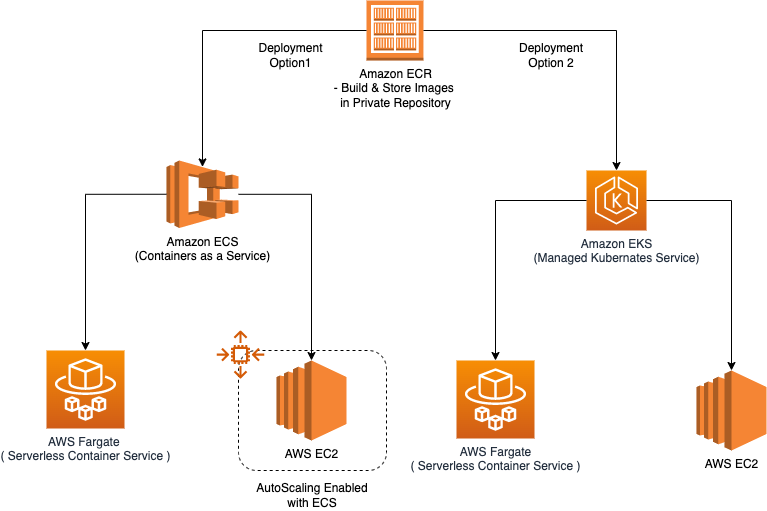

# Amazon ECS - Containers as a Service
- [Amazon ECS - Containers as a Service](https://aws.amazon.com/ecs/) is a [highly scalable](../../../1_HLDDesignComponents/0_SystemGlossaries/Scalability.md) and fast container management service.
- You can use it to run, stop, and manage containers on a cluster.
- With Amazon ECS, your containers are defined in a [task definition](https://docs.aws.amazon.com/AmazonECS/latest/developerguide/task_definitions.html) that you use to run an individual task or task within a service.
- Amazon ECS reduces the burden of setting up network, compute and security configurations, and managing scalability. 
- Up to 5,000 instances per cluster, can be launched in ECS.
- For example, you don’t need to build a generalized abstraction if you need a load balancer—ECS seamlessly integrates features such as [AWS Application Load Balancer (ALB)](../../1_NetworkingAndContentDelivery/ElasticLoadBalancer.md) and Network Load Balancer (NLB).
- [Amazon EKS vs ECS vs Fargate](../EKSvsECSvsFargate.md)

# :star: Amazon ECS with Application Load Balancer

# Amazon ECR
- [Amazon Elastic Container Registry (Amazon ECR)](https://aws.amazon.com/ecr/) is a fully managed container registry offering high-performance hosting, so you can reliably deploy application images and artifacts anywhere.

# Amazon ECS with Fargate

