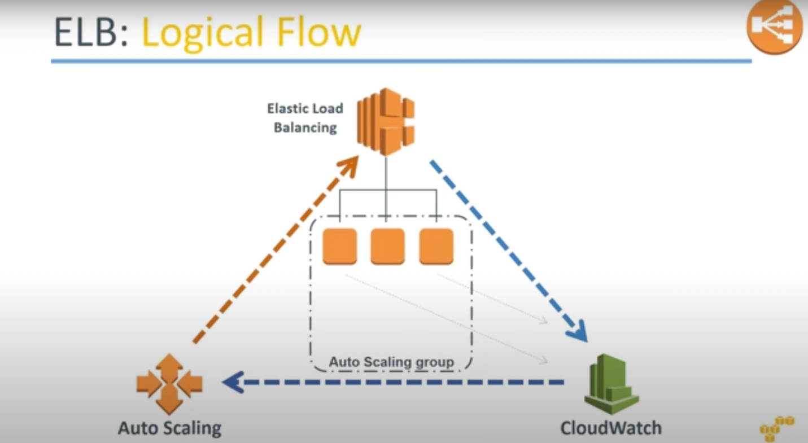

# How Auto-Scaling works?
- [Amazon CloudWatch](../../../8_MonitoringServices/AmazonCloudWatch.md) detects that an [EC2 instance](../ReadMe.md) is not healthy and sends the message [Auto-Scaling](README.md).
- [Auto Scaling](README.md) would then inform [ELB](../../../1_NetworkingAndContentDelivery/ElasticLodBalancer/Readme.md) to add [another EC2 instance](../ReadMe.md)
- We can use a [CloudWatch alarm](../../../8_MonitoringServices/AmazonCloudWatch.md) with Amazon EC2 Auto Scaling to scale your [Amazon EC2 instances](../ReadMe.md) based on demand.
- For more information, see [Dynamic Scaling](https://docs.aws.amazon.com/autoscaling/ec2/userguide/as-scale-based-on-demand.html) in the Amazon EC2 Auto Scaling User Guide.

- 