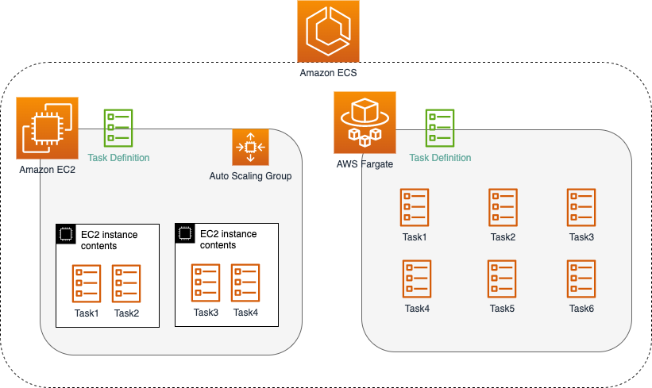

# Amazon ECS - Containers as a Service
- [Amazon ECS - Containers as a Service](https://aws.amazon.com/ecs/) is a [highly scalable](../../../1_HLDDesignComponents/0_SystemGlossaries/Scalability/DBScalability.md) and fast [container orchestration/management service](../../../1_HLDDesignComponents/0_SystemGlossaries/Scalability/ContainerOrchestrationService.md).
- You can use it to run, stop, and manage containers on a cluster.
- Amazon ECS reduces the burden of setting up network, compute and security configurations, and managing scalability. 
- Up to `5,000 instances per cluster`, can be launched in ECS.

# Amazon ECS tasks
- With Amazon ECS, your containers are defined in a [task definition](https://docs.aws.amazon.com/AmazonECS/latest/developerguide/task_definitions.html) that you use to run an individual task or task within a service.

# Integration with ELB
- ECS seamlessly integrates with [ELB](../../1_NetworkingAndContentDelivery/ElasticLoadBalancer/Readme.md).
- [How to configure ELB with ECS?](https://docs.aws.amazon.com/AmazonECS/latest/userguide/create-load-balancer.html)

# DNS-based service discovery using ECS
- [Amazon ECS]() now includes [integrated service discovery](https://docs.aws.amazon.com/AmazonECS/latest/developerguide/service-discovery.html) that makes it easy for your containerized services to discover and connect with each other.
- Services configured to use service discovery have a limit of 1,000 tasks for each service. This is due to a [Route53](../../1_NetworkingAndContentDelivery/AmazonRoute53.md) service quota.

## Service Discovery Key Concepts

| Concept                       | Description                                                                                                                                                      |
|-------------------------------|------------------------------------------------------------------------------------------------------------------------------------------------------------------|
| Service discovery namespace   | A logical group of service discovery services that share the same domain name, such as `example.com`.                                                            |
| Service discovery service     | Exists within the service discovery namespace and consists of the service name and DNS configuration for the namespace.                                          |
| Service discovery instance    | Exists within the service discovery service and consists of the attributes that are associated with each Amazon ECS service in the service directory.            |
| Amazon ECS health checks      | Amazon ECS performs periodic container-level health checks. If an endpoint doesn't pass the health check, it's removed from DNS routing and marked as unhealthy. |

[Read more](https://docs.aws.amazon.com/AmazonECS/latest/developerguide/service-discovery.html)

# Other Links
- [Amazon ECR](AmazonECR.md)
- [Amazon EKS vs ECS vs Fargate](../EKSvsECSvsFargate.md)

# References
- [Containers on AWS Overview: ECS | EKS | Fargate | ECR](https://www.youtube.com/watch?v=AYAh6YDXuho)
- [Application Load Balancer with ECS Fargate](https://stackoverflow.com/questions/64409699/application-load-balancer-with-ecs-fargate)