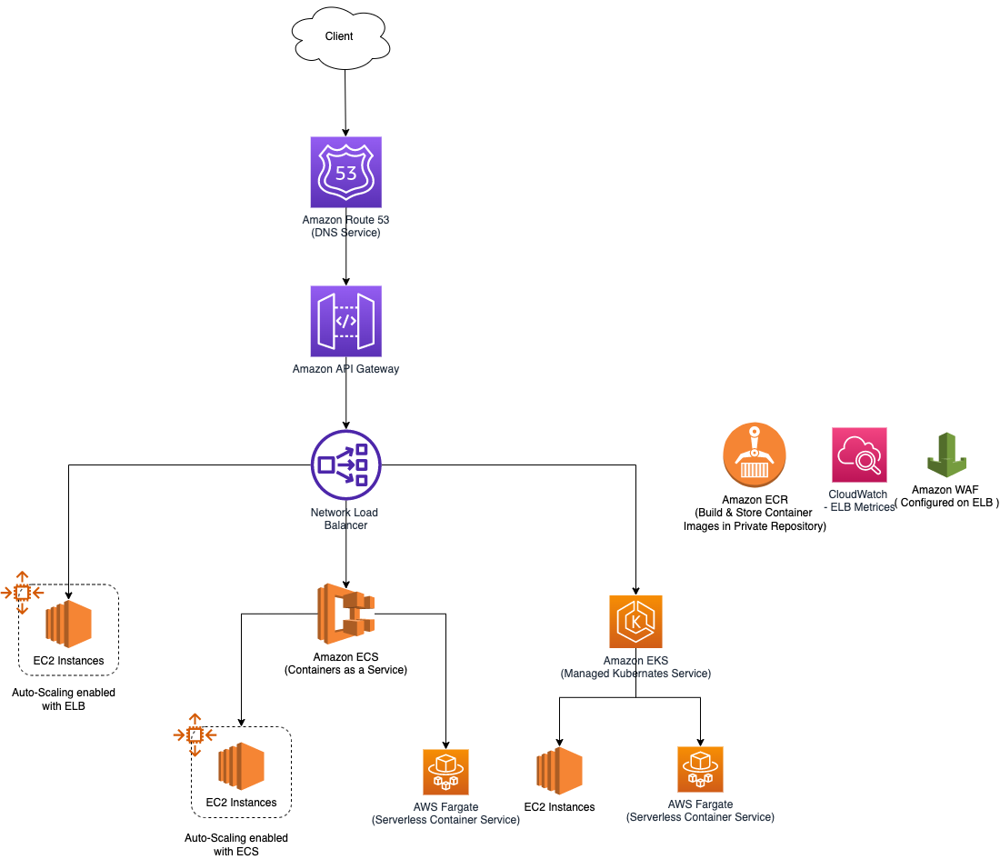

# Amazon EKS - Amazon Elastic Kubernetes Service
- [Amazon Elastic Kubernetes Service (Amazon EKS)](https://aws.amazon.com/eks/) is a `managed container service` to run and scale [Kubernetes](../../1_HLDDesignComponents/6_DevOps/Kubernates.md) applications in the cloud or on-premises.
- Amazon EKS runs up-to-date versions of the open-source [Kubernetes](../../1_HLDDesignComponents/6_DevOps/Kubernates.md) software, so you can use all the existing plugins and tooling from the [Kubernetes](../../1_HLDDesignComponents/6_DevOps/Kubernates.md) community. 
- Applications running on Amazon EKS are fully compatible with applications running on any standard Kubernetes environment, whether running in on-premises data centers or public clouds. 
- [Amazon EKS integrates IAM with Kubernetes](../2_SecurityAndIdentityServices/AWSUsers&AccessMgmt/AWSIAM.md), enabling you to register IAM entities with the native authentication system in [Kubernetes](../../1_HLDDesignComponents/6_DevOps/Kubernates.md). 
- There is no need to manually set up credentials for authenticating with the Kubernetes control plane. 
- The IAM integration enables you to use [IAM](../2_SecurityAndIdentityServices/AWSUsers&AccessMgmt/AWSIAM.md) to directly authenticate with the control plane itself and provide fine granular access to the public endpoint of your [Kubernetes](../../1_HLDDesignComponents/6_DevOps/Kubernates.md) control plane.

# Modular and Scalable Amazon EKS Architecture on AWS

[Read more](https://aws.amazon.com/quickstart/architecture/amazon-eks/)

# Other Links
- [EKS cluster for EC2 instances - Cloudformation template](../3_InfraAutomation/AWSCloudFormation/templates/EKS_ECS.yml)
- [Amazon EKS vs ECS vs Fargate](EKSvsECSvsFargate.md)

# References
- [Containers on AWS Overview: ECS | EKS | Fargate | ECR](https://www.youtube.com/watch?v=AYAh6YDXuho)
- [Implementing Microservices on AWS](https://docs.aws.amazon.com/whitepapers/latest/microservices-on-aws/microservices.html)