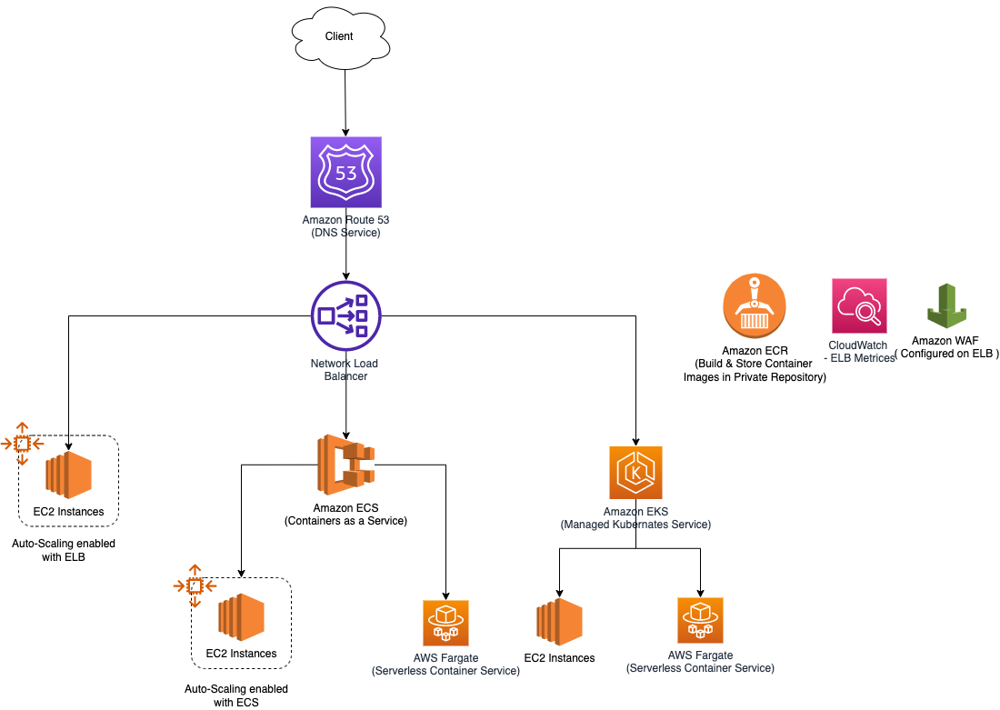

# Amazon EKS - Amazon Elastic Kubernetes Service
- [Amazon Elastic Kubernetes Service (Amazon EKS)](https://aws.amazon.com/eks/) is a `managed container service` to run and scale [Kubernetes](../../1_HLDDesignComponents/6_DevOps/Kubernates.md) applications in the cloud or on-premises.
- [EKS cluster for EC2 instances - Cloudformation template](../3_InfraAutomation/AWSCloudFormation/templates/EKS_ECS.yml)
- [Amazon EKS vs ECS vs Fargate](EKSvsECSvsFargate.md)

# Modular and Scalable Amazon EKS Architecture on AWS

[Read more](https://aws.amazon.com/quickstart/architecture/amazon-eks/)

# References
- [Containers on AWS Overview: ECS | EKS | Fargate | ECR](https://www.youtube.com/watch?v=AYAh6YDXuho)