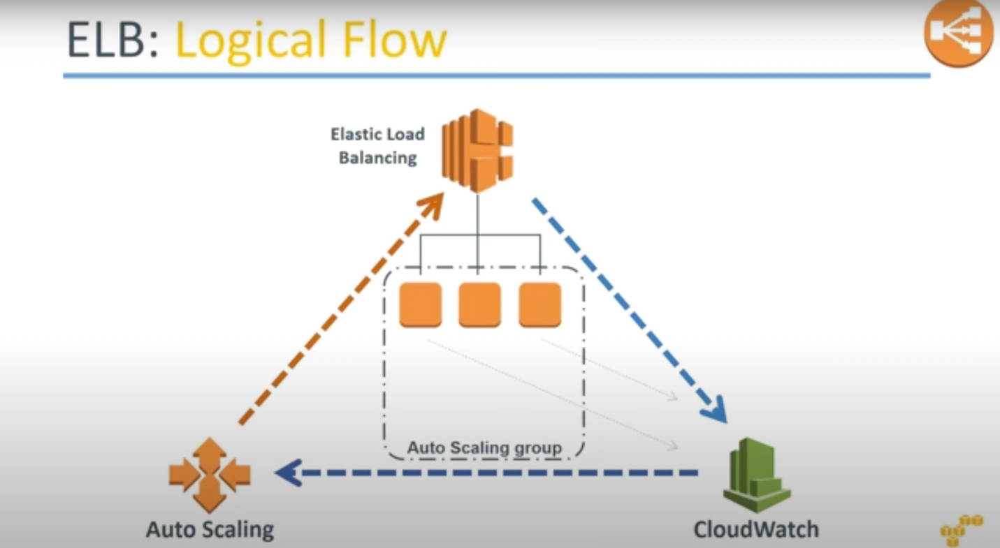

# How Auto-Scaling works with ELB?
- [CloudWatch](../../../8_MonitoringServices/AmazonCloudWatch.md) detects that an [EC2 instance](../ReadMe.md) is not healthy and sends the message [Auto-Scaling](README.md).
- [Auto Scaling](README.md) would then inform [ELB](../../../1_NetworkingAndContentDelivery/ElasticLoadBalancer.md) to add [another EC2 instance](../ReadMe.md)

- 