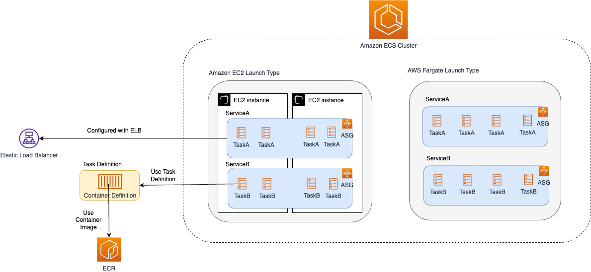

# Amazon ECS - Containers as a Service
- [Amazon ECS - Containers as a Service](https://aws.amazon.com/ecs/) is a [highly scalable](../../../1_HLDDesignComponents/0_SystemGlossaries/Scalability/DBScalability.md) and [fast container orchestration/management service](../../../1_HLDDesignComponents/0_SystemGlossaries/Scalability/ContainerOrchestrationService.md).
- You can use it to run, stop, and manage containers on a cluster.
- Amazon ECS reduces the burden of setting up network, compute and security configurations, and managing scalability. 
- Up to `5,000 instances per cluster`, can be launched in ECS.

# Various Components

| Term                                                                                                              | Description                                                                                                                                                                                                       | Similarity?                                                                            |
|-------------------------------------------------------------------------------------------------------------------|-------------------------------------------------------------------------------------------------------------------------------------------------------------------------------------------------------------------|----------------------------------------------------------------------------------------|
| :star: [Container Definition](#container-definition)                                                              | Nothing but container image & container level settings.                                                                                                                                                           | -                                                                                      |
| :star: [Task Definition](#task-definition)                                                                        | A blueprint for our application and describes one or more containers through attributes.                                                                                                                          | Similar to [Pod Configuration file in Kubernates](../../../1_HLDDesignComponents/6_DevOps/Kubernates.md)                                        |
| :star: [Task](#task-definition)                                                                                   | A task is the instantiation of task definition in the cluster.  - Tasks don't share the underlying kernel, CPU resources, memory resources or elastic network interface with another task.                    | Similar to [Pods in Kubernates](../../../1_HLDDesignComponents/6_DevOps/Kubernates.md) |
| :star: [Service](#service)                                                                                        | A service allows us to run and maintain a specified number (the desired count) of simultaneous tasks in an ECS cluster, configure load balancer, service discovery etc.                                           | Every microservice should be represented as Service in ECS.                            |
| [Cluster](https://docs.aws.amazon.com/AmazonECS/latest/developerguide/clusters.html)                              | An Amazon ECS cluster is a logical grouping of tasks or services.  - Your tasks and services are run on infrastructure that is registered to a cluster.                                                       | -                                                                                      |
| [Scheduled Tasks](https://docs.aws.amazon.com/AmazonECS/latest/developerguide/scheduling_tasks.html)              | Amazon ECS provides a service scheduler for long-running tasks and applications.  - It also provides the ability to run tasks manually for batch jobs or single run tasks.                                    | -                                                                                      |
| [Capacity Provider](https://docs.aws.amazon.com/AmazonECS/latest/developerguide/cluster-capacity-providers.html)  | Amazon ECS capacity providers manage the scaling of infrastructure for tasks in your clusters.                                                                                                                    | -                                                                                      |
| [CloudWatch metrics](https://docs.aws.amazon.com/AmazonECS/latest/developerguide/cloudwatch-metrics.html)         | You can monitor your Amazon ECS resources using [Amazon CloudWatch](../../8_MonitoringServices/AmazonCloudWatch.md), which collects and processes raw data from Amazon ECS into readable, near real-time metrics. | -                                                                                      |

# Container Definition

| Param                                      | Description |
|--------------------------------------------|-------------|
| Container Name                             | -           |
| Container Image                            | -           |
| Private Repo / Registry                    | -           |
| Memory Limits                              | -           |
| Port Mappings                              | -           |
| Environment Variables to pass to container | -           |
| Log Configuration                          | -           |

[Read more](https://docs.aws.amazon.com/AmazonECS/latest/APIReference/API_ContainerDefinition.html)

# Task Definition
- A blueprint for our application and describes one or more containers through attributes.

| Param                                                                                                               | Requird for Applicable Launch Type?                   | Description                                                                                                                                                                                                                                                                                   |
|---------------------------------------------------------------------------------------------------------------------|-------------------------------------------------------|-----------------------------------------------------------------------------------------------------------------------------------------------------------------------------------------------------------------------------------------------------------------------------------------------|
| Task Definition Name                                                                                                | Both                                                  | Name of task definition.                                                                                                                                                                                                                                                                      |
| [Task IAM Role](https://docs.aws.amazon.com/AmazonECS/latest/developerguide/task-iam-roles.html)                    | Both                                                  | [IAM Role](../../2_SecurityAndIdentityServices/AWSUsers&AccessMgmt/AWSIAM.md) that tasks can use to make API requests to authorized AWS resources                                                                                                                                             |
| [Task Execution IAM Role](https://docs.aws.amazon.com/AmazonECS/latest/developerguide/task_execution_IAM_role.html) | Both                                                  | [This IAM role](../../2_SecurityAndIdentityServices/AWSUsers&AccessMgmt/AWSIAM.md) is required by tasks to pull container images and publish container logs to [Amazon Cloudwatch](../../8_MonitoringServices/AmazonCloudWatch.md) on our behalf.                                             |
| Launch Type                                                                                                         | Both                                                  | Whether tasks are hosted on [Amazon EC2](../../4_ComputeServices/AmazonEC2/ReadMe.md) or [Fargate](../../4_ComputeServices/AWSFargate.md).                                                                                                                                                    |
| [Container Definitions](#container-definition)                                                                      | [Fargate only](../../4_ComputeServices/AWSFargate.md) | [Docker image](../../../1_HLDDesignComponents/6_DevOps/Docker/Readme.md) to use with each container in your task.                                                                                                                                                                             |
| [Task Size (CPU & Memory)](https://docs.aws.amazon.com/AmazonECS/latest/bestpracticesguide/capacity-tasksize.html)  | [Fargate only](../../4_ComputeServices/AWSFargate.md) | How much CPU and Memory to use for each task?  - :star: [Container level memory settings](#container-definition) are optional when task size is set. - Task size is not supported for Windows containers.                                                                             |
| [Networking Mode](https://docs.aws.amazon.com/AmazonECS/latest/developerguide/task-networking.html)                 | Both                                                  | For [fargate](../../4_ComputeServices/AWSFargate.md), we have only option available is AWSVPC in addition to [Docker Bridge](../../../1_HLDDesignComponents/6_DevOps/Docker/Readme.md), [Docker Host Only](../../../1_HLDDesignComponents/6_DevOps/Docker/Readme.md) & None networking modes. |
| [Logging Configuration](https://docs.aws.amazon.com/AmazonECS/latest/APIReference/API_LogConfiguration.html)        | Both                                                  | -                                                                                                                                                                                                                                                                                             |
| Others                                                                                                              | -                                                     | Data Volumes etc.                                                                                                                                                                                                                                                                             |

[Read more](https://docs.aws.amazon.com/AmazonECS/latest/developerguide/task_definitions.html)

# Service
- A [service](https://docs.aws.amazon.com/AmazonECS/latest/developerguide/ecs_services.html) allows us to run and maintain a specified number (the desired count) of simultaneous tasks in an ECS cluster, configure load balancer, service discovery etc.

| Param                                                                                                                                                                | Required?                                                                  | Description                                                                                                                                                                                                                                                          |
|----------------------------------------------------------------------------------------------------------------------------------------------------------------------|----------------------------------------------------------------------------|----------------------------------------------------------------------------------------------------------------------------------------------------------------------------------------------------------------------------------------------------------------------|
| Service Name                                                                                                                                                         | :white_check_mark: Yes                                                     | Name of the service                                                                                                                                                                                                                                                  |
| [Task Definition](#task-definition)                                                                                                                                  | :negative_squared_cross_mark: No                                           | Selected task definition                                                                                                                                                                                                                                             |
| Cluster                                                                                                                                                              | :negative_squared_cross_mark: No                                           | The short name or full Amazon Resource Name (ARN) of the cluster on which to run your service.  - If you do not specify a cluster, the default cluster is assumed.                                                                                               |
| VPC & Security Groups                                                                                                                                                | :white_check_mark: Yes                                                     | VPC and Security group for service                                                                                                                                                                                                                                   |
| [Service Type](https://docs.aws.amazon.com/AmazonECS/latest/developerguide/ecs_services.html)                                                                        | :negative_squared_cross_mark: No                                           | REPLICA or DAEMON                                                                                                                                                                                                                                                    |
| [Health Check grace period](https://aws.amazon.com/about-aws/whats-new/2017/12/amazon-ecs-adds-elb-health-check-grace-period/)                                       | :negative_squared_cross_mark: No                                           | The Amazon Elastic Container Service (Amazon ECS) service scheduler now allows you to define a grace period to prevent premature shutdown of newly instantiated tasks.                                                                                               |
| [Load Balancing](https://docs.aws.amazon.com/AmazonECS/latest/developerguide/service-load-balancing.html)                                                            | :negative_squared_cross_mark: No                                           | Amazon ECS service can optionally be configured to use Elastic Load Balancing to distribute traffic evenly across the tasks in your service.                                                                                                                         |
| [Desired Count / Number of tasks](https://docs.aws.amazon.com/AmazonECS/latest/developerguide/service_definition_parameters.html)                                    | :negative_squared_cross_mark: No                                           | The number of instantiations of the specified task definition to place and keep running on your cluster.  - This parameter is required if the REPLICA scheduling strategy is used. If the service uses the DAEMON scheduling strategy, this parameter is optional. |
| [Container to load balancer - Target Group name, protocol, Path pattern etc.](https://docs.aws.amazon.com/AmazonECS/latest/userguide/service-load-balancing.html)    | :negative_squared_cross_mark: No                                           | ECS seamlessly integrates with [ELB](../../1_NetworkingAndContentDelivery/ElasticLoadBalancer/Readme.md).                                                                                                                                                            |
| [Task Placement](https://docs.aws.amazon.com/AmazonECS/latest/developerguide/task-placement.html)                                                                    | :negative_squared_cross_mark: No, applicable for EC2 launch type only      | When a task that uses the EC2 launch type is launched, Amazon ECS must determine where to place the task based on the requirements specified in the task definition, such as CPU and memory.  - Example - One task per host                                      |
| [Service Discovery](https://docs.aws.amazon.com/AmazonECS/latest/developerguide/service-discovery.html)                                                              | :negative_squared_cross_mark: No                                           | -                                                                                                                                                                                                                                                                    |
| [Service Autoscaling](https://docs.aws.amazon.com/AmazonECS/latest/developerguide/service-auto-scaling.html)                                                         | :negative_squared_cross_mark: No                                           | Minimum number of tasks, auto-scaling parameters (CPU, memory etc.)                                                                                                                                                                                                  |

- [Read more](https://docs.aws.amazon.com/AmazonECS/latest/developerguide/service_definition_parameters.html)

# ECS integration with ELB

- [Read more](https://docs.aws.amazon.com/AmazonECS/latest/userguide/create-load-balancer.html)

# DNS-based service discovery using ECS
- [Amazon ECS]() now includes [integrated service discovery](https://docs.aws.amazon.com/AmazonECS/latest/developerguide/service-discovery.html) that makes it easy for your containerized services to discover and connect with each other.
- Services configured to use service discovery have a limit of 1,000 tasks for each service. This is due to a [Route53](../../1_NetworkingAndContentDelivery/AmazonRoute53.md) service quota.

## Service Discovery Key Concepts

| Concept                       | Description                                                                                                                                                      |
|-------------------------------|------------------------------------------------------------------------------------------------------------------------------------------------------------------|
| Service discovery namespace   | A logical group of service discovery services that share the same domain name, such as `example.com`.                                                            |
| Service discovery service     | Exists within the service discovery namespace and consists of the service name and DNS configuration for the namespace.                                          |
| Service discovery instance    | Exists within the service discovery service and consists of the attributes that are associated with each Amazon ECS service in the service directory.            |
| Amazon ECS health checks      | Amazon ECS performs periodic container-level health checks. If an endpoint doesn't pass the health check, it's removed from DNS routing and marked as unhealthy. |

[Read more](https://docs.aws.amazon.com/AmazonECS/latest/developerguide/service-discovery.html)

# Other Links
- [Amazon ECR](../AmazonECR.md)
- [Amazon EKS vs ECS vs Fargate](../EKSvsECSvsFargate.md)

# References
- [Containers on AWS Overview: ECS | EKS | Fargate | ECR](https://www.youtube.com/watch?v=AYAh6YDXuho)
- [Application Load Balancer with ECS Fargate](https://stackoverflow.com/questions/64409699/application-load-balancer-with-ecs-fargate)