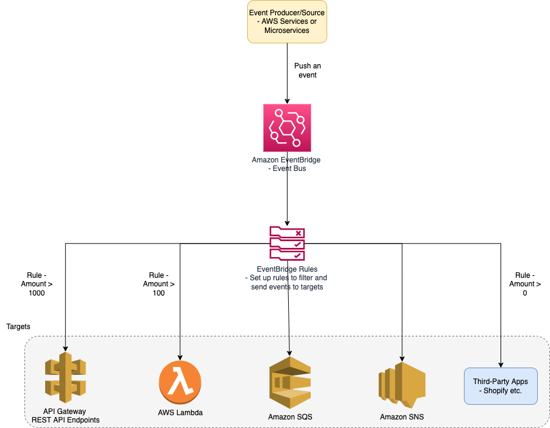

# Amazon Kinesis
- [Amazon Kinesis](https://aws.amazon.com/kinesis/) makes it easy to collect, process, and analyze real-time, streaming data, so you can get timely insights and react quickly to new information.
- Amazon Kinesis offers key capabilities to cost-effectively process streaming data at any scale, along with the flexibility to choose the tools that best suit the requirements of your application. 
- With Amazon Kinesis, you can ingest real-time data such as video, audio, application logs, website clickstreams, and IoT telemetry data for machine learning, analytics, and other applications. 
- Amazon Kinesis enables you to process and analyze data as it arrives and respond instantly instead of having to wait until all your data is collected before the processing can begin.

# Amazon Kinesis Data Streams
- [Amazon Kinesis Data Streams](https://aws.amazon.com/kinesis/data-streams/) is the real-time data streaming service in Amazon Kinesis with high scalability and durability. 
- It can help in continuously capturing multiple gigabytes of data every second from multiple sources. 
- The higher customizability with Kinesis Data Streams is also one of the profound highlights.

# Amazon Kinesis Data Firehouse
- [Amazon Kinesis Data Firehose](https://aws.amazon.com/kinesis/data-firehose/) is the easiest way to capture, transform, and load data streams into AWS data stores (like [Amazon S3](../7_StorageServices/AmazonS3.md), [Amazon Redshift](../6_DatabaseServices/AmazonRedshift.md)) for near real-time analytics with existing business intelligence tools.
- Example - [ECS-Fargate](../4_ComputeServices/AWSFargate.md) can add logs in Amazon Kinesis Data Firehouse & then it can be integrated with [NewRelic](https://docs.newrelic.com/docs/logs/forward-logs/stream-logs-using-kinesis-data-firehose/) for APM, Monitoring purpose.

# References
- [AWS Kinesis Data Streams vs AWS Kinesis Data Firehose](https://www.whizlabs.com/blog/aws-kinesis-data-streams-vs-aws-kinesis-data-firehose/)