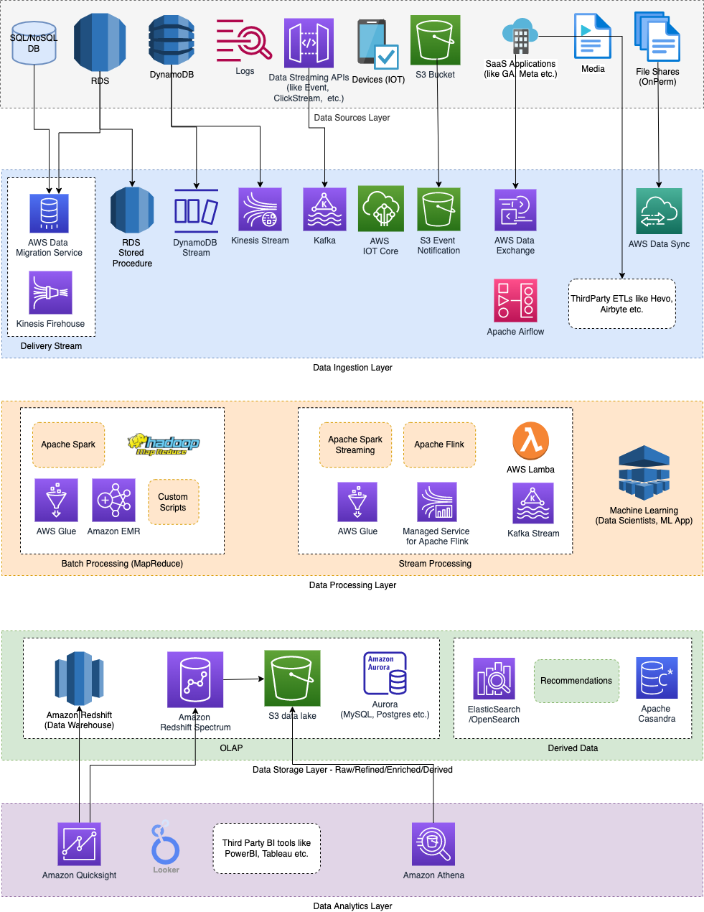

# Amazon Kinesis
- [Amazon Kinesis](https://aws.amazon.com/kinesis/) makes it easy to [collect, process, and analyze real-time, streaming data](../../../1_HLDDesignComponents/5_BigDataComponents/ETLServices/StreamProcessing/Readme.md), so you can get timely insights and react quickly to new information.
- [Amazon Kinesis]() offers key capabilities to [cost-effectively process streaming data](../../../1_HLDDesignComponents/5_BigDataComponents/ETLServices/StreamProcessing/Readme.md) at any scale, along with the flexibility to choose the tools that best suit the requirements of your application. 
- With [Amazon Kinesis](), you can ingest real-time data such as video, audio, application logs, website clickstreams, and IoT telemetry data for machine learning, analytics, and other applications. 
- [Amazon Kinesis]() enables you to process and analyze data as it arrives and respond instantly instead of having to wait until all your data is collected before the processing can begin.

# Amazon Kinesis Services

| Service                                                                                                                              | Key Strength                                                                                                                                                                                           | Processing Latency              | Use Case                                                                                                                                                                                                                                                                                                                                                          |
|--------------------------------------------------------------------------------------------------------------------------------------|--------------------------------------------------------------------------------------------------------------------------------------------------------------------------------------------------------|---------------------------------|-------------------------------------------------------------------------------------------------------------------------------------------------------------------------------------------------------------------------------------------------------------------------------------------------------------------------------------------------------------------|
| :star: [Amazon Kinesis Data Streams](AmazonKinesisDataStreams.md)                                                                    | Massively scalable and durable real-time data streaming service. - Managed alternative to [Apache Kafka](../../../1_HLDDesignComponents/4_MessageBrokers/Kafka/Readme.md)                          | Sub-1 second processing latency | Used to collect and process large streams of data records in real time.                                                                                                                                                                                                                                                                                           |
| :star: [Amazon Kinesis Data Firehouse](../../10_BigDataComponents/ETLServices/StreamProcessing/AmazonKinesisDataFirehouse/Readme.md) | Load streaming data into data stores and analytics tools.                                                                                                                                              | 60 seconds or higher            | Used to deliver real-time streaming data to destinations such as [Amazon S3](../../7_StorageServices/3_ObjectStorageS3/Readme.md), [Redshift](../../10_BigDataComponents/StorageDBs/DataWarehouse/AmazonRedshift.md) or external apis like [NewRelic for Cloudwatch logs](https://docs.aws.amazon.com/AmazonCloudWatch/latest/logs/SubscriptionFilters.html) etc. |
| [Amazon Kinesis Video Streams](https://aws.amazon.com/kinesis/video-streams)                                                         | Stream live video from devices                                                                                                                                                                         |                                 | Used to fully manage services that use to stream live video from devices.                                                                                                                                                                                                                                                                                         |
| [Amazon Kinesis Agent](https://docs.aws.amazon.com/streams/latest/dev/writing-with-agents.html)                                      | Send or collect data from [Amazon Kinesis Data Streams](AmazonKinesisDataStreams.md) or [Data Firehouse](../../10_BigDataComponents/ETLServices/StreamProcessing/AmazonKinesisDataFirehouse/Readme.md) |                                 | It is a stand-alone Java software application that offers an easy way to collect and send data to [Kinesis Data Streams](AmazonKinesisDataStreams.md) or [Data Firehouse](../../10_BigDataComponents/ETLServices/StreamProcessing/AmazonKinesisDataFirehouse/Readme.md).                                                                                          |

# Amazon Kinesis Data Stream & Data firehouse
- [Kinesis Data Stream vs Data Firehouse](KinesisDataStreamingVsFirehouse.md)

# References
- [Delivering Real-time Streaming Data to Amazon S3 Using Amazon Kinesis Data Firehose](https://towardsdatascience.com/delivering-real-time-streaming-data-to-amazon-s3-using-amazon-kinesis-data-firehose-2cda5c4d1efe)