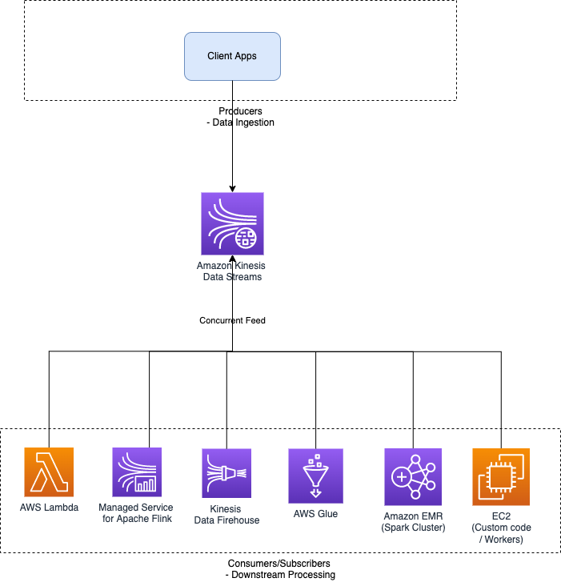

# Amazon Kinesis Data Streams
- [Amazon Kinesis Data Streams](https://aws.amazon.com/kinesis/data-streams/) is the [real-time data streaming service](../../1_HLDDesignComponents/5_BigDataComponents/StreamProcessing/Readme.md) in Amazon Kinesis with high scalability and durability.
- [KDS]() can continuously capture gigabytes of data per second from hundreds of thousands of sources & then provide a concurrent feed of the data stream to the downstream applications.
- The data collected is available in milliseconds, enabling real-time analytics.

# Use Cases

| Use Case                                                                         | Examples                                                                                                                                                                                                                                                                  |
|----------------------------------------------------------------------------------|---------------------------------------------------------------------------------------------------------------------------------------------------------------------------------------------------------------------------------------------------------------------------|
| [Streaming/Real-time data](https://aws.amazon.com/kinesis/data-streams/faqs/)    | Website clickstreams, database event streams, financial transactions, social media feeds, IT logs, and location-tracking events etc.                                                                                                                                      |
| Routing related records to the same record processor (as in streaming MapReduce) | Counting and aggregation are simpler when all records for a given key are routed to the same record processor.                                                                                                                                                            |
| Ordering of records.                                                             | You want to transfer log data from the application host to the processing/archival host while maintaining the order of log statements.                                                                                                                                    |
| Ability for multiple applications to consume the same stream concurrently.       | You have one application that updates a real-time dashboard and another that archives data to [Amazon Redshift](). - You want both applications to consume data from the same stream concurrently and independently.                                                  |
| Ability to consume records in the same order a few hours later.                  | You have a billing application and an audit application that runs a few hours behind the billing application.  - Because [Amazon Kinesis Data Streams]() stores data for up to 7 days, you can run the audit application up to 7 days behind the billing application. |

# Features

| Feature                                                                                                                        | Remarks                                                                                                                                                                                                                                                                                                                                                                                                                                                                                                                              |
|--------------------------------------------------------------------------------------------------------------------------------|--------------------------------------------------------------------------------------------------------------------------------------------------------------------------------------------------------------------------------------------------------------------------------------------------------------------------------------------------------------------------------------------------------------------------------------------------------------------------------------------------------------------------------------|
| :star: [Comparison between Various Message Brokers](../../1_HLDDesignComponents/4_MessageBrokers/KafkaVsRabbitMQVsSQSVsSNS.md) | [Amazon Kinesis Data Steams](https://shastri-shankar9.medium.com/apache-kafka-vs-amazon-kinesis-b55821c7f51f) is a managed alternative to [Apache Kafka](../../1_HLDDesignComponents/4_MessageBrokers/Kafka/Readme.md).                                                                                                                                                                                                                                                                                                              |
| [Amazon Kinesis Client Library (KCL)](https://docs.aws.amazon.com/streams/latest/dev/shared-throughput-kcl-consumers.html)     | The [Amazon Kinesis Client Library (KCL)](https://docs.aws.amazon.com/streams/latest/dev/shared-throughput-kcl-consumers.html) delivers all records for a given partition key to the same record processor, making it easier to build multiple applications reading from the same [Amazon Kinesis data stream]() (for example, to perform counting, aggregation, and filtering).                                                                                                                                                     |
| [Amazon DynamoDB as config store](../6_DatabaseServices/AmazonDynamoDB/Readme.md)                                              | [Amazon DynamoDB](../6_DatabaseServices/AmazonDynamoDB/Readme.md) is used as a Configuration store in Amazon Kinesis data stream.                                                                                                                                                                                                                                                                                                                                                                                                    |
| Maintain order of records                                                                                                      | -                                                                                                                                                                                                                                                                                                                                                                                                                                                                                                                                    |
| Reply records                                                                                                                  | It provides ordering of records, as well as the ability to read and/or replay records in the same order to multiple Amazon Kinesis Applications.                                                                                                                                                                                                                                                                                                                                                                                     |
| [Resharding a Stream](https://docs.aws.amazon.com/streams/latest/dev/kinesis-using-sdk-java-resharding.html)                   | With resharding, you can increase the number of shards in your stream to adapt to changes in the rate of data flow. - When you reshard, data records that were flowing to the existing shards are re-routed to new shards based on key values. - For example - - If your Lambda function is not processing records in a timely manner, you will see the [IteratorAge metric](https://repost.aws/knowledge-center/lambda-iterator-age) increase on your Lambda dashboard, and this might indicate that you need to "reshard." |
| [Quotas and Limits](https://docs.aws.amazon.com/streams/latest/dev/service-sizes-and-limits.html)                              | The default shard quota is 500 shards per AWS account for main AWS regions (US East (N. Virginia), US West (Oregon), and Europe (Ireland)).  - For other regions, max limit is 200 shards per AWS account.                                                                                                                                                                                                                                                                                                                       |
| Data destination not supported                                                                                                 | Kinesis Data Streams cannot directly write the output to [S3](../7_StorageServices/3_ObjectStorageS3/Readme.md).  - Unlike [Firehose](../10_BigDataComponents/StreamProcessing/AmazonKinesis/AmazonKinesisDataFirehouse.md), KDS does not offer a ready-made integration via an [intermediary Lambda function](../3_ComputeServices/AWSLambda/Readme.md) to reliably dump data into [S3](../7_StorageServices/3_ObjectStorageS3/Readme.md).                                                              |

# Kinesis Data Streaming and Processing tools

# Amazon Kinesis Data Streams and AWS DynamoDB
    

[Read more](https://docs.aws.amazon.com/amazondynamodb/latest/developerguide/kds.html)

