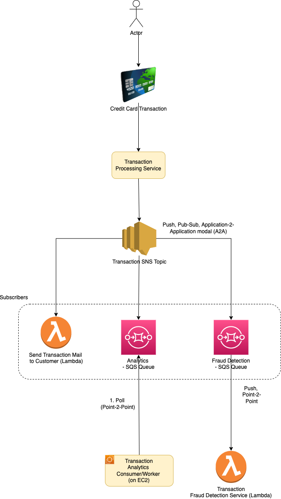

# Amazon Simple Notification Service (Amazon SNS)
- [Amazon SNS (Simple Notification Service)](https://aws.amazon.com/sns) is a fully managed messaging service for both [application-to-application (A2A)](https://docs.aws.amazon.com/sns/latest/dg/sns-system-to-system-messaging.html) and [application-to-person (A2P)](https://docs.aws.amazon.com/sns/latest/dg/sns-user-notifications.html) communication.
- Using Amazon SNS topics, your publisher systems can fanout messages to a large number of subscriber systems, including [Amazon SQS queues](AmazonSQS.md), [AWS Lambda functions](../4_ComputeServices/AWSLambda.md), HTTPS endpoints, and [Amazon Kinesis Data Firehose](AmazonKinesis.md), for parallel processing.
- The [application-to-person (A2P)](https://docs.aws.amazon.com/sns/latest/dg/sns-user-notifications.html) functionality enables you to send messages to users at scale via SMS, mobile push, and email.

## Application-to-Application (A2A)

The [application-to-application (A2A) pub/sub functionality](https://docs.aws.amazon.com/sns/latest/dg/sns-system-to-system-messaging.html) provides topics which are helpful in,
- [high-throughput, push-based, many-to-many messaging between distributed systems](../../1_HLDDesignComponents/0_SystemGlossaries/LatencyThroughput.md)
- [microservices, and event-driven serverless](../../1_HLDDesignComponents/1_MicroServicesSOA/README.md) applications.

- This pattern also known as [Fanout-pattern](https://aws.amazon.com/getting-started/hands-on/send-fanout-event-notifications/)

# :star: Amazon SNS vs Others
- [Read here](../../1_HLDDesignComponents/4_MessageBrokers/KafkaVsRabbitMQVsSQSVsSNS.md)

# References
- [SQS vs SNS vs Amazon MQ - Comparison - AWS Certification Cheat Sheet](https://cloud.in28minutes.com/aws-certification-sqs-vs-sns-vs-amazon-mq)
- [SNS vs SQS Comparison? Whats the difference?](https://www.youtube.com/watch?v=mXk0MNjlO7A)
- [Event-Driven Computing with Amazon SNS and AWS Compute, Storage, Database, and Networking Services](https://aws.amazon.com/blogs/compute/event-driven-computing-with-amazon-sns-compute-storage-database-and-networking-services/)