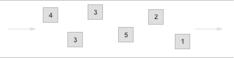

# Amazon SQS (Simple Queue Service)
- [Amazon SQS (Simple Queue Service)](https://aws.amazon.com/sqs/) is a fully managed message queuing service that enables you to [decouple and scale microservices](../../1_HLDDesignComponents/1_MicroServicesSOA/Readme.md), [distributed systems](../../1_HLDDesignComponents/0_SystemGlossaries/Readme.md), and serverless applications.

# Key Features

## At-least-Once delivery ( using Visibility Timeout)
- Unlike a [publish-subscribe system](../../1_HLDDesignComponents/4_MessageBrokers/ReadMe.md), a single message should be delivered to a single consumer, even when there are a lot of consumers running concurrently (also known as the [competing consumers pattern](https://www.conceptdraw.com/examples/message-queue)).
- When a message is being received by a consumer/worker, it is blocked from being visible to other consumers for a given period of time (known as [Visibility Timeout](https://docs.aws.amazon.com/AWSSimpleQueueService/latest/SQSDeveloperGuide/sqs-visibility-timeout.html)). 
- If the message isn't deleted before this timeout elapses, it will be visible again to all consumers. 

## Dead-Letter Queue
- [Amazon SQS]() supports [dead-letter queues (DLQ)](https://docs.aws.amazon.com/AWSSimpleQueueService/latest/SQSDeveloperGuide/sqs-dead-letter-queues.html), which other queues (source queues) can target for messages that can't be processed (consumed) successfully.
- After [maxReceiveCount](https://docs.aws.amazon.com/AWSSimpleQueueService/latest/SQSDeveloperGuide/sqs-dead-letter-queues.html), message would be pushed in the configured dead letter queue.

## APIs Supported
- [Amazon SQS]() is a message queueing service, meaning that [it exposes an API to publish and consume messages](https://docs.aws.amazon.com/AWSSimpleQueueService/latest/SQSDeveloperGuide/sqs-working-with-apis.html).

## Highly Available
- [Amazon SQS]() is [highly available](../../1_HLDDesignComponents/0_SystemGlossaries/Reliability/HighAvailability.md), by default.

## Inflight Messages Limit

A single Amazon SQS message queue can contain an unlimited number of messages.

However, there is a quota of inflight messages
- 120,000 for a standard queue
- 20,000 for a FIFO queue
 
**Note** - [Messages are inflight](https://aws.amazon.com/premiumsupport/knowledge-center/sqs-message-backlog/) after they have been received from the queue by a consuming component, but have not yet been deleted from the queue.

## Queue types

Amazon SQS offers two types of message queues - Standard & FIFO queues.

### :star: Standard Queues (Out-Of-Order, Recommended, Mostly-Used)

[Standard queues (Recommended, Mostly-Used)](https://docs.aws.amazon.com/AWSSimpleQueueService/latest/SQSDeveloperGuide/standard-queues.html) offer [maximum throughput](../../1_HLDDesignComponents/0_SystemGlossaries/Scalability/LatencyThroughput.md), best-effort ordering, and at-least-once delivery.
 
#### Unlimited Throughput
- Standard queues support a nearly [unlimited number of transactions per second (TPS)](../../1_HLDDesignComponents/0_SystemGlossaries/Scalability/LatencyThroughput.md) per API action.

#### At-Least-Once Delivery
- A message is delivered at least once, but occasionally more than one copy of a message is delivered.

#### Best-Effort Ordering
- Occasionally, messages might be delivered in an order different from which they were sent.

#### Use Cases

You can use standard message queues in many scenarios, as long as `your application can process messages that arrive more than once and out of order`.

For example:
- Decouple live user requests from intensive background work: `Let users upload media while resizing or encoding it`.
- Allocate tasks to multiple worker nodes: Process a high number of credit card validation requests. 
- Batch messages for future processing: Schedule multiple entries to be added to a database.

### FIFO Queues (FIFO-Order)

[SQS FIFO queues](https://docs.aws.amazon.com/AWSSimpleQueueService/latest/SQSDeveloperGuide/FIFO-queues.html) are designed to guarantee that messages are processed exactly once, in the exact order that they are sent.

#### High Throughput
- By default, FIFO queues support up to [300 messages per second](../../1_HLDDesignComponents/0_SystemGlossaries/Scalability/LatencyThroughput.md) (300 send, receive, or delete operations per second). 
- When you batch 10 messages per operation (maximum), FIFO queues can support up to 3,000 messages per second. 
- If you require higher throughput, you can enable high throughput mode for FIFO on the Amazon SQS console.
- This will support up to `30,000 messages per second` with batching, or up to `3,000 messages per second without batching`.

#### Exactly-Once Processing
- A message is delivered once and remains available until a consumer processes and deletes it. 
- Duplicates aren't introduced into the queue.

#### First-In-First-Out Delivery
- The order in which messages are sent and received is strictly preserved (i.e. `First-In-First-Out`).

#### Use Cases

FIFO queues are designed to enhance messaging between applications `when the order of operations and events is critical`, or where duplicates can't be tolerated. 

For example:
- Ensure that user-entered commands are executed in the right order.
- Display the correct product price by sending price modifications in the right order.
- Prevent a student from enrolling in a course before registering for an account.

# Other Links 
- :star: [Amazon SQS vs others](../../1_HLDDesignComponents/4_MessageBrokers/KafkaVsRabbitMQVsSQSVsSNS.md)

# References
- [Amazon's SQS performance and latency](https://softwaremill.com/amazon-sqs-performance-latency/)
- [SQS vs SNS vs Amazon MQ - Comparison - AWS Certification Cheat Sheet](https://cloud.in28minutes.com/aws-certification-sqs-vs-sns-vs-amazon-mq)