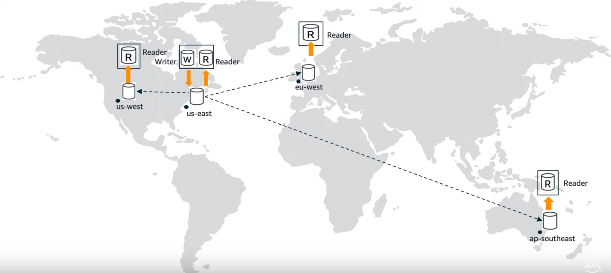

# Aurora Global Database
- [Amazon Aurora global databases](https://docs.aws.amazon.com/AmazonRDS/latest/AuroraUserGuide/aurora-global-database.html) span multiple AWS Regions, enabling low latency global reads and providing fast recovery from the rare outage that might affect an entire AWS Region. 
- An Aurora global database has a primary [Aurora DB cluster](AuroraDBClusters.md) in one Region, and up to five secondary [Aurora DB clusters](AuroraDBClusters.md) in different Regions.

## :thumbsup: Advantages of Aurora Global Database
- [Cross-Region Replication with low replica lag ( in less than 1 second )](../../AWS-Global-Architecture-Region-AZ.md). 
  - Aurora uses [physical, log-based asynchronous replication](../../../1_HLDDesignComponents/0_SystemGlossaries/Append-Only.md).
- [Disaster Recovery](../../../1_HLDDesignComponents/0_SystemGlossaries/FaultTolerance&DisasterRecovery.md) promotes remote databases to a primary for faster recovery ( in less than 1 min ) in the event of a disaster. 
  - For industries like `Financial Services` etc.
- `Data Locality` brings data closer to users in different regions to enable faster reads.

## Design Patterns - Write forwarding with global read replicas

