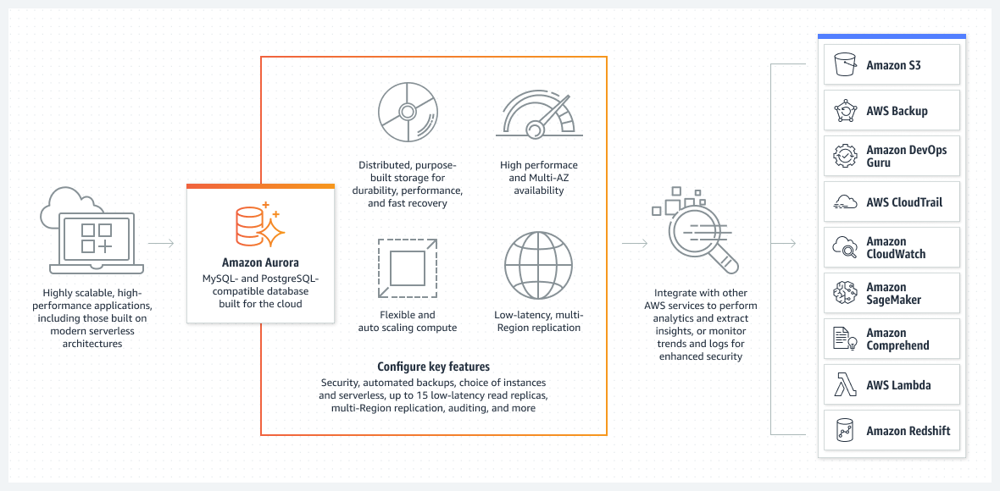
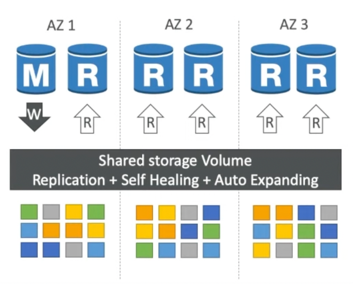

# [Why Amazon Aurora engine is better than Amazon RDS, for MySQL/Postgres DB engines?](../AWSAuroraVsRDS.md)

# [Amazon Aurora](https://aws.amazon.com/rds/aurora/)
- Designed for unparalleled high performance and availability at global scale with full MySQL and PostgreSQL compatibility ( that means your drivers will work as if Aurora was a Postgres or MySQL database).
- Aurora is a proprietary technology from AWS (not open sourced).
- Aurora is `AWS Cloud Optimized` and claims `5x performance improvement over MySQL on RDS`, over `3x performance improvement over Postgres on RDS`.
- High throughput - Up to `200K writes/second`, with negligible performance impact.

## Amazon Aurora High Availability & Scaling (through read replicas )
- Aurora is [highly available](../../../1_HLDDesignComponents/0_SystemGlossaries/HighAvailability.md) and fail over is instantaneous. 
  - Automated fail over for master in less than 30 seconds.
- It automatically maintains `6 copies of the data across 3 Availability Zones` and automatically backs up data in `Amazon S3`.
  - Highly available for writes - `4 copies out of 6 are for writes`.
  - Highly available for reads - `3 copies out of 6 are for reads`.
- One Aurora Instance (master) takes writes.
  - One master can have up to `15 Aurora Read Replicas` across multi-regions ( through auto-scaling or on demand ). 
- Aurora supports `Auto Expanding` & its storage automatically grows in increments of 10GB, up to 128 TB.

## Important Points
- [Aurora DB Clusters](AuroraDBClusters.md)
- [Aurora Global Database](AuroraGlobalDatabase.md)
- [Aurora Serverless](AuroraServerless.md)

## Aurora Security ( similar to RDS )
- Encryption at rest using KMS
- Automated backups, snapshots & replicas are also encrypted.
- Encryption in flight/transmit using SSL
- Authentication using IAM

## References
- :star: [Amazon Aurora Global Database Design Patterns for HA and DR | Amazon Web Services](https://www.youtube.com/watch?v=bbiWciJSouY)
- [Amazon Aurora Introduction - By Stephane Maarek](https://www.youtube.com/watch?v=ZCt3ctVfGIk)