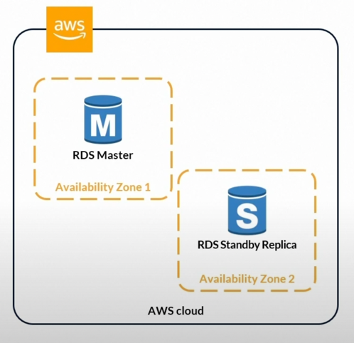

# Amazon Aurora
- [Amazon Aurora](https://aws.amazon.com/rds/aurora/) is designed for unparalleled [high performance and availability at global scale](../../../1_HLDDesignComponents/0_SystemGlossaries/LatencyThroughput.md) with full MySQL and PostgreSQL compatibility (that means your drivers will work as if Aurora was a Postgres or MySQL database).
- Aurora is a proprietary technology from AWS (not open sourced).
- Aurora is `AWS Cloud Optimized` and claims `5x performance improvement over MySQL on RDS`, over `3x performance improvement over Postgres on RDS`.
- [High throughput up to 200K writes/second](../../../1_HLDDesignComponents/0_SystemGlossaries/LatencyThroughput.md), with negligible performance impact.
- [Why Amazon Aurora engine is better than Amazon RDS, for MySQL/Postgres DB engines?](../AmazonAuroraVsRDS.md)

# Important Points
- [Aurora DB Clusters](AuroraDBClusters.md)
- [Aurora Global Database](AuroraGlobalDatabase.md)
- [Aurora Serverless](AuroraServerless.md)

# High Availability - Multi-AZ feature
- Aurora is [highly available by default](../../../1_HLDDesignComponents/0_SystemGlossaries/HighAvailability.md) but 10 minutes as fail over time.

In an [Amazon RDS Multi-AZ deployment](https://aws.amazon.com/rds/features/multi-az/), 
- Amazon RDS automatically creates a primary database (DB) instance and synchronously replicates the data to secondary RDS instance (replica/standby) in a different AZ in the same region.
- The only purpose of Multi-AZ is to provide a [Master-Slave / failover option](../../../1_HLDDesignComponents/0_SystemGlossaries/FaultTolerance&DisasterRecovery.md) for a primary RDS instance. (not read replicas)
- When it detects a failure, [Amazon RDS]() automatically fails over to a secondary RDS instance (replica/standby) without manual intervention, in less than 30 seconds.
- It automatically maintains `6 copies of the data across 3 Availability Zones` and automatically backs up data in [Amazon S3](../../7_StorageServices/AmazonS3.md).
  - Highly available for writes - `4 copies out of 6 are for writes`.
  - Highly available for reads - `3 copies out of 6 are for reads`.

# Scalability (through read replicas )
- One Aurora Instance (master) takes writes.
- One master can have up to `15 Aurora Read Replicas` across [multi-regions](../../AWS-Global-Architecture-Region-AZ.md) ( through auto-scaling or on demand ). 
- Aurora supports `Auto Expanding` & its storage automatically grows in increments of 10GB, up to 128 TB.

## Multi-Master feature
- TBD

# Security ( similar to RDS )
- Encryption at rest using KMS
- Automated backups, snapshots & replicas are also encrypted.
- Encryption in flight/transmit using SSL
- Authentication using IAM

# Master-Slave vs Read Replica?
- [Read More](https://www.quora.com/What-does-it-mean-by-read-replica-in-Amazon-RDS-Is-that-similar-to-the-slave-server)

# References
- :star: [Amazon Aurora Global Database Design Patterns for HA and DR | Amazon Web Services](https://www.youtube.com/watch?v=bbiWciJSouY)
- [Amazon Aurora Introduction - By Stephane Maarek](https://www.youtube.com/watch?v=ZCt3ctVfGIk)