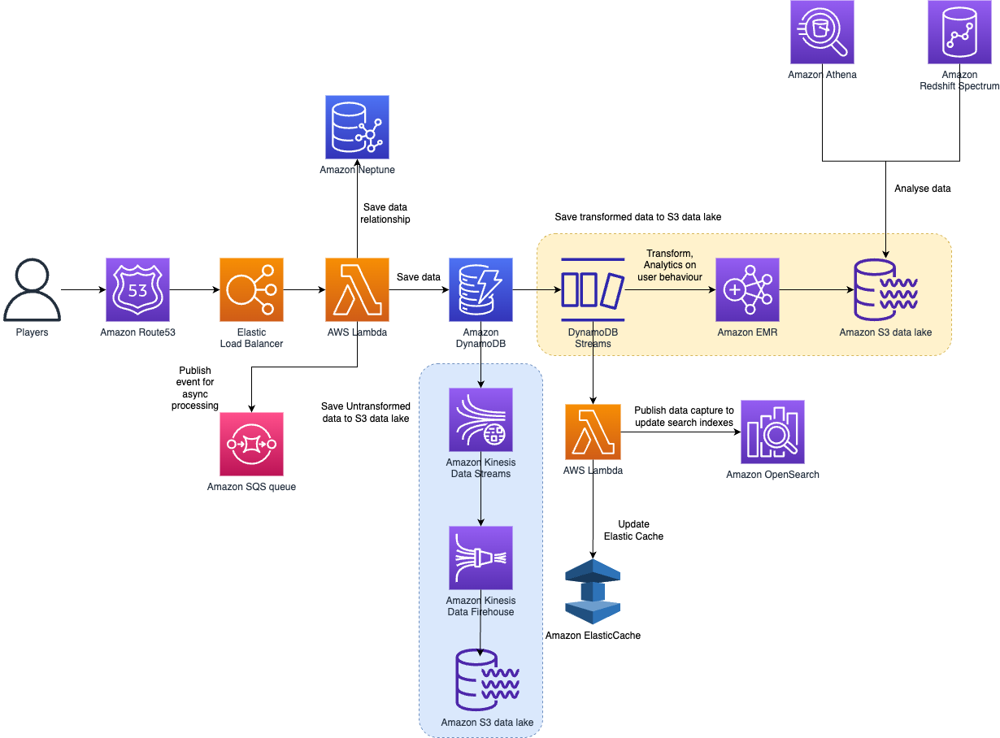

# DynamoDB Streams
- [DynamoDB Streams](https://docs.aws.amazon.com/amazondynamodb/latest/developerguide/HowItWorks.CoreComponents.html#HowItWorks.CoreComponents.Streams) is an optional feature that captures data modification events in DynamoDB tables. The data about these events appear in the stream in near real time, and in the order that the events occurred.
- [DynamoDB Streams](https://docs.aws.amazon.com/amazondynamodb/latest/developerguide/Streams.html) captures a [time-ordered sequence of item-level modifications](../../../1_HLDDesignComponents/0_SystemGlossaries/Database/ChangeDataCapture.md) in any DynamoDB table and stores this information in a log for up to 24 hours.

Each event is represented by a stream record. If you enable a stream on a table, DynamoDB Streams writes a stream record whenever one of the following events occurs:
- A new item is added to the table: The stream captures an image of the entire item, including all of its attributes
- An item is updated: The stream captures the before and after image of any attributes that were modified in the item
- An item is deleted from the table: The stream captures an image of the entire item before it was deleted

Each stream record also contains the name of the table, event timestamp, and other metadata. Stream records have a lifetime of 24 hours, after which they are automatically removed from the stream.

# Best practice - Architecture diagram

# DynamoDB Streams and AWS Lambda triggers
- [Amazon DynamoDB](https://docs.aws.amazon.com/amazondynamodb/latest/developerguide/Streams.Lambda.html) is integrated with [AWS Lambda](../../3_ComputeServices/AWSLambda/Readme.md) so that you can create triggers—pieces of code that automatically respond to events in DynamoDB Streams. 
- With triggers, you can build applications that react to data modifications ([change data capture](../../../1_HLDDesignComponents/0_SystemGlossaries/Database/ChangeDataCapture.md)) in DynamoDB tables.

# How to turn on streams on DynamoDB?

