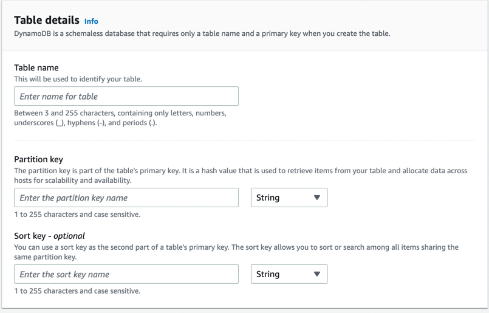

# Amazon DynamoDB
- [DynamoDB](https://aws.amazon.com/dynamodb/) is a fully managed [NoSQL](../../../1_HLDDesignComponents/3_DatabaseComponents) database service. 
- DynamoDB is a key-value and document database. 
- Every record in a DynamoDB database can be considered as a map of attributes and values with a primary key to retrieve the record.
- All data items are stored on `Solid State Drives (SSDs)`, and are replicated across [3 Availability Zones](../../AWS-Global-Architecture-Region-AZ.md) for [high availability](../../../1_HLDDesignComponents/0_SystemGlossaries/HighAvailability.md) and [durability](../../../1_HLDDesignComponents/0_SystemGlossaries/Durability.md). 
- With DynamoDB, `you can offload the administrative burden of operating and scaling a highly available distributed database cluster`, while paying a low price for only what you use.

## :star: Real world use cases of DynamoDB
- [Twillo - Send Message API Design](../../../3_HLDDesignProblems/TwilloSendMessageAPI)

## Key Features
- Provisioned Throughput
- Fast, predictable performance (`1000s of records per second, single-digit millisecond performance`)
- [Partitions and data distribution](#partitionssharding-and-data-distribution)
- [DynamoDB Global tables](DynamoDBGlobalTables.md)
- [DynamoDB Accelerator (DAX)](DynamoDBAccelerator.md)
- [PartiQL - a SQL-compatible query language for Amazon DynamoDB](https://docs.aws.amazon.com/amazondynamodb/latest/developerguide/ql-reference.html)
- [Time to Live (TTL) supported for the data](https://docs.aws.amazon.com/amazondynamodb/latest/developerguide/TTL.html)
- JSON Support
- Items size up to 400 KB

## Automated Storage Scaling
- `There is no limit to the amount of data you can store in a DynamoDB table`, and the service automatically allocates more storage, as you store more data using the DynamoDB write APIs.

## Provisioned Throughput
- When creating a table, simply specify how much request capacity you require? (`OnDemand` or `specific number`)
- DynamoDB allocates dedicated resources to your table to meet your performance requirements, and automatically partitions data over a sufficient number of servers to meet your request capacity.
- If your throughput requirements change, simply update your table's request capacity using the `AWS Management Console or the Amazon DynamoDB APIs`.
- You are still able to achieve your prior throughput levels while scaling is underway.

## Consistency Models
- [Eventual Consistency Model](../../../1_HLDDesignComponents/0_SystemGlossaries/ReplicationAndDataConsistency.md#consistency-patterns)
- [Strong Consistency Model](../../../1_HLDDesignComponents/0_SystemGlossaries/ReplicationAndDataConsistency.md#consistency-patterns)

## Data types supported in DynamoDB

DynamoDB supports a large set of data types for table attributes. 

Each data type falls into one of the three following categories -
- `Scalar` - These types represent a single value, and include number, string, binary, Boolean, and null.
- `Document` - These types represent a complex structure possessing nested attributes, and include lists and maps.
- `Set` - These types represent multiple scalars, and include string sets, number sets, and binary sets.

## Partitions/Sharding and data distribution
- Amazon DynamoDB scales horizontally ( using data partition/sharding ) and can seamlessly scale a single table over hundreds of servers.
- [Amazon DynamoDB stores data in partitions](https://docs.aws.amazon.com/amazondynamodb/latest/developerguide/HowItWorks.Partitions.html). 
- A partition is an allocation of storage for a table, backed by `solid state drives (SSDs)` and automatically replicated across multiple Availability Zones within an AWS Region. 
- `Partition management is handled entirely by DynamoDB` — you never have to manage partitions yourself.
- Partition management occurs automatically in the background and is transparent to your applications. 
- Your table remains available throughout and fully supports your provisioned throughput requirements.

### Data distribution: Partition key
- To write an item to the table
  - DynamoDB uses the value of the partition key as input to an internal hash function. 
  - The output value from the hash function determines the partition in which the item will be stored.
- To read an item from the table
  - You must specify the `partition key value` for the item. 
  - DynamoDB uses this value as input to its hash function, yielding the partition in which the item can be found.

### Setup Steps - Partition, Sort keys

## :thumbsdown: What are disadvantages of DynamoDB?
- Deployable only on AWS and cannot be installed on individual desktops/servers
- No server side scripts
- General disadvantages of NoSQL
  - Querying data is extremely limited
  - Table Joins are impossible
  - No triggers
  - No foreign key concept to refer to other table items

# References
- [Top DynamoDB Interview Questions](https://www.javainuse.com/misc/dynamodb-interview-questions)
- [20 DynamoDB Interview Questions and Answers](https://climbtheladder.com/dynamodb-interview-questions/)
- [What I’ve Learned From Using AWS DynamoDB in Production for More Than 3 Years?](https://medium.com/aws-tip/what-ive-learned-from-using-aws-dynamodb-in-production-for-more-than-3-years-49a077886b5c)