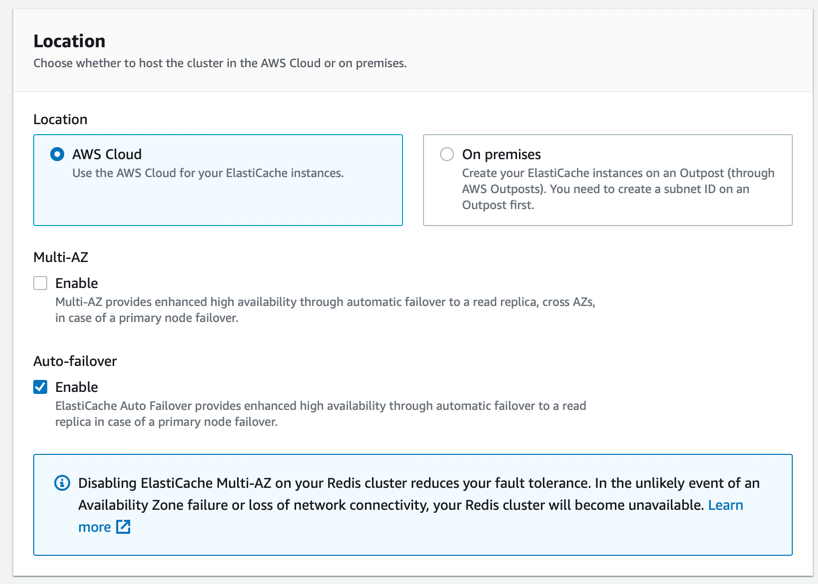

# Amazon Elastic Cache
- [Amazon Elastic Cache](https://aws.amazon.com/elasticache/) is a [fully Managed Memcached or Redis](../../1_HLDDesignComponents/3_DatabaseComponents/In-Memory-Cache/Redis).
- Scale from one to many nodes, using [Cluster](../../1_HLDDesignComponents/0_SystemGlossaries/Scalability/ServersCluster.md).
- [Single-digit millisecond speed (usually)](../../1_HLDDesignComponents/0_SystemGlossaries/Scalability/LatencyThroughput.md).
- Self-healing (automatically replaces dead instance).

[Read more](https://docs.aws.amazon.com/AmazonElastiCache/latest/red-ug/Replication.Redis-RedisCluster.html)

# Multi-AZ deployments for increased high availability

[Read more](https://docs.aws.amazon.com/AmazonElastiCache/latest/red-ug/FaultTolerance.html).

# Caching strategies

| Strategy                                                                                            | Description                                                                                                 | Read-Performance           |
|-----------------------------------------------------------------------------------------------------|-------------------------------------------------------------------------------------------------------------|----------------------------|
| :star: [Write-through](https://docs.aws.amazon.com/AmazonElastiCache/latest/mem-ug/Strategies.html) | The write-through strategy adds data or updates data in the cache whenever data is written to the database. | Better than "lazy-loading" |
| [Lazy loading](https://docs.aws.amazon.com/AmazonElastiCache/latest/mem-ug/Strategies.html)         | lazy loading is a caching strategy that loads data into the cache only when necessary.                      | -                          |
 
# Redis (Cluster Mode Disabled) vs. Redis (Cluster Mode Enabled)

| Feature                       | [Redis (cluster mode disabled)](../../1_HLDDesignComponents/3_DatabaseComponents/In-Memory-Cache/Redis/RedisMasterSlaveReplication.md) | [Redis (cluster mode enabled)](../../1_HLDDesignComponents/3_DatabaseComponents/In-Memory-Cache/Redis/RedisCluster.md) |
|-------------------------------|----------------------------------------------------------------------------------------------------------------------------------------|-----------------------------------------------------------------------------------------------------------------------|
| Modifiable                    | Yes. Supports adding and deleting replica nodes, and scaling up node type.                                                             | [Limited](https://docs.aws.amazon.com/AmazonElastiCache/latest/red-ug/scaling-redis-cluster-mode-enabled.html)        |
| Data Sharding                 | No                                                                                                                                     | Yes                                                                                                                   |
| Shards                        | 1                                                                                                                                      | 1 to 500                                                                                                              |
| Read Replicas                 | 0 to 5                                                                                                                                 | 0 to 5 per shard                                                                                                      |
| HA - Multi-AZ                 | Yes, with at least 1 replica.  - "Multi-AZ" is on by default                                                                       | Yes.  - "Multi-AZ" is on by default.                                                                     |
| Snapshots (Backups & Restore) | Yes, single .rdb file                                                                                                                  | Yes, unique .rdb file for each shard                                                                                  |

# References
- [Benefits of Fully Managed Redis](https://aws.amazon.com/elasticache/redis/fully-managed-redis/)
- [Connect to the cluster's node](https://docs.aws.amazon.com/AmazonElastiCache/latest/red-ug/GettingStarted.ConnectToCacheNode.html)

