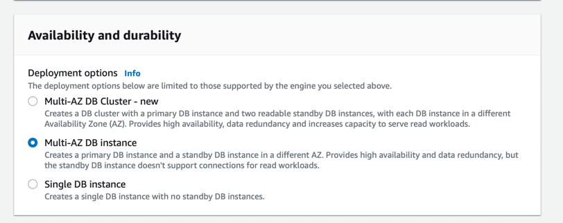

# Amazon RDS
- [Amazon RDS](https://aws.amazon.com/rds/) is a database management service for relational databases.
- It manages patching, upgrading, and data backups automatically. 
- It's a database management service for structured data only ( database engines like MySQL, PostgresSQL, SQL Server etc.)
- Amazon RDS can be scaled either through [Vertical Scaling](../../1_HLDDesignComponents/0_SystemGlossaries/Scalability.md#vertical-scalability--scale-up-) or [Horizontal Scaling (master-slave)](../../1_HLDDesignComponents/0_SystemGlossaries/Scalability.md#db---horizontal-scaling-techniques).
- [Why Amazon Aurora engine is better than Amazon RDS, for MySQL/Postgres DB engines?](AmazonAuroraVsRDS.md)

# Amazon RDS - High Availability

For your MySQL, MariaDB, PostgreSQL, Oracle, and SQL Server database (DB) instances, you can use [Amazon RDS Multi-AZ deployments](https://aws.amazon.com/rds/ha/). 
- When you provision a Multi-AZ DB instance, Amazon RDS automatically creates a primary DB instance and synchronously replicates the data to a standby instance in a different Availability Zone (AZ). 
- In case of an infrastructure failure, Amazon RDS performs an automatic failover to the standby DB instance. 
- Since the endpoint for your DB instance remains the same after a failover, your application can resume database operation without the need for manual administrative intervention.
- [Read more](https://aws.amazon.com/rds/features/multi-az/)
- [High availability in Aurora - Read here](AmazonRDSAurora/Readme.md#high-availability)

# What is a maintenance window in Amazon RDS? Will your DB instance be available during maintenance events?
- RDS maintenance window lets you decide when DB instance modifications, database engine version upgrades, and software patching have to occur.
- The automatic scheduling is done only for patches that are related to security and [durability](../../1_HLDDesignComponents/0_SystemGlossaries/Durability.md).
- By default, there is a 30-minute value assigned as the maintenance window and the DB instance will still be available during these events though you might observe a minimal effect on performance.

# Security
- Encryption at rest using KMS
- Automated backups, snapshots & replicas are also encrypted.
- Encryption in flight/transmit using SSL
- Authentication using IAM

# AWS Database Migration Service
- [AWS DMS](https://aws.amazon.com/dms/) helps to migrate other databases to Amazon RDS.

# Master-Slave vs Read Replica?
- [Read More](https://www.quora.com/What-does-it-mean-by-read-replica-in-Amazon-RDS-Is-that-similar-to-the-slave-server)

# References
- [Amazon RDS High Availability](https://aws.amazon.com/rds/ha/)
- [AWS RDS Max Connections Limit As Per Instance Type](https://sysadminxpert.com/aws-rds-max-connections-limit/)