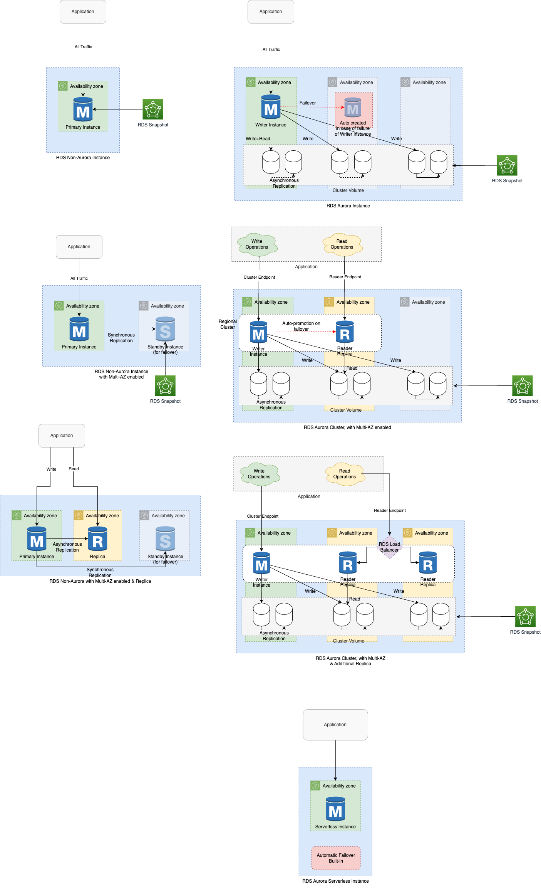

# Amazon RDS Aurora
- [Amazon RDS Aurora](https://aws.amazon.com/rds/aurora/) is designed for [unparalleled high performance and availability at global scale](../../../1_HLDDesignComponents/0_SystemGlossaries/Scalability/LatencyThroughput.md) with full MySQL and PostgreSQL compatibility (that means your drivers will work as if Aurora was a Postgres or MySQL database).
- Aurora is [AWS Cloud Optimized (proprietary technology](https://aws.amazon.com/rds/aurora/) from AWS, not open-source and claims [5x performance improvement over MySQL on RDS, over 3x performance improvement over Postgres on RDS](../../../1_HLDDesignComponents/0_SystemGlossaries/Scalability/LatencyThroughput.md).
- [High throughput up to 200K writes/second](../../../1_HLDDesignComponents/0_SystemGlossaries/Scalability/LatencyThroughput.md), with negligible performance impact.
- :star: [Amazon RDS Aurora vs Other RDS DB engines](AmazonAuroraVsOtherDBEngines.md)

# Features

| Feature                                                                                                                              | Description                                                                                                                                                                                                                                                                                                     |
|--------------------------------------------------------------------------------------------------------------------------------------|-----------------------------------------------------------------------------------------------------------------------------------------------------------------------------------------------------------------------------------------------------------------------------------------------------------------|
| [Aurora Storage](https://aws.amazon.com/rds/aurora/pricing/)                                                                         | Amazon Aurora increases availability by [replicating your data six ways across three Availability Zones]().                                                                                                                                                                                                     |
| Aurora Storage - Scalability                                                                                                         | [Aurora supports Auto Expanding](https://aws.amazon.com/about-aws/whats-new/2020/10/amazon-aurora-enables-dynamic-resizing-database-storage-space/) i.e. its storage automatically grows in increments of 10GB, up to 128 TB.                                                                                   |
| [Aurora Compute](https://aws.amazon.com/rds/aurora/pricing/)                                                                         | -                                                                                                                                                                                                                                                                                                               |
| Aurora Compute - Scalability through read replicas                                                                                   | [One master can have up to 15 Aurora Replicas across the Availability Zones that a DB cluster spans within an AWS Region.](https://docs.aws.amazon.com/AmazonRDS/latest/AuroraUserGuide/Aurora.Replication.html) (through auto-scaling or on demand).                                                           |
| :thumbsup: [Aurora Single-Master cluster](https://docs.aws.amazon.com/AmazonRDS/latest/AuroraUserGuide/AuroraMySQL.Replication.html) | [In Single-Master Aurora cluster](https://docs.aws.amazon.com/AmazonRDS/latest/AuroraUserGuide/AuroraMySQL.Replication.html), there would be only 1 writer instance and multiple read replicas in different AZs/regions. - [Aurora Serverless supported in Single-Master cluster only](AuroraServerless.md) |
| :thumbsdown: [Aurora Multi-master cluster]()                                                                                         | [Read more](https://docs.aws.amazon.com/AmazonRDS/latest/AuroraUserGuide/aurora-multi-master.html)                                                                                                                                                                                                              |

# Aurora Read-Replica Priority Tiers, for automatic promotion in case of fail-over
- For Amazon Aurora, each Read Replica is associated with a [priority tier (0-15)](https://aws.amazon.com/blogs/aws/additional-failover-control-for-amazon-aurora/). 
- In the event of a failover, [Amazon Aurora will promote the Read Replica that has the highest priority](https://aws.amazon.com/blogs/aws/additional-failover-control-for-amazon-aurora/) (the lowest numbered tier). 
- If two or more Aurora Replicas share the same priority, then Amazon RDS promotes the replica that is largest in size. 
- If two or more Aurora Replicas share the same priority and size, then Amazon Aurora promotes an arbitrary replica in the same promotion tier.

# :thumbsdown: Disadvantages with Aurora Multi-master clusters
- You can have a [maximum of four master DB instances in a multi-master cluster](https://docs.aws.amazon.com/AmazonRDS/latest/AuroraUserGuide/aurora-multi-master.html).
- [All DB instances in a multi-master cluster must be in the same AWS Region](../../AWS-Global-Architecture-Region-AZ.md).
- [You can't enable cross-Region replicas from multi-master clusters]().
- Multi-master clusters are only available in the certain AWS Regions.
- [A multi-master cluster doesn't do any load balancing for connections](https://docs.aws.amazon.com/AmazonRDS/latest/AuroraUserGuide/aurora-multi-master.html#aurora-multi-master-connectivity).
- Application must implement its own connection management logic to distribute read and write operations among multiple DB instance endpoints.

# References
- [Amazon Aurora Global Database Design Patterns for HA and DR | Amazon Web Services](https://www.youtube.com/watch?v=bbiWciJSouY)
- [Amazon RDS High Availability](https://aws.amazon.com/rds/ha/)
- [High availability for Amazon Aurora](https://docs.aws.amazon.com/AmazonRDS/latest/AuroraUserGuide/Concepts.AuroraHighAvailability.html)
- [Amazon Aurora Introduction - By Stephane Maarek](https://www.youtube.com/watch?v=ZCt3ctVfGIk)
