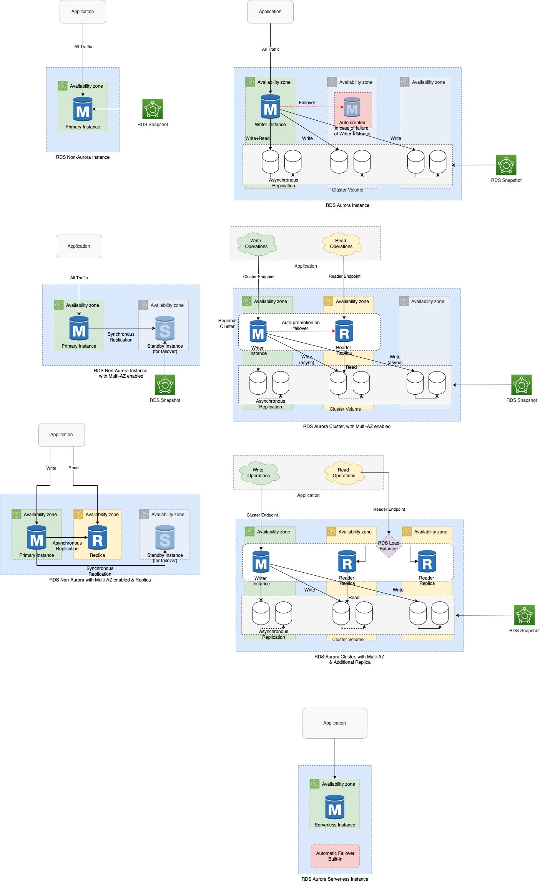

# RDS Read-Replicas
- [Read replicas](https://aws.amazon.com/rds/features/read-replicas/) helps in scalability by handling read traffic on RDS.

# Features

| Features                                                                                                        | Supported DB Engine?             | Description                                                                                                                                                                                                                                                                                                                                                                                                                                                                                          |
|-----------------------------------------------------------------------------------------------------------------|----------------------------------|------------------------------------------------------------------------------------------------------------------------------------------------------------------------------------------------------------------------------------------------------------------------------------------------------------------------------------------------------------------------------------------------------------------------------------------------------------------------------------------------------|
| [Automatic Fail-over Priority](https://aws.amazon.com/blogs/aws/additional-failover-control-for-amazon-aurora/) | [Aurora](AmazonAurora/Readme.md) | In the event of a failover, [Amazon Aurora will promote the Read Replica that has the highest priority (the lowest numbered tier)](https://aws.amazon.com/blogs/aws/additional-failover-control-for-amazon-aurora/). - If two or more Aurora Replicas share the same priority, then Amazon RDS promotes the replica that is largest in size. - If two or more Aurora Replicas share the same priority and size, then Amazon Aurora promotes an arbitrary replica in the same promotion tier. |
| Not-Supported - Promotion to a standalone DB instance                                                           | None                             | You cannot promote an Aurora Read Replica to a standalone DB instance.                                                                                                                                                                                                                                                                                                                                                                                                                               |
| [Data transfer charges for data replication](https://aws.amazon.com/rds/faqs/)                                  | All RDS engines                  | No data transfer in replicating data between the source DB instance and read replica within the same AWS Region. - [Data transfer charges apply across AWS Regions](https://aws.amazon.com/rds/faqs/).                                                                                                                                                                                                                                                                                           |
| Replica Lag                                                                                                     | All RDS engines                  | Uses [physical, log-based asynchronous replication](../../../1_HLDDesignComponents/3_DatabaseComponents/1_Glossaries/AppendOnlyProperty.md)                                                                                                                                                                                                                                                                                                                                                           |
| Same storage, compute as source DB instance                                                                     | All RDS engines                  | For replication to operate effectively, each read replica should have the same amount of compute and storage resources as the source DB instance.                                                                                                                                                                                                                                                                                                                                                    |

# Automatic Fail-over Priority

# References
- [Working with MySQL read replicas](https://docs.amazonaws.cn/en_us/AmazonRDS/latest/UserGuide/USER_MySQL.Replication.ReadReplicas.html)
