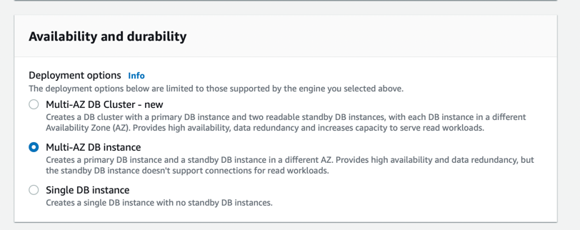

# Amazon RDS
- [Amazon RDS](https://aws.amazon.com/rds/) is a database management service for relational databases.
- It's a database management service for structured data only (database engines like MySQL, PostgresSQL, SQL Server etc.).
- Amazon RDS can be scaled either through [Vertical Scaling](../../../1_HLDDesignComponents/0_SystemGlossaries/Scalability/DBScalability.md) or [Horizontal Scaling (master-slave)](../../../1_HLDDesignComponents/0_SystemGlossaries/Scalability/DBScalability.md).
- [Why Amazon Aurora engine is better than Amazon RDS, for MySQL/Postgres DB engines?](AmazonAuroraVsRDS.md)

# :star: RDS - Different Roles

| Role             | Architecture        | Applicable RDS Engine                                                | Remarks                                                                                |
|------------------|---------------------|----------------------------------------------------------------------|----------------------------------------------------------------------------------------|
| Instance         | -                   | :white_check_mark: All                                               | Simple DB instance, without Multi-AZ enabled.                                          |
| Regional Cluster | Master-Read-Replica | :white_check_mark: [Aurora](AmazonAurora.md)                         | Aurora DB Cluster                                                                      |
| Writer Instance  | Master-Read-Replica | :white_check_mark: [Aurora](AmazonAurora.md)                         | Takes all writes (& reads if multi-AZ disabled), in regional cluster                   |
| Reader Instance  | Master-Read-Replica | :white_check_mark: [Aurora (when Multi-AZ enabled)](AmazonAurora.md) | Takes all reads, in regional cluster                                                   |
| Serverless       | -                   | :white_check_mark: [Aurora](AmazonAurora.md)                         | Serverless compute of Aurora Instance                                                  |
| Primary          | Master-Slave        | Non-Aurora                                                           | Writer Instance, with Multi-AZ enabled and takes all writes.                           |
| Replica          | Master-Slave        | Non-Aurora (when Multi-AZ enabled)                                   | Replica is a standby instance of Primary instance, in the different Availability Zone. |

# Features

| Feature                                                                                                     | Remarks                                                                                                                                                                                                                                                                                                                                                                                                                                                                                                                                                                                                 |
|-------------------------------------------------------------------------------------------------------------|---------------------------------------------------------------------------------------------------------------------------------------------------------------------------------------------------------------------------------------------------------------------------------------------------------------------------------------------------------------------------------------------------------------------------------------------------------------------------------------------------------------------------------------------------------------------------------------------------------|
| High Availability using [Amazon RDS Multi-AZ deployments](https://aws.amazon.com/rds/ha/)                   | When [you provision a Multi-AZ DB instance](https://aws.amazon.com/rds/features/multi-az/), Amazon RDS automatically creates a primary DB instance and synchronously replicates the data to a standby instance in a different Availability Zone (AZ). - In case of an infrastructure failure, Amazon RDS performs an automatic failover to the standby DB instance. - Since the endpoint for your DB instance remains the same after a failover, your application can resume database operation without the need for manual administrative intervention.                                        |
| Security                                                                                                    | RDS is protected by the [VPC security group](https://docs.aws.amazon.com/AmazonRDS/latest/UserGuide/UsingWithRDS.html). It doesn't have its own security group. - Encryption at rest using [AWS KMS](../../2_SecurityAndIdentityServices/2_DataProtectionServices/AWSKMS.md) with [AES-256 encryption algorithm](https://docs.aws.amazon.com/AmazonRDS/latest/UserGuide/Overview.Encryption.html). - Authentication using [AWS IAM](../../2_SecurityAndIdentityServices/1_IdentityServices/AWSIAM.md). - Automated backups, snapshots & replicas are also encrypted. - Encryption in flight/transmit using SSL. |
| Automatic Upgrade                                                                                           | It manages patching, upgrading, and data backups automatically.                                                                                                                                                                                                                                                                                                                                                                                                                                                                                                                                         |
| [DB instance classes](https://docs.aws.amazon.com/AmazonRDS/latest/UserGuide/Concepts.DBInstanceClass.html) | The DB instance class determines the computation and memory capacity of an Amazon RDS DB instance.  - The DB instance class that you need depends on your processing power and memory requirements. - [Memory & Burstable are different instance types](https://aws.amazon.com/rds/instance-types/).                                                                                                                                                                                                                                                                                            |
| [AWS Database Migration Service](../AWSDataMigrationService.md)                                             | -                                                                                                                                                                                                                                                                                                                                                                                                                                                                                                                                                                                                       |
| Amazon RDS instance modification mediums                                                                    | AWS CLI - AWS Management Console - [Amazon RDS API](https://docs.aws.amazon.com/AmazonRDS/latest/UserGuide/ProgrammingGuide.html)                                                                                                                                                                                                                                                                                                                                                                                                                                                               |
| Maintenance window                                                                                          | RDS maintenance window lets you decide when DB instance modifications, database engine version upgrades, and software patching have to occur. - The automatic scheduling is done only for patches that are related to security and [durability](../../../1_HLDDesignComponents/0_SystemGlossaries/Database/Durability.md). - By default, there is a 30-minute value assigned as the maintenance window and the DB instance will still be available during these events though you might observe a minimal effect on performance.                                                                |
| Billing, Capacity Mode - OnDemand, Reserved, [Serverless (if Aurora)](../ScalingServerlessDB.md)            | Billing - Per hour basis pricing. - Reserved - Reserve instance for 1 to 3 years, on discounted pricing.                                                                                                                                                                                                                                                                                                                                                                                                                                                                                            |

# Amazon RDS Proxy
- [Amazon RDS Proxy](https://aws.amazon.com/rds/proxy/) is a fully managed, highly available database proxy for Amazon Relational Database Service (RDS) that makes applications more scalable, more resilient to database failures, and more secure.
- Many applications, including those built on modern serverless architectures, can have a large number of open connections to the database server and may open and close database connections at a high rate, exhausting database memory and compute resources.

# Real-time data analytics architecture

# References
- [Amazon RDS High Availability](https://aws.amazon.com/rds/ha/)
- [AWS RDS Max Connections Limit As Per Instance Type](https://sysadminxpert.com/aws-rds-max-connections-limit/)
- [What does it mean by read replica in Amazon RDS? Is that similar to the slave server?](https://www.quora.com/What-does-it-mean-by-read-replica-in-Amazon-RDS-Is-that-similar-to-the-slave-server)
- [Is Amazon RDS for PostgreSQL or Amazon Aurora PostgreSQL a better choice for me?](https://aws.amazon.com/blogs/database/is-amazon-rds-for-postgresql-or-amazon-aurora-postgresql-a-better-choice-for-me/)