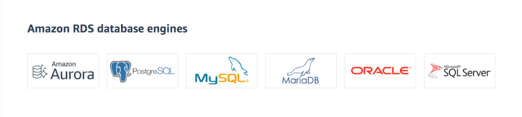

# Amazon RDS
- [Amazon RDS](https://aws.amazon.com/rds/) is a database management service for relational databases (structured data engines like MySQL, PostgresSQL, SQL Server etc.).
- :star: [Amazon RDS Aurora vs Other RDS DB engines](AmazonAuroraVsOtherDBEngines.md)

# System Designs

## Real-time data analytics architecture - Using stored procedure of RDS

# Features

| Feature                                                                                                                                  | Remarks                                                                                                                                                                                                                                                                                                                                                                                                                                                                                                                                   |
|------------------------------------------------------------------------------------------------------------------------------------------|-------------------------------------------------------------------------------------------------------------------------------------------------------------------------------------------------------------------------------------------------------------------------------------------------------------------------------------------------------------------------------------------------------------------------------------------------------------------------------------------------------------------------------------------|
| [High Availability using Amazon RDS Multi-AZ deployments](MultiAZDeployment.md)                                                          | -                                                                                                                                                                                                                                                                                                                                                                                                                                                                                                                                         |
| [Scalability using Read Replicas](https://docs.aws.amazon.com/AmazonRDS/latest/AuroraUserGuide/Aurora.Replication.html)                  | Amazon RDS can be scaled either through [Horizontal Scaling (read replicas)](../../../1_HLDDesignComponents/0_SystemGlossaries/Scalability/DBScalability.md) or [Vertical Scaling](../../../1_HLDDesignComponents/0_SystemGlossaries/Scalability/DBScalability.md).                                                                                                                                                                                                                                                                       |
| Security - Security Group                                                                                                                | RDS is protected by the [VPC security group](https://docs.aws.amazon.com/AmazonRDS/latest/UserGuide/UsingWithRDS.html). It doesn't have its own security group.                                                                                                                                                                                                                                                                                                                                                                           |
| Security - Encryption at rest                                                                                                            | Encryption at rest using [AWS KMS](../../2_SecurityAndIdentityServices/2_DataProtectionServices/AWSKMS.md) with [AES-256 encryption algorithm](https://docs.aws.amazon.com/AmazonRDS/latest/UserGuide/Overview.Encryption.html). - If master database is encrypted, automated backups, snapshots & replicas would also encrypted. - If the master database is not encrypted, the read replicas cannot be encrypted.                                                                                                               |
| Security - Encryption at transmit/flight                                                                                                 | Encryption in flight/transmit using SSL.                                                                                                                                                                                                                                                                                                                                                                                                                                                                                                  |
| Billing, Capacity Mode - OnDemand, Reserved, [Serverless (if Aurora)](../ScalingServerlessDB.md)                                         | Billing - Per hour basis pricing. - Reserved - Reserve instance for 1 to 3 years, on discounted pricing.                                                                                                                                                                                                                                                                                                                                                                                                                              |
| [DB instance classes](https://docs.aws.amazon.com/AmazonRDS/latest/UserGuide/Concepts.DBInstanceClass.html)                              | The DB instance class determines the computation and memory capacity of an Amazon RDS DB instance.  - The DB instance class that you need depends on your processing power and memory requirements. - [Memory & Burstable are different instance types](https://aws.amazon.com/rds/instance-types/).                                                                                                                                                                                                                              |
| Maintenance window                                                                                                                       | RDS maintenance window lets you decide when DB instance modifications, database engine version upgrades, and software patching have to occur. - The automatic scheduling is done only for patches that are related to security and [durability](../../../1_HLDDesignComponents/0_SystemGlossaries/Database/Durability.md). - By default, there is a 30-minute value assigned as the maintenance window and the DB instance will still be available during these events though you might observe a minimal effect on performance.  |
| Automatic Upgrades                                                                                                                       | RDS manages patching, upgrading, and data backups automatically. - Using [Point-In-Time snapshots](https://docs.aws.amazon.com/AmazonRDS/latest/UserGuide/USER_PIT.html), we can restore a DB.                                                                                                                                                                                                                                                                                                                                        |
| RDS instance modification mediums                                                                                                        | AWS CLI - AWS Management Console - [Amazon RDS API](https://docs.aws.amazon.com/AmazonRDS/latest/UserGuide/ProgrammingGuide.html)                                                                                                                                                                                                                                                                                                                                                                                                 |
| [AWS Database Migration Service](../AWSDataMigrationService.md)                                                                          | -                                                                                                                                                                                                                                                                                                                                                                                                                                                                                                                                         |
| [Amazon RDS Proxy](https://aws.amazon.com/rds/proxy/)                                                                                    | [Amazon RDS Proxy](https://aws.amazon.com/rds/proxy/) is a fully managed, highly available database proxy for Amazon Relational Database Service (RDS) that makes applications more scalable, more resilient to database failures, and more secure.                                                                                                                                                                                                                                                                                       |
| [RDS Custom for Oracle](https://aws.amazon.com/blogs/aws/amazon-rds-custom-for-oracle-new-control-capabilities-in-database-environment/) | With RDS Custom for Oracle, you can now access and customize your database server host and operating system, for example by applying special patches and changing the database software settings to support third-party applications that require privileged access. -  Many applications, including those built on modern serverless architectures, can have a large number of open connections to the database server and may open and close database connections at a high rate, exhausting database memory and compute resources. |
| Automatic data backup in S3                                                                                                              | It also automatically backs up data in [Amazon S3](../../7_StorageServices/3_ObjectStorageTypes/AmazonS3/Readme.md).                                                                                                                                                                                                                                                                                                                                                                                                                                                                                                                                          |

# Supported DB Engines

# :star: RDS - Different Roles

| Role             | Applicable RDS Engine?                                               | Remarks                                                                                      |
|------------------|----------------------------------------------------------------------|----------------------------------------------------------------------------------------------|
| Regional Cluster | :white_check_mark: [Aurora](AmazonAurora.md)                         | Aurora DB Cluster                                                                            |
| Writer Instance  | :white_check_mark: [Aurora](AmazonAurora.md)                         | Takes all writes (& reads if [Multi-AZ](MultiAZDeployment.md) disabled), in regional cluster |
| Reader Instance  | :white_check_mark: [Aurora (when Multi-AZ enabled)](AmazonAurora.md) | Takes all reads, in regional cluster                                                         |
| Serverless       | :white_check_mark: [Aurora](AmazonAurora.md)                         | Serverless compute of Aurora Instance                                                        |
| Primary          | Non-Aurora                                                           | Writer Instance, with [Multi-AZ](MultiAZDeployment.md) enabled and takes all writes.                                 |
| Replica          | Non-Aurora (when [Multi-AZ](MultiAZDeployment.md) enabled)           | Replica is a standby instance of Primary instance, in the different Availability Zone.       |

# References
- [AWS RDS Max Connections Limit As Per Instance Type](https://sysadminxpert.com/aws-rds-max-connections-limit/)
- [What does it mean by read replica in Amazon RDS? Is that similar to the slave server?](https://www.quora.com/What-does-it-mean-by-read-replica-in-Amazon-RDS-Is-that-similar-to-the-slave-server)
- [Is Amazon RDS for PostgreSQL or Amazon Aurora PostgreSQL a better choice for me?](https://aws.amazon.com/blogs/database/is-amazon-rds-for-postgresql-or-amazon-aurora-postgresql-a-better-choice-for-me/)