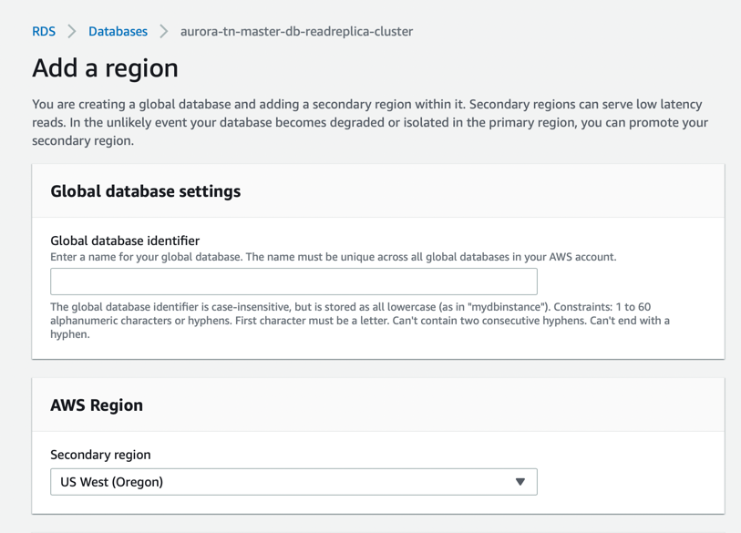
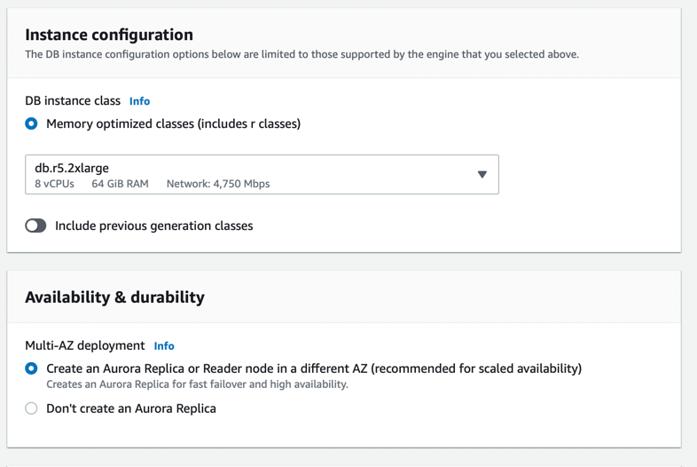

# Aurora Global Database
- [Amazon Aurora global databases](https://docs.aws.amazon.com/AmazonRDS/latest/AuroraUserGuide/aurora-global-database.html) span multiple AWS Regions, enabling low latency global reads and providing fast recovery from the rare outage that might affect an entire AWS Region. 
- An Aurora global database has a primary [Aurora DB cluster](Readme.md) in one Region, and [up to five secondary Aurora DB clusters](Readme.md) in different Regions.
- [Only Single-Master Aurora cluster is supported](https://docs.aws.amazon.com/AmazonRDS/latest/AuroraUserGuide/aurora-multi-master.html) in Aurora Global Database i.e. there would be only 1 writer instance and multiple read replicas in different regions.

## Primary vs Secondary DB Cluster

## How to set up Aurora Global Database?
- Select Aurora DB Cluster and click on [Add Region](https://docs.aws.amazon.com/AmazonRDS/latest/AuroraUserGuide/aurora-global-database-getting-started.html#aurora-global-database-attaching).

## :thumbsup: Advantages of Aurora Global Database
- [Cross-Region Replication with low replica lag (in less than 1 second)](../../AWS-Global-Architecture-Region-AZ.md). 
  - [Aurora uses physical, log-based asynchronous replication](../../../1_HLDDesignComponents/0_SystemGlossaries/AppendOnlyDataStructure.md).
- [Disaster Recovery](../../../1_HLDDesignComponents/0_SystemGlossaries/Reliability/FaultTolerance&DisasterRecovery.md) promotes remote databases to a primary for faster recovery ( in less than 1 min ) in the event of a disaster. 
  - For industries like `Financial Services` etc.
- [Data Locality]() brings data closer to users in different regions to enable faster reads.

## Using write forwarding in an Amazon Aurora global database

[Read more](https://docs.aws.amazon.com/AmazonRDS/latest/AuroraUserGuide/aurora-global-database-write-forwarding.html)
