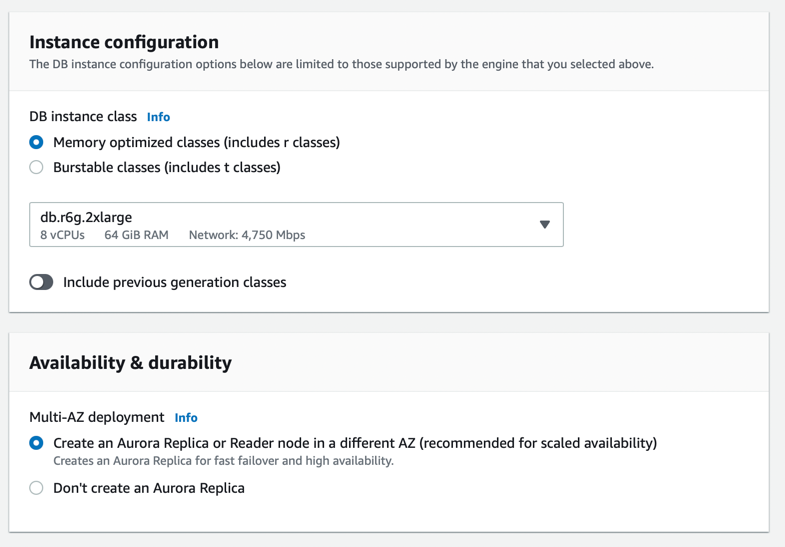

# Amazon RDS Aurora
- [Amazon RDS Aurora](https://aws.amazon.com/rds/aurora/) is designed for unparalleled [high performance and availability at global scale](../../../1_HLDDesignComponents/0_SystemGlossaries/LatencyThroughput.md) with full MySQL and PostgreSQL compatibility (that means your drivers will work as if Aurora was a Postgres or MySQL database).
- Aurora is a proprietary technology from AWS (not open sourced).
- Aurora is `AWS Cloud Optimized` and claims `5x performance improvement over MySQL on RDS`, over `3x performance improvement over Postgres on RDS`.
- [High throughput up to 200K writes/second](../../../1_HLDDesignComponents/0_SystemGlossaries/LatencyThroughput.md), with negligible performance impact.

# Important Points
- [Aurora Global Database](AuroraGlobalDatabase.md)
- [Aurora Serverless](AuroraServerless.md)
- [Why Amazon Aurora engine is better than Amazon RDS, for MySQL/Postgres DB engines?](../AmazonAuroraVsRDS.md)

# High Availability

## Aurora Storage - High Availability
- The [Amazon Aurora PostgreSQL and Amazon Aurora MySQL engines](https://aws.amazon.com/rds/ha/) include [additional High Availability](../../../1_HLDDesignComponents/0_SystemGlossaries/HighAvailability.md) options. 
- Even with a single database instance, Amazon Aurora increases availability by [replicating your data six ways across three Availability Zones](). 
- This means that your DB cluster can tolerate a failure of an Availability Zone without any loss of data and only a brief interruption of service.
- It also automatically backs up data in [Amazon S3](../../7_StorageServices/AmazonS3.md).

## Aurora Compute - High Availability
In addition, you can choose to run one or more Replicas in an [Amazon Aurora DB cluster](../../../1_HLDDesignComponents/0_SystemGlossaries/ServersCluster.md), through [Multi-AZ deployment](https://aws.amazon.com/rds/features/multi-az/). 
- If the primary instance in the DB cluster fails, RDS automatically promotes an existing Aurora Replica to be the new primary instance and updates the server endpoint so that your application can continue operation with no manual intervention. 
- If no Replicas have been provisioned, RDS will automatically create a new replacement DB instance for you when a failure is detected. (but this might take upto 10 minutes)

### How to setup Multi-AZ deployment in Aurora?

[Read more](https://aws.amazon.com/rds/features/multi-az/)

# Scalability (through read replicas)
- One Aurora Instance (master) takes writes.
- [One master can have up to 15 Aurora Read Replicas across the Availability Zones that a DB cluster spans within an AWS Region. across multi-regions](https://docs.aws.amazon.com/AmazonRDS/latest/AuroraUserGuide/Aurora.Replication.html) (through auto-scaling or on demand). 
- Aurora supports `Auto Expanding` & its storage automatically grows in increments of 10GB, up to 128 TB.

## Aurora Multi-master cluster
- About [Aurora Multi-master cluster](https://docs.aws.amazon.com/AmazonRDS/latest/AuroraUserGuide/aurora-multi-master.html)

### :thumbsdown: Disadvantages with Aurora Multi-master clusters
- You can have a maximum of `four master DB instances` in a multi-master cluster.
- All DB instances in a multi-master cluster must be in the same AWS Region.
- You can't enable cross-Region replicas from multi-master clusters.
- Multi-master clusters are available in the certain AWS Regions.
- A multi-master cluster doesn't do any load balancing for connections.
- Application must implement its own connection management logic to distribute read and write operations among multiple DB instance endpoints.

# Security ( similar to RDS )
- Encryption at rest using KMS
- Automated backups, snapshots & replicas are also encrypted.
- Encryption in flight/transmit using SSL
- Authentication using IAM

# Master-Slave vs Read Replica?
- [Read More](https://www.quora.com/What-does-it-mean-by-read-replica-in-Amazon-RDS-Is-that-similar-to-the-slave-server)

# References
- [Amazon RDS High Availability](https://aws.amazon.com/rds/ha/)
- [High availability for Amazon Aurora](https://docs.aws.amazon.com/AmazonRDS/latest/AuroraUserGuide/Concepts.AuroraHighAvailability.html)
- :star: [Amazon Aurora Global Database Design Patterns for HA and DR | Amazon Web Services](https://www.youtube.com/watch?v=bbiWciJSouY)
- [Amazon Aurora Introduction - By Stephane Maarek](https://www.youtube.com/watch?v=ZCt3ctVfGIk)
- [Why does AWS RDS Aurora have the option of "Multi-AZ Deployment" when it does replication across different zones already by default?](https://stackoverflow.com/questions/31976527/why-does-aws-rds-aurora-have-the-option-of-multi-az-deployment-when-it-does-re)