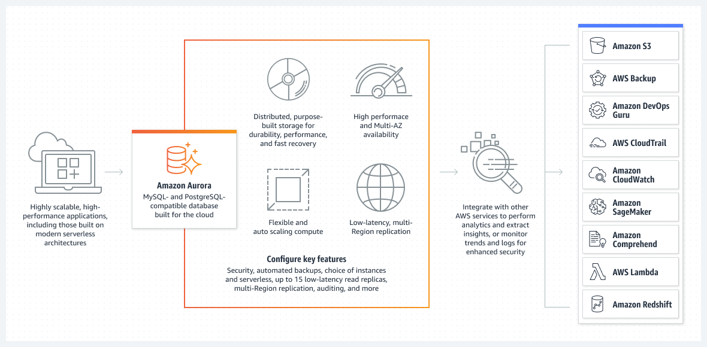

# Amazon RDS Aurora
- [Amazon RDS Aurora](https://aws.amazon.com/rds/aurora/) is designed for [unparalleled high performance and availability at global scale](../../../1_HLDDesignComponents/0_SystemGlossaries/Scalability/LatencyThroughput.md) with full MySQL and PostgreSQL compatibility (that means your drivers will work as if Aurora was a Postgres or MySQL database).
- Aurora is AWS Cloud Optimized and claims [5x performance improvement over MySQL on RDS, over 3x performance improvement over Postgres on RDS](../../../1_HLDDesignComponents/0_SystemGlossaries/Scalability/LatencyThroughput.md).
- [High throughput up to 200K writes/second](../../../1_HLDDesignComponents/0_SystemGlossaries/Scalability/LatencyThroughput.md), with negligible performance impact.
- [Amazon RDS Aurora vs Other RDS DB engines](../AmazonAuroraVsRDS.md)
- Aurora is a proprietary technology from AWS (not open sourced).

# High Availability

## Aurora Storage
- The [Amazon Aurora PostgreSQL and Amazon Aurora MySQL engines](https://aws.amazon.com/rds/ha/) include [additional High Availability](../../../1_HLDDesignComponents/0_SystemGlossaries/Reliability/HighAvailability.md) options. 
- Even with a single database instance, Amazon Aurora increases availability by [replicating your data six ways across three Availability Zones](). 
- This means that your [DB cluster can tolerate a failure of an Availability Zone](../../../1_HLDDesignComponents/0_SystemGlossaries/Reliability/FaultTolerance&DisasterRecovery.md) without any loss of data and only a brief interruption of service.
- It also automatically backs up data in [Amazon S3](../../7_StorageServices/AmazonS3.md).

## Aurora Compute
- You can choose to run one or more Replicas in an [Amazon Aurora DB cluster](../../../1_HLDDesignComponents/0_SystemGlossaries/Scalability/ServersCluster.md), through [Multi-AZ deployment](https://aws.amazon.com/rds/features/multi-az/). 
- If the primary instance in the DB cluster fails, RDS automatically promotes an existing Aurora Replica to be the new primary instance and updates the server endpoint so that your application can continue operation with no manual intervention. 
- Note - If no Replicas have been provisioned, RDS will automatically create a new replacement DB instance for you when a failure is detected. (but this might take upto 10 minutes)

### How to set up Multi-AZ deployment in Aurora?

[Read more](https://aws.amazon.com/rds/features/multi-az/)

# Scalability (through Aurora replicas)
- [One master can have up to 15 Aurora Replicas across the Availability Zones that a DB cluster spans within an AWS Region.](https://docs.aws.amazon.com/AmazonRDS/latest/AuroraUserGuide/Aurora.Replication.html) (through auto-scaling or on demand). 
- [Aurora supports Auto Expanding](https://aws.amazon.com/about-aws/whats-new/2020/10/amazon-aurora-enables-dynamic-resizing-database-storage-space/) i.e. its storage automatically grows in increments of 10GB, up to 128 TB.

## :thumbsup: Aurora Single-Master cluster
- [In Single-Master Aurora cluster](https://docs.aws.amazon.com/AmazonRDS/latest/AuroraUserGuide/AuroraMySQL.Replication.html), there would be only 1 writer instance and multiple read replicas in different AZs/regions.
- [Use Aurora Serverless for serverless compute of DB instances](AuroraServerless.md)

[Use :globe_with_meridians: Aurora Global Database for multiple replicas in different regions.](AuroraGlobalDatabase.md)

## :thumbsdown: Aurora Multi-master cluster
- [Read more](https://docs.aws.amazon.com/AmazonRDS/latest/AuroraUserGuide/aurora-multi-master.html)

### Disadvantages with Aurora Multi-master clusters
- You can have a [maximum of four master DB instances in a multi-master cluster](https://docs.aws.amazon.com/AmazonRDS/latest/AuroraUserGuide/aurora-multi-master.html).
- [All DB instances in a multi-master cluster must be in the same AWS Region](../../AWS-Global-Architecture-Region-AZ.md).
- [You can't enable cross-Region replicas from multi-master clusters]().
- Multi-master clusters are only available in the certain AWS Regions.
- [A multi-master cluster doesn't do any load balancing for connections](https://docs.aws.amazon.com/AmazonRDS/latest/AuroraUserGuide/aurora-multi-master.html#aurora-multi-master-connectivity).
  - Application must implement its own connection management logic to distribute read and write operations among multiple DB instance endpoints.
  
# References
- [Amazon Aurora Global Database Design Patterns for HA and DR | Amazon Web Services](https://www.youtube.com/watch?v=bbiWciJSouY)
- [Amazon RDS High Availability](https://aws.amazon.com/rds/ha/)
- [High availability for Amazon Aurora](https://docs.aws.amazon.com/AmazonRDS/latest/AuroraUserGuide/Concepts.AuroraHighAvailability.html)
- [Amazon Aurora Introduction - By Stephane Maarek](https://www.youtube.com/watch?v=ZCt3ctVfGIk)
- [Why does AWS RDS Aurora have the option of "Multi-AZ Deployment" when it does replication across different zones already by default?](https://stackoverflow.com/questions/31976527/why-does-aws-rds-aurora-have-the-option-of-multi-az-deployment-when-it-does-re)