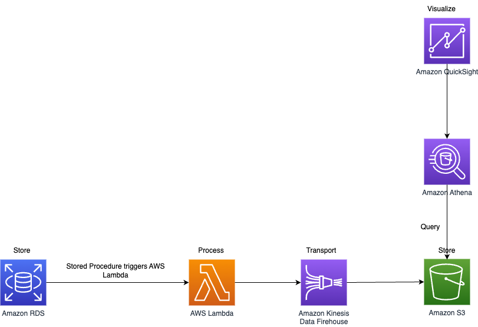

# Amazon Simple Storage Service (S3)
- [Amazon S3](https://aws.amazon.com/s3/) is an object store (flat-structure), meaning it is a higher layer data storage system, essentially [it is a database "blob" storage](https://www.techopedia.com/definition/32166/blob-storage), storing data in an underlying simple database as an object.
- It's designed for [WRITE once READ many access i.e. append-only data structure](../../../../1_HLDDesignComponents/0_SystemGlossaries/Database/AppendOnlyDataStructure.md), perfect for [Static content](../../../../1_HLDDesignComponents/0_SystemGlossaries/CDNs/StaticContentWithCDN.md).
- It's [distributed](../../../../1_HLDDesignComponents/0_SystemGlossaries/Readme.md) and offers a very high level of redundancy i.e. [data is stored in 3 AZs within a specific region](../../../AWS-Global-Architecture-Region-AZ.md).

# Amazon S3 use cases

| Use Case                                                                                             | Description                                                                                                                                                                                                                                                                                                                                                                                                                     |
|------------------------------------------------------------------------------------------------------|---------------------------------------------------------------------------------------------------------------------------------------------------------------------------------------------------------------------------------------------------------------------------------------------------------------------------------------------------------------------------------------------------------------------------------|
| [Static websites](../../../../1_HLDDesignComponents/0_SystemGlossaries/CDNs/StaticContentWithCDN.md) | You can configure your S3 bucket to host a static website of HTML, CSS, and client-side scripts.                                                                                                                                                                                                                                                                                                                                |
| [Static content](../../../../1_HLDDesignComponents/0_SystemGlossaries/CDNs/StaticContentWithCDN.md)  | Because of the limitless scaling, the support for large files, and the fact that you access any object over the web at any time, Amazon S3 is the perfect place to store static content.                                                                                                                                                                                                                                        |
| Backup and storage                                                                                   | Amazon S3 is a natural place to back up files because it is highly redundant.  - As mentioned in the last unit, AWS stores your EBS snapshots in S3 to take advantage of its high availability.                                                                                                                                                                                                                             |
| Media hosting                                                                                        | Because you can store unlimited objects, and each individual object can be up to 5 TBs, Amazon S3 is an ideal location to host video, photo, and music uploads.                                                                                                                                                                                                                                                                 |
| Software delivery                                                                                    | You can use Amazon S3 to host your software applications that customers can download.                                                                                                                                                                                                                                                                                                                                           |
| [Data lakes](../../../10_BigDataComponents/DataLakes/S3DataLake.md)                                  | -                                                                                                                                                                                                                                                                                                                                                                                                                               |
| Data Catalog                                                                                         | You can create the comprehensive data catalog by using standard AWS services like AWS Lambda, Amazon DynamoDB, and Amazon Elasticsearch Service (Amazon ES).  - At a high level, you can use Lambda triggers to populate DynamoDB tables with object names and metadata.  - When those objects are put into Amazon S3 then Amazon ES is used to search for specific assets, related metadata, and data classifications. |

# Key Features of S3

| Feature                                                                                                                                | Description                                                                                                                                                                                                                                                                                                                                           |
|----------------------------------------------------------------------------------------------------------------------------------------|-------------------------------------------------------------------------------------------------------------------------------------------------------------------------------------------------------------------------------------------------------------------------------------------------------------------------------------------------------|
| :star: [S3 vs Others](../../S3vsEBSvsEFS.md)                                                                                           | -                                                                                                                                                                                                                                                                                                                                                     |
| [Buckets](S3Bucket.md)                                                                                                                 | Buckets are permanent containers that hold objects.                                                                                                                                                                                                                                                                                                   |
| [Highly durable](../../../../1_HLDDesignComponents/0_SystemGlossaries/Database/Durability.md)                                          | -                                                                                                                                                                                                                                                                                                                                                     |
| [Infinitely scalable](../../../../1_HLDDesignComponents/0_SystemGlossaries/Scalability/DBScalability.md)                               | Application can achieve [at least 3,500 PUT/COPY/POST/DELETE or 5,500 GET/HEAD requests per second per prefix](https://docs.aws.amazon.com/AmazonS3/latest/userguide/optimizing-performance.html) in a bucket.                                                                                                                                        |
| [Versioning](Versioning.md)                                                                                                            | -                                                                                                                                                                                                                                                                                                                                                     |
| [S3 Storage Classes & Lifecycle](S3StorageClassesAndLifecycle.md)                                                                      | -                                                                                                                                                                                                                                                                                                                                                     |
| [Objects up to 5TB in size](https://aws.amazon.com/blogs/aws/amazon-s3-object-size-limit/)                                             | When uploading data via the AWS Management Console, the maximum file that you can upload is 160GB.  - To upload a file larger than 160 GB, use the AWS CLI, AWS SDK, or Amazon S3 REST API.                                                                                                                                                       |
| [Strong data consistency model](https://aws.amazon.com/s3/consistency/)                                                                | After a successful write of a new object or overwrite of an existing object, any subsequent read request immediately receives the latest version of the object.  - Amazon S3 also provides strong consistency for list operations, so after a write, you can immediately perform a listing of the objects in a bucket with any changes reflected. |
| [Automatic event on adding file in S3](https://docs.aws.amazon.com/AmazonS3/latest/userguide/grant-destinations-permissions-to-s3.html) | S3 can publish event notification messages to a destination (Lambda, SQS, SNS etc.) on new object upload.                                                                                                                                                                                                                                             |
| [Analyse data using Amazon Athena](../../../10_BigDataComponents/DataAnalytics/AmazonAthena.md)                                        | [Amazon Athena](../../../10_BigDataComponents/DataAnalytics/AmazonAthena.md) is a serverless, interactive analytics service built on open-source frameworks, supporting open-table and file formats.                                                                                                                                                  |
| [Multipart Upload](https://docs.aws.amazon.com/AmazonS3/latest/userguide/mpuoverview.html)                                             | Multipart upload allows you to upload a single object as a set of parts.  - Each part is a contiguous portion of the object's data.  - You can upload these object parts independently and in any order.                                                                                                                                      |
| [Server Access Logs](https://docs.aws.amazon.com/AmazonS3/latest/userguide/ServerLogs.html)                                            | Server access logging provides detailed records for the requests that are made to a bucket.  - Server access logs are useful for many applications. For example, access log information can be useful in security and access audits.  - It can also help you learn about your customer base and understand your Amazon S3 bill.               |
| [MFA delete to protect bucket](https://docs.aws.amazon.com/AmazonS3/latest/userguide/MultiFactorAuthenticationDelete.html)             | MFA delete requires secondary authentication to take place before objects can be permanently deleted from an Amazon S3 bucket. Hence, this is the correct option.                                                                                                                                                                                     |
| [Cross-Region Replication (CRR)](https://docs.aws.amazon.com/AmazonS3/latest/userguide/replication-config-for-kms-objects.html)        | [Cross-Region replication](https://docs.aws.amazon.com/AmazonS3/latest/userguide/replication-config-for-kms-objects.html) is a bucket-level configuration that enables automatic, asynchronous copying of objects across buckets in different AWS Regions.                                                                                            |
| [Same-Region Replication (SRR)](https://aws.amazon.com/about-aws/whats-new/2019/09/amazon-s3-introduces-same-region-replication/)      | Amazon S3 supports automatic and asynchronous replication of newly uploaded S3 objects to a destination bucket in the same AWS Region.                                                                                                                                                                                                                |

## Cross-Region Supported

# :star: Real world use cases of Amazon S3

## :star: Amazon S3 + Amazon CloudFront: A Match Made in the Cloud
- Instead of [directly accessing the S3 resource](https://aws.amazon.com/blogs/networking-and-content-delivery/amazon-s3-amazon-cloudfront-a-match-made-in-the-cloud/), we should use [CloudFront distribution](../../../1_NetworkingAndContentDelivery/1_EdgeNetworking/AmazonCloudFront.md) in the middle (which acts as a [CDN](../../../../1_HLDDesignComponents/0_SystemGlossaries/CDNs/CDNs.md))

## Upload Image using Amazon S3 and Lambda

[Read more](../../../0_AWSDesigns/DesignUploadImageAWSLambdaS3/README.md)

## Hosting a static website using Amazon S3 & CloudFront
- You can use [Amazon S3 to host a static website](https://docs.aws.amazon.com/AmazonS3/latest/userguide/WebsiteHosting.html).
- [On a static website, individual webpages include static content](../../../../1_HLDDesignComponents/0_SystemGlossaries/CDNs/StaticContentWithCDN.md).
- They might also contain client-side scripts.

By contrast, a dynamic website relies on server-side processing, including server-side scripts, such as PHP, JSP, or ASP.NET.
- [Amazon S3]() does not support server-side scripting, but AWS has other resources for hosting dynamic websites.

[Read more](../../../0_AWSDesigns/WPSiteCloudFront&S3.md)

## Real-time data analytics architecture

# Useful Tools

| Tool                                                                                                                               | Description                                                                                                                                                                                                                         |
|------------------------------------------------------------------------------------------------------------------------------------|-------------------------------------------------------------------------------------------------------------------------------------------------------------------------------------------------------------------------------------|
| :star: [Amazon S3 Storage Lens](S3StorageLens.md)                                                                                  | -                                                                                                                                                                                                                                   |
| [Amazon S3 analytics – Storage Class Analysis](https://docs.aws.amazon.com/AmazonS3/latest/userguide/analytics-storage-class.html) | By using Amazon S3 analytics Storage Class Analysis you can analyze storage access patterns to help you decide when to transition the right data to the right [storage class](S3StorageClassesAndLifecycle.md).                     |
| [Amazon S3 inventory](https://docs.aws.amazon.com/AmazonS3/latest/userguide/storage-inventory.html)                                | Amazon S3 inventory is one of the tools Amazon S3 provides to help manage your storage. You can use it to audit and report on the replication and encryption status of your objects for business, compliance, and regulatory needs. |
| [Amazon S3 Server access logging](https://docs.aws.amazon.com/AmazonS3/latest/userguide/ServerLogs.html)                           | Amazon S3 Server access logging provides detailed records for the requests that are made to a bucket.                                                                                                                               |
| [AWS Cloudtrail logs](../../../8_MonitoringServices/AWSCloudTrail.md)                                                              | AWS CloudTrail is a service that enables governance, compliance, operational auditing, and risk auditing of your AWS account                                                                                                        |
| [Amazon QuickSight](https://aws.amazon.com/quicksight/)                                                                            | Amazon QuickSight powers data-driven organizations with unified business intelligence (BI) at hyperscale.                                                                                                                           |
| [Amazon Cloudwatch](../../../8_MonitoringServices/AmazonCloudWatch.md)                                                             | -                                                                                                                                                                                                                                   |
| [AWS Budgets](../../../11_AWSCostOptimization/Readme.md)                                                                           | -                                                                                                                                                                                                                                   |
| [AWS Costs & Usage Reports](../../../11_AWSCostOptimization/Readme.md)                                                             | -                                                                                                                                                                                                                                   |

# S3 Cli
- It's a best practice to use [aws s3 commands](https://docs.aws.amazon.com/cli/latest/reference/s3/) for multipart uploads and downloads, because these [aws s3 commands automatically perform multipart uploading and downloading based on the file size](https://repost.aws/knowledge-center/s3-multipart-upload-cli).

| Name                 | Command                            | Remarks                                                                                                                                                 |
|----------------------|------------------------------------|---------------------------------------------------------------------------------------------------------------------------------------------------------|
| Copy file            | aws s3 cp command                  | In this command, you use the aws s3 cp command to copy the whale.jpg file from the client local machine in c:\sourcefiles to the demo-oceanlife bucket. |
| List files           | aws s3 ls                          | -                                                                                                                                                       |
| List files in bucket | aws s3 ls *bucketname*             | -                                                                                                                                                       |
| Sync folder          | aws s3 sync <source> <destination> | -                                                                                                                                                       |
| Move file            | -                                  | -                                                                                                                                                       |

[Read more](https://docs.aws.amazon.com/cli/latest/reference/s3/)

# References
- [Append data to an S3 object](https://stackoverflow.com/questions/41783903/append-data-to-an-s3-object)