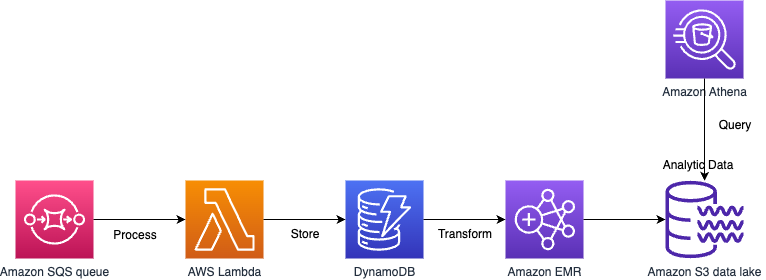

# Amazon Athena
- [Amazon Athena](https://aws.amazon.com/athena/) is an interactive query service that makes it easy for you to analyze data directly in Amazon S3, using standard SQL.

# IoT sensor data capture architecture
- Capturing data from thousands of Internet of Things (IoT) sensors can be a challenge. This architecture represents one solution to this challenge.

