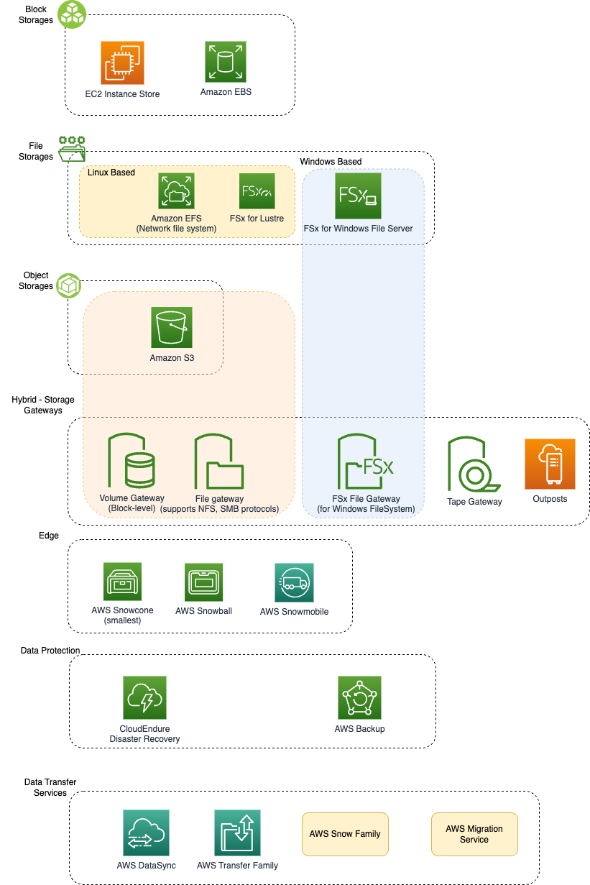

# Storage Services

# Storage types

|             | Block                                                                                                          | File                                        | Object                          |
|-------------|----------------------------------------------------------------------------------------------------------------|---------------------------------------------|---------------------------------|
| Example     | SSD, HDD disks etc.                                                                                            | NAS drives etc.                             | -                               |
| AWS Service | [Amazon EBS](1_BlockStorageTypes/AmazonEBS.md) & [Instance Storage](1_BlockStorageTypes/AmazonEC2InstanceStore.md) | [Amazon EFS](2_FileStorageTypes/AmazonEFS.md) | [Amazon S3](3_ObjectStorageTypes/AmazonS3/Readme.md) |
| Speed       | Relatively fast                                                                                                | -                                           | -                               |

.png)

# Pricing

|             | Description                                                                                                                                                                                                                 |
|-------------|-----------------------------------------------------------------------------------------------------------------------------------------------------------------------------------------------------------------------------|
| On-Demand   | For some storage services, such as [Amazon Elastic File System (Amazon EFS)](2_FileStorageTypes/AmazonEFS.md) and [Amazon Simple Storage Service (Amazon S3)](3_ObjectStorageTypes/AmazonS3/Readme.md), you pay for the capacity that you consume. |
| Provisioned | For other storage services, such as [Amazon Elastic Block Store (Amazon EBS)](1_BlockStorageTypes/AmazonEBS.md), Amazon FSx for Lustre, and Amazon FSx for Windows File Server, you pay for the capacity that you provision.  |
