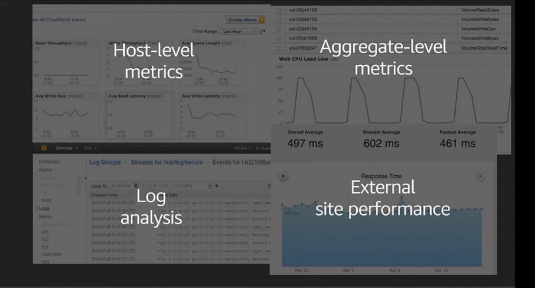

# Amazon CloudWatch
- [Amazon CloudWatch](https://aws.amazon.com/cloudwatch/) is a real-time monitoring service that gives you visibility into the performance and health of your AWS resources and applications. 
- Depending on multiple metrics, it participates in triggering alarms and gives actionable insights.

# Key Features
- [Collect - Metrics & Logs](https://docs.aws.amazon.com/AWSEC2/latest/UserGuide/viewing_metrics_with_cloudwatch.html#ec2-cloudwatch-metrics)
- Monitor - Alarms & dashboards
- Act - Auto Scaling & events
- Analyse - Trends & metric math
- Compliance & security

# What AWS resources can be monitored in CloudWatch?

Mostly all AWS resources can be monitored in [AWS Cloudwatch](https://images.ctfassets.net/ee3ypdtck0rk/3Nj7dlXrWjY6QGLJ2WlLQy/37e85ae7a0581d31792dd05dd0830e50/Screen_Shot_2021-08-27_at_16.31.30.png?w=1853&h=1059&q=50&fm=webp).

| AWS Service          | Remarks                                                                 |
|----------------------|-------------------------------------------------------------------------|
| EC2                  | CPU, Memory utilization, NetworkIn / Out, DiskReadOps/DiskWriteOps etc. |
| Amazon RDS           | Instances, Slow SQL Queries etc.                                        |
| Load Balancer        | Various HTTP Errors, Error Rates etc.                                   |
| CloudFront Metrics   | Origin Latency, Error Rates etc.                                        |
| Amazon SQS           | -                                                                       |
| S3                   | -                                                                       |
| [SNS](https://docs.aws.amazon.com/sns/latest/dg/sns-monitoring-using-cloudwatch.html)                  | -                                                                       |

# CloudWatch's metrics for the Elastic Load Balancer

[Read more](https://docs.aws.amazon.com/elasticloadbalancing/latest/application/load-balancer-cloudwatch-metrics.html)

# CloudWatch's metrics for Elastic Cache

