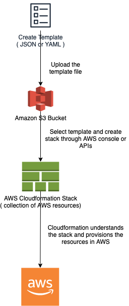

# AWS CloudFormation - Infrastructure as a CODE
- [AWS CloudFormation](https://aws.amazon.com/cloudformation/) is a service that helps you model and set up your AWS resources so that you can spend less time managing those resources and more time focusing on your applications that run in AWS.
- [You can create a template](https://docs.aws.amazon.com/AWSCloudFormation/latest/UserGuide/gettingstarted.templatebasics.html) that describes all the AWS resources that you want (like [Amazon EC2 instances](../../3_ComputeServices/AmazonEC2) or [Amazon RDS DB instances](../../6_DatabaseServices/AmazonRDS/Readme.md)), and CloudFormation takes care of provisioning and configuring those resources for you.
- You don't need to individually create and configure AWS resources and figure out what's dependent on what - CloudFormation handles that.



# Steps involved in a CloudFormation Solution
- [Create or use an existing CloudFormation template](https://docs.aws.amazon.com/AWSCloudFormation/latest/UserGuide/gettingstarted.templatebasics.html) using `JSON or YAML format`.
- Save the code in an [S3 bucket](../../7_StorageServices/3_ObjectStorageS3/Readme.md), which serves as a repository for the code.
- Use [AWS CloudFormation]() to call the bucket and [create a stack on your template](https://docs.aws.amazon.com/AWSCloudFormation/latest/UserGuide/stacks.html).
- CloudFormation reads the file and understands the services that are called, their order, the relationship between the services, and provisions the services one after the other.

# Features

| Feature                                                                                                | Section            | Description                                                                                                                                                                                                                                                                                                                                                                                                                                                                                                                                                                                                                                |
|--------------------------------------------------------------------------------------------------------|--------------------|--------------------------------------------------------------------------------------------------------------------------------------------------------------------------------------------------------------------------------------------------------------------------------------------------------------------------------------------------------------------------------------------------------------------------------------------------------------------------------------------------------------------------------------------------------------------------------------------------------------------------------------------|
| Template                                                                                               | General            | [A CloudFormation template](https://docs.aws.amazon.com/AWSCloudFormation/latest/UserGuide/gettingstarted.templatebasics.html) is deployed into the AWS environment as a [STACK](https://docs.aws.amazon.com/AWSCloudFormation/latest/UserGuide/stacks.html) (like microservice etc.).<br/>- You can manage stacks through the AWS Management Console, AWS Command Line Interface, or AWS CloudFormation APIs.<br/>- If you need to make changes to the running resources in a stack, you update the stack.                                                                                                                                |
| Change Sets                                                                                            | General            | [Change sets](https://docs.aws.amazon.com/AWSCloudFormation/latest/UserGuide/using-cfn-updating-stacks-changesets.html) enable you to see how your changes might impact your running resources, especially for critical resources, before implementing them.<br/>- Before making changes to your resources, [you can generate a change set](https://docs.aws.amazon.com/AWSCloudFormation/latest/UserGuide/using-cfn-updating-stacks-changesets.html), which is a summary of your proposed changes.                                                                                                                                        |
| Nested Stacks                                                                                          | General            | [Nested stacks](https://docs.aws.amazon.com/AWSCloudFormation/latest/UserGuide/using-cfn-nested-stacks.html) are stacks created as part of other stacks. You create a nested stack within another stack by using the `AWS::CloudFormation::Stack` resource. <br/>- To update a nested stack, always update the parent (root stack).<br/>- Example - Load Balancer, Security Group etc.<br/>- [CloudFormation cross-stack vs nested-stack](https://stackoverflow.com/questions/56157423/cloudformation-cross-stack-vs-nested-stack)                                                                                                         |
| Custom Resources                                                                                       | Advanced           | CloudFormation supports two types of [custom resources](https://docs.aws.amazon.com/AWSCloudFormation/latest/UserGuide/template-custom-resources.html): SNS-backed custom resource and Lambda-backed custom resource.                                                                                                                                                                                                                                                                                                                                                                                                                      |
| Cloudformation Registry                                                                                | Advanced           | The [CloudFormation registry](https://docs.aws.amazon.com/AWSCloudFormation/latest/UserGuide/registry.html) lets you manage extensions, both public and private, such as resources, modules, and hooks that are available for use in your AWS account.<br/>- Currently, you can use the following extension types in the AWS registry: resources types, modules, and hooks.<br/>- The registry makes it easier to discover and provision extensions in your AWS CloudFormation templates in the same manner you use AWS-provided resources. <br/>Register custom resource type in Cloudformation Registry (private or public).             |
| Template Modules                                                                                       | Advanced           | [Modules](https://aws.amazon.com/blogs/mt/introducing-aws-cloudformation-modules/) are building blocks that can be reused across multiple CloudFormation templates and is used just like a native CloudFormation resource.                                                                                                                                                                                                                                                                                                                                                                                                                 |
| Dynamic References                                                                                     | Advanced           | Dynamically refer to [AWS System Manager](../../2_SecurityAndIdentityServices/2_DataProtectionServices/AWSSystemManager.md) or [AWS Secret Manager](../../2_SecurityAndIdentityServices/2_DataProtectionServices/AWSSecretsManager.md) parameter.<br/>- [Read more](https://docs.aws.amazon.com/AWSCloudFormation/latest/UserGuide/dynamic-references.html)                                                                                                                                                                                                                                                                                |
| Stack                                                                                                  | General            | A collection of AWS resources that you can manage as a single unit.                                                                                                                                                                                                                                                                                                                                                                                                                                                                                                                                                                        |                                                                                                                                                                                                                                                                                                                                                                                                                                                                                                                                                                       |
| [Stack Sets](https://docs.aws.amazon.com/AWSCloudFormation/latest/UserGuide/what-is-cfnstacksets.html) | General            | [AWS CloudFormation StackSets](https://docs.aws.amazon.com/AWSCloudFormation/latest/UserGuide/what-is-cfnstacksets.html) extends the capability of stacks by enabling you to create, update, or delete stacks across multiple accounts and AWS Regions with a single operation.<br/>- Using an administrator account, you define and manage an AWS CloudFormation template, and use the template as the basis for provisioning stacks into selected target accounts across specified AWS Regions.                                                                                                                                          |
| State Management                                                                                       | General            | Since CloudFormation is a managed AWS service, it does state management automatically. <br/> - CloudFormation will consistently check infrastructure it has provisioned to detect if it is maintaining that state and configuration.Terraform stores the state of the infrastructure on the provisioning computer, or in a remote site (for team use). <br/>- This state file is a custom JSON format which serves as a map for Terraform, describing which resources it manages, and how those resources should be configured. [Read more](https://www.missioncloud.com/blog/aws-cloudformation-vs-terraform-which-one-should-you-choose) |
| Cloudformation Drift                                                                                   | General            | Performing a [drift detection operation](https://docs.aws.amazon.com/AWSCloudFormation/latest/UserGuide/detect-drift-stack.html) on a stack determines whether the stack has drifted from its expected template configuration, and returns detailed information about the drift status of each resource in the stack that supports drift detection.                                                                                                                                                                                                                                                                                        |
| Resource Imports                                                                                       | Generate Templates | If you created an AWS resource outside of AWS CloudFormation management, you can bring this existing resource into AWS CloudFormation management using [resource import](https://docs.aws.amazon.com/AWSCloudFormation/latest/UserGuide/resource-import.html).                                                                                                                                                                                                                                                                                                                                                                             |
| AWS SAM template anatomy                                                                               | Generate Templates | An [AWS SAM template](https://docs.aws.amazon.com/serverless-application-model/latest/developerguide/sam-specification-template-anatomy.html) file closely follows the format of an AWS CloudFormation template file.                                                                                                                                                                                                                                                                                                                                                                                                                      |
| AWS CDK                                                                                                | Generate Templates | [AWS Cloud Development Kit (CDK)](https://aws.amazon.com/cdk/) accelerates cloud development using common programming languages to model your applications.                                                                                                                                                                                                                                                                                                                                                                                                                                                                                |
| Cloudformation Macros                                                                                  | Advanced           | [Macros](https://docs.aws.amazon.com/AWSCloudFormation/latest/UserGuide/template-macros.html) enable you to perform custom processing on templates, from simple actions like find-and-replace operations to extensive transformations of entire templates.                                                                                                                                                                                                                                                                                                                                                                                 |

# Template anatomy
- A template is a JSON- or YAML-formatted text file that describes your AWS infrastructure. 
- The following examples show an [AWS CloudFormation template structure and its sections](https://docs.aws.amazon.com/AWSCloudFormation/latest/UserGuide/template-anatomy.html).

````yaml
AWSTemplateFormatVersion: "version date"

Description:
  String

Metadata:
  template metadata

Parameters:
  set of parameters

Rules:
  set of rules

Mappings:
  set of mappings

Conditions:
  set of conditions

Transform:
  set of transforms

Resources:
  set of resources

Outputs:
  set of outputs
````

## Description
- The [Description section (optional)](https://docs.aws.amazon.com/AWSCloudFormation/latest/UserGuide/template-description-structure.html) enables you to include comments about your template.

````yaml
Description: >
  Here are some
  details about
  the template.
````

## Metadata
- You can use the optional [Metadata section](https://docs.aws.amazon.com/AWSCloudFormation/latest/UserGuide/metadata-section-structure.html) to include arbitrary JSON or YAML objects that provide details about the template.
- [AWS::Cloudformation::Designer](https://docs.aws.amazon.com/AWSCloudFormation/latest/UserGuide/working-with-templates-cfn-designer.html) key would be automatically generated while creating Cloudformation template in AWS Cloudformation designer.

## Parameters
- Use the [optional Parameters section](https://docs.aws.amazon.com/AWSCloudFormation/latest/UserGuide/parameters-section-structure.html) to customize & reuse your templates. 
- Parameters enable you to input custom values to your template each time you create or update a stack.
- Parameters + Template form Cloudformation Stack.

````yaml
Parameters:
  InstanceTypeParameter:
    Type: String
    Default: t2.micro
    AllowedValues:
      - t2.micro
      - m1.small
      - m1.large
    Description: Enter t2.micro, m1.small, or m1.large. Default is t2

Ec2Instance:
  Type: AWS::EC2::Instance
  Properties:
    InstanceType:
      Ref: InstanceTypeParameter
    ImageId: ami-0ff8a91507f77f867
````

### Parameter Types

| Type                                                                                                                                        | Description                                                                                                                                      | Example                 |
|---------------------------------------------------------------------------------------------------------------------------------------------|--------------------------------------------------------------------------------------------------------------------------------------------------|-------------------------|
| String                                                                                                                                      | A literal string.                                                                                                                                | "MyUserName"            |
| Number                                                                                                                                      | An integer or float.                                                                                                                             | "8888"                  |
| List<Number>                                                                                                                                | An array of integers or floats that are separated by commas.                                                                                     | `["80","20"]`           |
| CommaDelimitedList                                                                                                                          | An array of literal strings that are separated by commas.                                                                                        | `["test","dev","prod"]` |
| :star: SSM Parameter Types                                                                                                                  | Parameters that correspond to existing parameters in [Systems Manager Parameter Store](../../2_SecurityAndIdentityServices/2_DataProtectionServices/AWSSystemManager.md). | -                       |
| AWS-Specific Parameter Types                                                                                                                | AWS values such as Amazon EC2 key pair names and VPC IDs.                                                                                        | -                       |
| [AWS::ServiceDiscovery::Service](https://docs.aws.amazon.com/AWSCloudFormation/latest/UserGuide/aws-resource-servicediscovery-service.html) | A complex type that contains information about a service, which defines the configuration of the following entities:                                                                                                                                                 |                         |

[Read more](https://docs.aws.amazon.com/AWSCloudFormation/latest/UserGuide/parameters-section-structure.html)

### General requirements for parameters
- You can have a maximum of 200 parameters in an AWS CloudFormation template.
- Each parameter must be given a logical name (also called logical ID), which must be alphanumeric and unique among all logical names within the template.
- Each parameter must be assigned a [parameter type](#parameter-types) that is supported by [AWS CloudFormation]().
- Each parameter must be assigned a value at runtime for [AWS CloudFormation]() to successfully provision the stack. 
- You can optionally specify a default value for AWS CloudFormation to use unless another value is provided.
- Parameters must be declared and referenced from within the same template. 
- You can reference parameters from the Resources and Outputs sections of the template.

## Rules
- The [optional Rules](https://docs.aws.amazon.com/AWSCloudFormation/latest/UserGuide/rules-section-structure.html) section validates a parameter or a combination of parameters passed to a template during a stack creation or stack update.
- To use template rules, explicitly declare Rules in your template followed by an assertion.
- Use the rules section to validate parameter values before creating or updating resources.

````yaml
Rules:
  Rule01:
    RuleCondition:
      rule-specific intrinsic function: Value01
    Assertions:
      - Assert:
          rule-specific intrinsic function: Value02
        AssertDescription: Information about this assert
      - Assert:
          rule-specific intrinsic function: Value03
        AssertDescription: Information about this assert
  Rule02:
    Assertions:
      - Assert:
          rule-specific intrinsic function: Value04
        AssertDescription: Information about this assert
````

## Mappings
- Mappings are fixed variables within your Cloudformation template.
- They are very handy to differentiate b/w different environments (dev or prod), regions (AWS regions), AMI types etc.

````yaml
Mappings: 
  Mapping01: 
    Key01: 
      Name: Value01
    Key02: 
      Name: Value02
    Key03: 
      Name: Value03
````

## Conditions
- You can use [intrinsic functions](https://docs.aws.amazon.com/AWSCloudFormation/latest/UserGuide/intrinsic-function-reference-conditions.html), such as Fn::If, Fn::Equals, and Fn::Not, to conditionally create stack resources

````yaml
Conditions
   CreateProdResource: !Equals[!Ref EnvType, prod]

Resources
  ResourceName:
    Condition: CreateProdResource //only when condition is true, this resource would be created
````

## Resources
- The [required Resources section](https://docs.aws.amazon.com/AWSCloudFormation/latest/UserGuide/resources-section-structure.html) declares the AWS resources that you want to include in the stack, such as an [Amazon EC2 instance](../../3_ComputeServices/AmazonEC2/Readme.md) or an [Amazon S3 bucket](../../7_StorageServices/3_ObjectStorageS3/Readme.md).
- Through `AWS::SSM::Parameter` resource, we can create an SSM Parameter in [AWS System Manager Parameter Store](../../2_SecurityAndIdentityServices/2_DataProtectionServices/AWSSystemManager.md).

Syntax
- The Resource's section consists of the key name Resources. 
- The following pseudo template outlines the Resources section:
````yaml
Resources:
  Logical ID:
    Type: Resource type
    Properties:
      Set of properties
````

Example
- The following example shows a resource declaration. 
- It defines two resources. 
- The MyInstance resource includes the MyQueue resource as part of its UserData property.

````yaml
Resources: 
  MyInstance: 
    Type: "AWS::EC2::Instance"
    Properties: 
      UserData: 
        "Fn::Base64":
          !Sub |
            Queue=${MyQueue}
      AvailabilityZone: "us-east-1a"
      ImageId: "ami-0ff8a91507f77f867"
  MyQueue: 
    Type: "AWS::SQS::Queue"
    Properties: {}
````

## Resource Attributes

| Name                                                                                                               | Description                                                                                                                                                                  |
|--------------------------------------------------------------------------------------------------------------------|------------------------------------------------------------------------------------------------------------------------------------------------------------------------------|
| DependsOn                                                                                                          | Specify that creation of a specific resource follows another.                                                                                                                |
| [DeletionPolicy](https://docs.aws.amazon.com/AWSCloudFormation/latest/UserGuide/aws-attribute-deletionpolicy.html) | Control what happens when the Cloudformation template is deleted or when a resource is removed directly from a Cloudformation template. For example - Take Snapshots of RDS. |
| UpdateReplacePolicy                                                                                                | Control what happens to a resource if you update a property whose update behaviour is Replacement.                                                                           |

## Outputs
- The [optional Outputs section](https://docs.aws.amazon.com/AWSCloudFormation/latest/UserGuide/outputs-section-structure.html) declares output values that you can import into other stacks (to create cross-stack references), return in response (to describe stack calls), or view on the [AWS CloudFormation console](https://docs.aws.amazon.com/AWSCloudFormation/latest/UserGuide/cfn-using-console.html). 
- For example, you can output the [S3 bucket name](../../7_StorageServices/3_ObjectStorageS3/Readme.md) for a stack to make the bucket easier to find. It would then be shown in [Outputs](https://docs.aws.amazon.com/AWSCloudFormation/latest/UserGuide/outputs-section-structure.html) section in Cloudformation Stack details page.
- You can also [export the output resource](https://docs.aws.amazon.com/AWSCloudFormation/latest/UserGuide/using-cfn-stack-exports.html), which other stack can import.
- It's the best way to perform some collaborations cross stack, as you let expert handle their own part of the stack.

Syntax
- The Outputs section consists of the key name Outputs, followed by a space and a single colon. 
- You can declare a maximum of 200 outputs in a template.

````yaml
Outputs:
  Logical ID:
    Description: Information about the value
    Value: Value to return
    Export:
      Name: Export_variable_name
````

Example
- In the following example, the output named BackupLoadBalancerDNSName returns the DNS name for the resource with the logical ID BackupLoadBalancer only when the CreateProdResources condition is true.

````yaml
Outputs:
  BackupLoadBalancerDNSName:
    Description: The DNSName of the backup load balancer
    Value: !GetAtt BackupLoadBalancer.DNSName
    Condition: CreateProdResources
  InstanceID:
    Description: The Instance ID
    Value: !Ref EC2Instance
````

# Intrinsic functions

| Name                                                                                                                                                                                                                                          | Description                                                                                                                                                                                                        | Example Code                                                       |
|-----------------------------------------------------------------------------------------------------------------------------------------------------------------------------------------------------------------------------------------------|--------------------------------------------------------------------------------------------------------------------------------------------------------------------------------------------------------------------|--------------------------------------------------------------------|
| [!Ref](https://docs.aws.amazon.com/AWSCloudFormation/latest/UserGuide/intrinsic-function-reference-ref.html)                                                                                                                                  | The intrinsic function `Ref` returns the value of the specified parameter or resource.                                                                                                                             | `!Ref logicalName`                                                 |
| [!GetAtt](https://docs.aws.amazon.com/AWSCloudFormation/latest/UserGuide/intrinsic-function-reference-getatt.html)                                                                                                                            | The `Fn::GetAtt` intrinsic function returns the value of an attribute from any resource created.                                                                                                                   | `!GetAtt logicalNameOfResource.attributeName`                      |
| [!FindInMap](https://docs.aws.amazon.com/AWSCloudFormation/latest/UserGuide/intrinsic-function-reference-findinmap.html)                                                                                                                      | Return a named value from a specific key of the mapping.                                                                                                                                                           | `!FindInMap [ MapName, TopLevelKey, SecondLevelKey ]`              |
| [!ImportValue](https://docs.aws.amazon.com/AWSCloudFormation/latest/UserGuide/intrinsic-function-reference-importvalue.html)                                                                                                                  | The intrinsic function `Fn::ImportValue` returns the value of an output exported by another stack.                                                                                                                 | `!ImportValue sharedValueToImport`                                 |
| [!Join](https://docs.aws.amazon.com/AWSCloudFormation/latest/UserGuide/intrinsic-function-reference-join.html)                                                                                                                                | The intrinsic function `Fn::Join` appends a set of values into a single value, separated by the specified delimiter. If a delimiter is the empty string, the set of values are concatenated with no delimiter.     | `!Join [ ":", [ a, b, c ] ]`                                       |
| [!Base64](https://docs.aws.amazon.com/AWSCloudFormation/latest/UserGuide/intrinsic-function-reference-base64.html)                                                                                                                            | Convert a string to Base64.                                                                                                                                                                                        |
| [!Cidr](https://docs.aws.amazon.com/AWSCloudFormation/latest/UserGuide/intrinsic-function-reference-cidr.html)                                                                                                                                | Returns an array of CIDR address blocks.                                                                                                                                                                           |                                                                    |
| [!GetAZs](https://docs.aws.amazon.com/AWSCloudFormation/latest/UserGuide/intrinsic-function-reference-getavailabilityzones.html)                                                                                                              | Returns an array of availability zones in a region in alphabetical order.                                                                                                                                          |                                                                    |
| [!Select](https://docs.aws.amazon.com/AWSCloudFormation/latest/UserGuide/intrinsic-function-reference-select.html)                                                                                                                            | Returns a single object from an array of objects by index                                                                                                                                                          | `!Select [ index, listOfObjects ]`                                                                   |
| [!Split](https://docs.aws.amazon.com/AWSCloudFormation/latest/UserGuide/intrinsic-function-reference-split.html)                                                                                                                              | Split a string into a set of string values.                                                                                                                                                                        |                                                                    |
| [Fn::Transform](https://docs.aws.amazon.com/AWSCloudFormation/latest/UserGuide/intrinsic-function-reference-transform.html)                                                                                                                   | The intrinsic function Fn::Transform specifies a macro to perform custom processing on part of a stack template.                                                                                                   |                                                                    |
| [!Sub](https://docs.aws.amazon.com/AWSCloudFormation/latest/UserGuide/intrinsic-function-reference-sub.html)                                                                                                                                  | The intrinsic function `Fn::Sub` substitutes variables in an input string with values that you specify. String must contain ${variableName} for the substitution.                                                  | `!Sub 'arn:aws:ec2:${AWS::Region}:${AWS::AccountId}:vpc/${vpc}'`   |

[Read more](https://docs.aws.amazon.com/AWSCloudFormation/latest/UserGuide/intrinsic-function-reference.html)

# :+1: Pros and Cons of Cloudformation

| Pros                                 | Cons                                      |
|--------------------------------------|-------------------------------------------|
| Makes your life easier               | Steep Learning Curve                      |
| Coding Review Infrastructure Changes | Innocent Looking changes can be dangerous |
| Integration with CI Pipeline         | Drift can be painful                      |
| Large Community Support              | -                                         |

# CloudFormation Init

| Title            | Description                                                                                                               |
|------------------|---------------------------------------------------------------------------------------------------------------------------|
| Groups and Users | If you want to have multiple users and groups (with an optional gid) in your EC2 instance, you can create users & groups. |
| Files            | Files are very powerful as you have full control over any content you want.                                               |
| Sources          | -                                                                                                                         |
| Packages         | -                                                                                                                         |
| Services         | -                                                                                                                         |

````yaml
  AWS::CloudFormation::Init:
        config:
          packages:
            yum:
              httpd: []
              php: []
          groups:
            apache: {}
          users:
            "apache":
              groups:
                - "apache"
          sources:
            "/home/ec2-user/aws-cli": "https://github.com/aws/aws-cli/tarball/master"
          files:
            "/tmp/cwlogs/apacheaccess.conf":
              content: !Sub |
                [general]
                state_file= /var/awslogs/agent-state
                [/var/log/httpd/access_log]
                file = /var/log/httpd/access_log
                log_group_name = ${AWS::StackName}
                log_stream_name = {instance_id}/apache.log
                datetime_format = %d/%b/%Y:%H:%M:%S
              mode: '000400'
              owner: apache
              group: apache
            "/var/www/html/index.php":
              content: !Sub |
                <?php
                echo '<h1>AWS CloudFormation sample PHP application for ${AWS::StackName}</h1>';
                ?>
              mode: '000644'
              owner: apache
              group: apache
            "/etc/cfn/cfn-hup.conf":
              content: !Sub |
                [main]
                stack=${AWS::StackId}
                region=${AWS::Region}
              mode: "000400"
              owner: "root"
              group: "root"
            "/etc/cfn/hooks.d/cfn-auto-reloader.conf":
              content: !Sub |
                [cfn-auto-reloader-hook]
                triggers=post.update
                path=Resources.WebServerHost.Metadata.AWS::CloudFormation::Init
                action=/opt/aws/bin/cfn-init -v --stack ${AWS::StackName} --resource WebServerHost --region ${AWS::Region}
              mode: "000400"
              owner: "root"
              group: "root"
            # Fetch a webpage from a private S3 bucket
            "/var/www/html/webpage.html":
              source: !Sub "https://${MyS3BucketName}.s3.${AWS::Region}.amazonaws.com/webpage.html"
              mode: '000644'
              owner: apache
              group: apache
              authentication: S3AccessCreds
          commands:
            test:
              command: "echo \"$MAGIC\" > test.txt"
              env:
                MAGIC: "I come from the environment!"
              cwd: "~"
          services:
            sysvinit:
              httpd:
                enabled: 'true'
                ensureRunning: 'true'
              postfix:
                enabled: 'false'
                ensureRunning: 'false'
              cfn-hup:
                enable: 'true'
                ensureRunning: 'true'
                files:
                  - "/etc/cfn/cfn-hup.conf"
                  - "/etc/cfn/hooks.d/cfn-auto-reloader.conf"
````

# CloudFormation Helper Scripts

| Script                                                                                                                 | Description                                                                                                                                                       |
|------------------------------------------------------------------------------------------------------------------------|-------------------------------------------------------------------------------------------------------------------------------------------------------------------|
| [cfn-init](https://docs.aws.amazon.com/AWSCloudFormation/latest/UserGuide/cfn-init.html)                               | Use to retrieve and interpret resource metadata, install packages, create files, and start services.                                                              |
| [cfn-signal](https://docs.aws.amazon.com/AWSCloudFormation/latest/UserGuide/cfn-signal.html)                           | Use to signal with a [CreationPolicy](https://docs.aws.amazon.com/AWSCloudFormation/latest/UserGuide/aws-attribute-creationpolicy.html) or [WaitCondition](https://docs.aws.amazon.com/AWSCloudFormation/latest/UserGuide/aws-properties-waitcondition.html), so you can synchronize other resources in the stack when the prerequisite resource or application is ready. |
| [cfn-get-metadata](https://docs.aws.amazon.com/AWSCloudFormation/latest/UserGuide/cfn-helper-scripts-reference.html)   | Use to retrieve metadata for a resource or path to a specific key.                                                                                                |
| [cfn-hup](https://docs.aws.amazon.com/AWSCloudFormation/latest/UserGuide/cfn-hup.html)                                 | Use to check for updates to metadata and execute custom hooks when changes are detected.                                                                                                                                                                  |

[Read more](https://docs.aws.amazon.com/AWSCloudFormation/latest/UserGuide/cfn-helper-scripts-reference.html)

# Examples - Templates, Concepts etc.

## Dynamic References - Sample Template

````yaml
Resources:
  MyEC2Instance:
    Type: AWS::EC2::Instance
    Properties:
      ImageId: !Ref ImageId
      KeyName: !Ref KeyName
      # ssm dynamic reference
      InstanceType: '{{resolve:ssm:/ec2/instanceType:1}}'

  MyIAMUser:
    Type: AWS::IAM::User
    Properties:
      UserName: 'sample-user'
      LoginProfile:
        # ssm-secure dynamic reference (latest version)
        Password: '{{resolve:ssm-secure:/iam/userPassword}}'

  MyDBInstance:
    Type: AWS::RDS::DBInstance
    Properties:
      DBInstanceClass: db.t2.micro
      Engine: mysql
      AllocatedStorage: "20"
      VPCSecurityGroups:
      - !GetAtt [DBEC2SecurityGroup, GroupId]
      # secretsmanager dynamic reference
      MasterUsername: '{{resolve:secretsmanager:MyRDSSecret:SecretString:username}}'
      MasterUserPassword: '{{resolve:secretsmanager:MyRDSSecret:SecretString:password}}'
````

## Stack Sets


## Nested Stack


## Cloudformation Drift


# Tools for Cloudformation

| Name                                                                                                         | Type                    | Description                                                                                                                                                                                                                                                                                                                                                                                                                                                                                      |
|--------------------------------------------------------------------------------------------------------------|-------------------------|--------------------------------------------------------------------------------------------------------------------------------------------------------------------------------------------------------------------------------------------------------------------------------------------------------------------------------------------------------------------------------------------------------------------------------------------------------------------------------------------------|
| [cfn-lint](https://github.com/aws-cloudformation/cfn-lint)                                                   | Template Validation     | [Cloudformation linter](https://github.com/aws-cloudformation/cfn-lint) can validate [AWS CloudFormation yaml/json templates](https://docs.aws.amazon.com/AWSCloudFormation/latest/UserGuide/gettingstarted.templatebasics.html) against the [AWS CloudFormation Resource Specification](https://docs.aws.amazon.com/AWSCloudFormation/latest/UserGuide/cfn-resource-specification.html) and additional checks.<br/>- Includes checking valid values for resource properties and best practices. |
| CloudFormation Console                                                                                       | Template Validation     | Automatically validates the template after you specify input parameters.                                                                                                                                                                                                                                                                                                                                                                                                                         |
| [TaskCat](https://github.com/aws-ia/taskcat)                                                                 | Template Validation     | [TaskCat](https://github.com/aws-ia/taskcat) is a tool that tests AWS CloudFormation templates. It deploys your AWS CloudFormation template in multiple AWS Regions and generates a report with a pass/fail grade for each region.                                                                                                                                                                                                                                                               |
| [Former2](https://github.com/iann0036/former2)                                                               | Template Validation     | [Former2](https://github.com/iann0036/former2) allows you to generate IaC (ex. CloudFormation templates) from existing resources.                                                                                                                                                                                                                                                                                                                                                                |
| [cfn-nag](https://github.com/stelligent/cfn_nag)                                                             | Template Validation     | A tool that looks for patterns in CloudFormation templates that may indicate insecure infrastructure.                                                                                                                                                                                                                                                                                                                                                                                            |
| [aws-cfn-template-flip](https://github.com/awslabs/aws-cfn-template-flip)                                    | Template Validation     | A tool that converts CloudFormation templates between JSON and YAML formats.                                                                                                                                                                                                                                                                                                                                                                                                                     |
| [cfn-diagram](https://github.com/mhlabs/cfn-diagram)                                                         | Template Validation     | A tool to visualize CloudFormation/SAM/CDK templates as diagrams.                                                                                                                                                                                                                                                                                                                                                                                                                                |
| [cfn-format](https://github.com/awslabs/aws-cloudformation-template-formatter)                               | Template Validation     | A tool that reads a CloudFormation template and outputs a cleanly-formatted copy adhering to CloudFormation standards.                                                                                                                                                                                                                                                                                                                                                                           |
| [Awesome CloudFormation](https://github.com/aws-cloudformation/awesome-cloudformation)                       | Sample Templates        | Reference list for open-source projects related to CloudFormation.                                                                                                                                                                                                                                                                                                                                                                                                                               |
| :star: [AWS CloudFormation Sample Templates](https://github.com/awslabs/aws-cloudformation-templates)        | Sample Templates        | Sample CFN Templates.                                                                                                                                                                                                                                                                                                                                                                                                                                                                            |
| [Sample templates](https://docs.aws.amazon.com/AWSCloudFormation/latest/UserGuide/cfn-sample-templates.html) | Sample Templates        | Sample Template                                                                                                                                                                                                                                                                                                                                                                                                                                                                                  |
| [Template snippets](https://docs.aws.amazon.com/AWSCloudFormation/latest/UserGuide/CHAP_TemplateQuickRef.html)                                                                                            | Sample Templates        | Sample Template                                                                                                                                                                                                                                                                                                                                                                                                                                                                                                 |
| [cfn-guard](https://github.com/aws-cloudformation/cloudformation-guard)                                      | Template Validation     | Validate CloudFormation templates for compliance to organization policy guidelines.                                                                                                                                                                                                                                                                                                                                                                                                              |

# Alternatives to AWS CloudFormation

| Service                                              |
|------------------------------------------------------|
| [Terraform - Open Source](https://www.terraform.io/) |
| [Puppet - Open Source](https://puppet.com/)          |
| [Ansible by Red Hat](https://www.ansible.com/)       |

# References
- [AWS CloudFormation Sample Templates](https://github.com/awslabs/aws-cloudformation-templates)
- [Cloudformation Coverage Roadmap](https://github.com/aws-cloudformation/cloudformation-coverage-roadmap/projects/1)
- [What is AWS Cloudformation? Pros and Cons?](https://www.youtube.com/watch?v=0Sh9OySCyb4)
- [CloudFormation Ref & GetAtt cheatsheet](https://theburningmonk.com/cloudformation-ref-and-getatt-cheatsheet/)