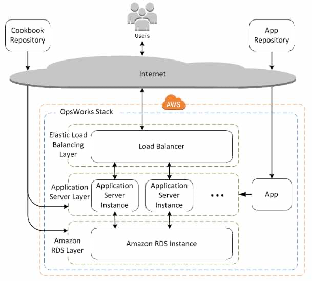

# [AWS OpsWorks - Server Configuration and Automation](https://stackshare.io/stackups/amazon-ec2-container-service-vs-aws-opswork)
- Model and manage your entire application from load balancers to databases using Chef.
- You would have full control of deployments and automation of each component.
- With AWS OpsWorks, you can automate how nodes are configured, deployed, and managed, whether they are Amazon EC2 instances or on-premises devices.

# AWS Macie
- To discover sensitive information that the enterprise stores in AWS and then use `NLP` to classify the data and provide business-related insights.